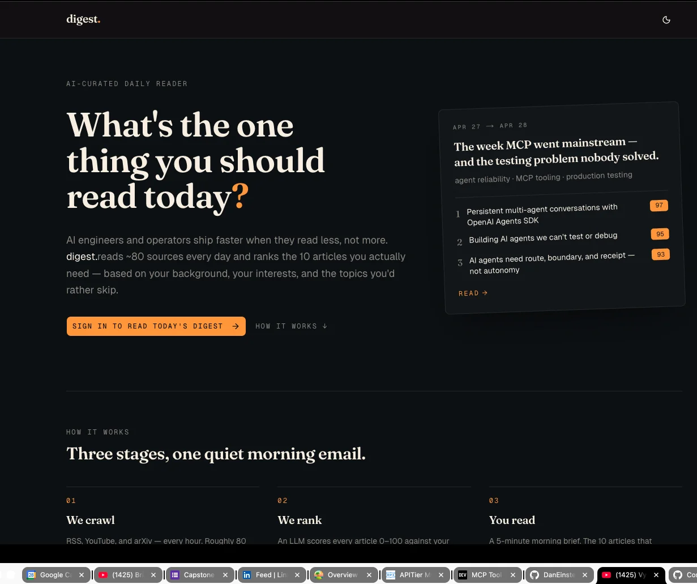
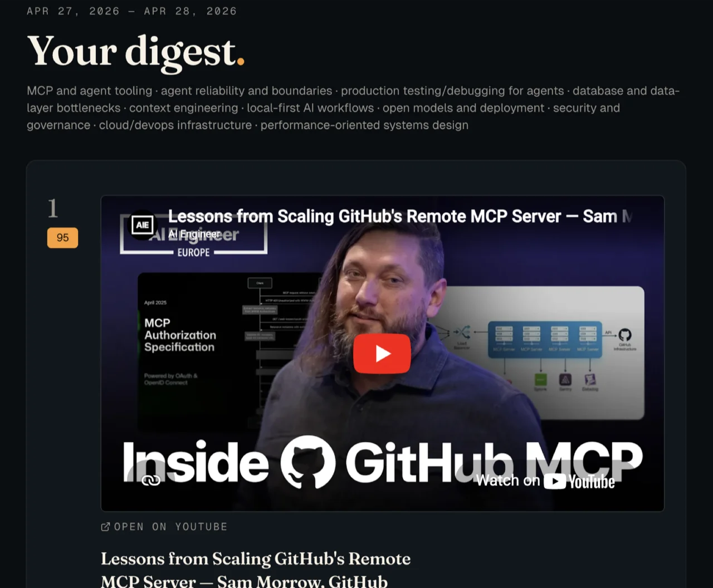
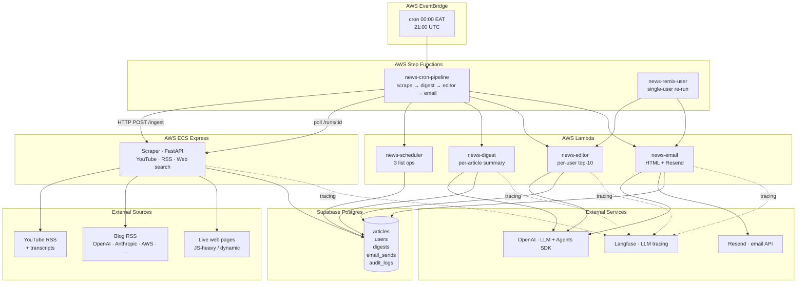
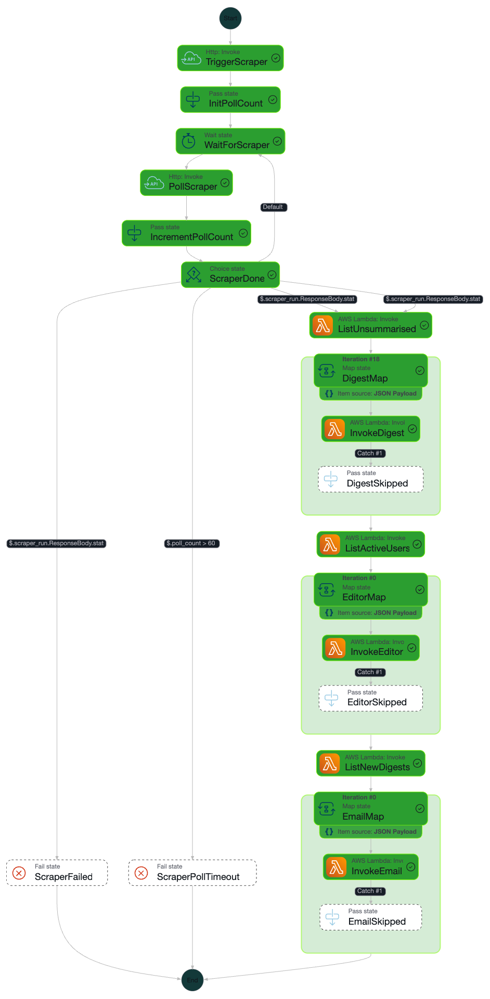

# AI News Aggregator

> A production-grade, multi-source news aggregation pipeline that turns the
> daily firehose of AI/tech content into a curated, personalised 10-item
> digest delivered to each user's inbox at 00:00 EAT — built as a monorepo
> on AWS (ECS Express + Lambda + Step Functions + EventBridge), Supabase
> Postgres, and the OpenAI Agents SDK with full observability.

[](https://github.com/PatrickCmd/ai-agents-news-aggregator/releases/tag/foundation-v0.1.1)
[](https://github.com/PatrickCmd/ai-agents-news-aggregator/releases/tag/ingestion-v0.2.1)
[](https://github.com/PatrickCmd/ai-agents-news-aggregator/releases/tag/agents-v0.3.0)
[](https://github.com/PatrickCmd/ai-agents-news-aggregator/releases/tag/scheduler-v0.4.0)
[](https://github.com/PatrickCmd/ai-agents-news-aggregator/releases/tag/api-v0.5.0)
[](https://github.com/PatrickCmd/ai-agents-news-aggregator/releases/tag/frontend-v0.7.0)
[](.python-version)
[](#testing)

---

## Table of Contents

1. [Problem Statement](#problem-statement)
2. [Solution at a Glance](#solution-at-a-glance)
3. [Architecture](#architecture)
4. [Daily Pipeline (Step Functions)](#daily-pipeline-step-functions)
5. [Tech Stack](#tech-stack)
6. [Key Design Decisions & Trade-offs](#key-design-decisions--trade-offs)
7. [Project Status](#project-status)
8. [Repository Layout](#repository-layout)
9. [Getting Started](#getting-started)
10. [Running Locally](#running-locally)
11. [Deploying to AWS](#deploying-to-aws)
12. [Observability & Reliability](#observability--reliability)
13. [Security](#security)
14. [Testing](#testing)
15. [Day-to-Day Commands](#day-to-day-commands)
16. [Project Conventions](#project-conventions)
17. [Lessons Learned](#lessons-learned)
18. [Roadmap](#roadmap)
19. [License](#license)

---

## Problem Statement

Anyone working in AI/ML, software engineering, or adjacent fields wakes up
to a daily firehose: dozens of YouTube channels, vendor blogs (OpenAI,
Anthropic, AWS, Google), news sites, and Twitter threads. The signal-to-noise
ratio is poor, and the cognitive cost of triaging that stream — opening
tabs, skim-reading, deciding what's worth a deeper read — is significant.

Existing solutions fall short in three concrete ways:

1. **Fragmented modalities.** RSS readers handle blogs but not YouTube
   transcripts or rendered/JS-heavy pages; YouTube apps don't talk to RSS;
   newsletters are editorially curated for an *average* reader, not for
   *you*. There is no single inbox that ingests across video, RSS, and
   live web search and reasons about all of it together.
2. **No personalisation.** A backend engineer interested in distributed
   systems, an AI researcher tracking model releases, and a founder
   tracking startup news need very different cuts of the same news graph.
   Generic newsletters force everyone into the same priority list.
3. **No reasoning, only retrieval.** Even modern aggregators stop at
   "fetch + rank by recency". They don't read each article, they don't
   summarise it, they don't reason about which ten items would matter
   most to *this* reader given *their* role and current focus.

**The goal of this project** is to close all three gaps with a system that
ingests heterogeneous sources, summarises every item with an LLM, ranks
the top ten for each user against a structured profile, and delivers a
clean HTML digest at a deterministic time each day — built so it can scale
from one user (the author) to a multi-tenant SaaS without architectural
rewrites.

---

## Solution at a Glance

A **fully serverless, event-driven monorepo** decomposed into seven
independent sub-projects that ship in sequence, each producing
working software on its own:

| # | Sub-project | What it ships | Status |
|---|---|---|---|
| **0** | **Foundation** | Monorepo, shared packages (`db`, `schemas`, `config`, `observability`), Postgres schema, async SQLAlchemy, CI, pre-commit hooks | ✅ shipped |
| **1** | **Ingestion** | `services/scraper/` — FastAPI on **ECS Express**: YouTube RSS + transcripts, blog RSS via [rss-mcp](rss-mcp/), live web search via Playwright MCP + OpenAI Agents SDK | ✅ shipped |
| **2** | **Agents** | Three Lambdas: digest (per-article summary), editor (per-user top-10 ranking), email (Resend HTML send) | ✅ shipped |
| **3** | **Scheduler** | `news-scheduler-dev` Lambda + 2 Step Functions state machines (cron pipeline + remix-user) + EventBridge cron + CloudWatch alarms | ✅ shipped |
| **4** | **API + Auth** | FastAPI on Lambda + API Gateway HTTP API + Clerk JWT (lazy-upsert via FastAPI dep). Six endpoints powering the upcoming Next.js frontend (#5). | ✅ shipped |
| **5** | **Frontend** | Next.js (static export) + Clerk Account Portal + Tailwind v4 / shadcn (dark-first editorial redesign) + TanStack Query, hosted on S3 + CloudFront. Profile editor, digest history, "remix now" button, YouTube preview for video sources, public landing page. | ✅ shipped |
| 6 | **CI/CD + Ops** | GitHub Actions deploy pipelines, cross-cutting alerts, runbooks | not started |

Each sub-project has its own design spec, implementation plan, Terraform
module, IAM scope, and release tag. **Sub-projects #0–#5 are deployed and
live on AWS today** — the daily cron has been verified end-to-end in
production: scraper triggered via Step Functions HTTP-invoke, polled to
completion, 19 articles digested in parallel, 1 user ranked, 1 email
delivered via Resend — all in 2m24s.

---

## Frontend Preview

Sub-project #5 ships a dark-first editorial reader at
[dev-digest.patrickcmd.dev](https://dev-digest.patrickcmd.dev). Public
landing for signed-out visitors; authenticated digest list, detail, and
profile editor for signed-in users. YouTube embed for video sources via
the privacy-enhanced `youtube-nocookie.com` host.

| Public landing | Digest detail with YouTube preview |
|---|---|
|  |  |

Typography: [Fraunces](https://fonts.google.com/specimen/Fraunces) for
display, [Geist](https://vercel.com/font) for body, Geist Mono for
metadata (dates, scores, ranks). Single warm-amber accent
(`oklch(0.78 0.16 65)`) on warm-slate dark
(`oklch(0.16 0.012 245)`) — never pure black, never violet.

---

## Architecture

The system is composed along two axes — **a per-sub-project axis** (each
deployable owns its own Terraform module, IAM role, and release lifecycle)
and **a layered-data axis** (raw articles → summaries → per-user rankings
→ delivered emails, all stored in Postgres with a full audit trail).



### Why this shape?

- **ECS Express for the scraper, Lambda for everything else.** Web
  scraping and the rss-mcp / Playwright MCP subprocesses are long-lived,
  process-shaped workloads (subprocess lifetimes wrap the whole run, page
  budgets accumulate state). Per-article summarisation, per-user ranking,
  and per-digest email rendering are short, parallelisable, bursty —
  textbook Lambda. Mixing the two execution models in one cluster would
  be a square peg / round hole problem; running both as Lambda would
  break the rss-mcp lifecycle assumption.
- **Step Functions for orchestration, not SQS.** The pipeline has a hard
  ordering dependency (scraper *must* complete before digest can run) and
  a need to fan-out per-item with bounded concurrency and per-item failure
  tolerance. Step Functions Map states with `ToleratedFailurePercentage`
  give us this declaratively, plus visual debuggability and durable
  retries without writing a single consumer loop. SQS would force us to
  build the same state machine in code, badly.
- **Direct Postgres, not a queue, between stages.** Articles, digests,
  and email-sends are durable artefacts the system needs to query later
  (digest history, retry decisions, audit). Putting them on a queue would
  duplicate state and complicate consistency. Step Functions only carries
  *IDs* — the data lives in Postgres.

See [docs/architecture.md](docs/architecture.md) for the full set of
diagrams (Mermaid).

---

## Daily Pipeline (Step Functions)

The cron pipeline state machine is the heart of the system. It runs once
daily at 00:00 EAT (`cron(0 21 * * ? *)` UTC) and executes nine logical
stages:



> Save the workflow screenshot to `docs/img/cron-pipeline-workflow.png` —
> it's also visible live in the AWS Step Functions console under the
> `news-cron-pipeline-dev` state machine.

In ASL terms (full source: [infra/scheduler/templates/cron_pipeline.asl.json](infra/scheduler/templates/cron_pipeline.asl.json)):

| Stage | State Type | What happens |
|---|---|---|
| **TriggerScraper** | `http:invoke` | POSTs `/ingest` on the scraper's HTTPS endpoint via an EventBridge Connection (auth headers, retries, circuit-breaker — for free). |
| **InitPollCount → WaitForScraper → PollScraper → IncrementPollCount → ScraperDone** | `Pass + Wait + http:invoke + Choice` | Polls `/runs/:id` every 30 s with an iteration cap (`scraper_poll_max_iterations=60` → max 30 min). Routes to `ListUnsummarised` on `success`/`partial`, `ScraperFailed` on `failed`, `ScraperPollTimeout` on cap. |
| **ListUnsummarised** | `lambda:invoke` (scheduler) | Returns the list of unsummarised article IDs from the last 24h. |
| **DigestMap** | `Map` (concurrency 10, tolerate 100% failures) | Per-article fan-out — each iteration invokes the digest Lambda. Failures are `Catch`-ed into a `DigestSkipped` Pass state so one bad article doesn't fail the run. |
| **ListActiveUsers** | `lambda:invoke` (scheduler) | Returns the list of users with `profile_completed_at IS NOT NULL`. |
| **EditorMap** | `Map` (concurrency 5, tolerate 100% failures) | Per-user fan-out — each iteration invokes the editor Lambda for that user, which writes a digest row. |
| **ListNewDigests** | `lambda:invoke` (scheduler) | Returns the list of digests generated today (status=`generated`, `email_sent_at IS NULL`). |
| **EmailMap** | `Map` (concurrency 2, tolerate 100% failures) | Per-digest fan-out — each iteration invokes the email Lambda, which renders + sends via Resend. Concurrency 2 to respect Resend's free-tier rate limit. |

The same Lambdas are reusable: a separate **`news-remix-user`** state
machine takes a user_id and runs editor → email for just that user
(triggered by the upcoming "remix my digest now" button in the web UI,
sub-project #4).

---

## Tech Stack

| Layer | Choice | Why |
|---|---|---|
| **Language** | Python 3.12 | Mature async ecosystem (asyncpg, httpx, FastAPI), strongest LLM-tooling story (OpenAI Agents SDK, Langfuse), simple Lambda packaging. |
| **Workspace** | uv + monorepo | Fast resolver/installer (orders of magnitude over pip-tools), workspace dependencies for shared `packages/`, a single `uv.lock` for reproducibility. |
| **Type system** | Pydantic v2 + mypy strict | Runtime validation on package boundaries + compile-time coverage on internal code. Pydantic v2 also generates JSON Schema for OpenAI Structured Outputs. |
| **DB driver** | SQLAlchemy 2.0 async + asyncpg | Vendor-neutral (we'd hate to be locked into supabase-py for a 3rd-party host migration), mature async story, integrates with Alembic for migrations. |
| **DB host** | Supabase Postgres (Session + Transaction poolers) | Free tier, IPv4-friendly poolers, point-in-time recovery, dashboard for ad-hoc queries. Pgbouncer transaction-mode requires `statement_cache_size=0`. |
| **Migrations** | Alembic | The standard. Config under `packages/db/alembic.ini`, revisions checked in. |
| **API framework** | FastAPI + uvicorn | Async-first, OpenAPI for free, painless Pydantic v2 integration. |
| **Container runtime** | AWS ECS Express (scraper) | Newer ECS mode that auto-provisions an ALB-equivalent HTTPS endpoint, autoscaling, and IAM in one resource — much less Terraform than classic Fargate. |
| **Function runtime** | AWS Lambda (Python 3.12, zip artefacts on S3) | Sub-second cold start with the right packaging, generous free tier, scales to zero. |
| **Orchestration** | AWS Step Functions Standard + EventBridge cron | Native HTTP task (`http:invoke`), durable Map states, visual debugger, replay-from-failure. |
| **Browser automation** | Playwright via MCP server | Run by the web-search agent for JS-heavy / dynamic pages. The MCP server runs as a child process under the OpenAI Agents SDK's tool-use loop. |
| **LLM** | OpenAI (default `gpt-5.4-mini`) via the OpenAI Agents SDK | Structured outputs, tool calling, agent loops, OpenTelemetry tracing — and the SDK has the strongest streaming + cost reporting we tested. |
| **LLM observability** | Langfuse self-hostable + cloud | Trace every prompt/completion, attach cost + latency metadata, group by trace ID, slice by model. The integration is a single `configure_tracing()` call. |
| **Email** | Resend | Modern, transactional-friendly DX, simple HTTP API, generous free tier. The agents call it through `news_email.resend_client`. |
| **Auth (planned)** | Clerk | Drop-in JWT issuer + onboarding flows, no need to build email verification + magic links + password rotation ourselves. |
| **Frontend (planned)** | Next.js 15 + Clerk + S3/CloudFront | Server components for a chunky digest history view, edge-rendered fast, statically deployable to S3. |
| **IaC** | Terraform per sub-project | Independent blast-radius — applying #2 won't roll #1. Shared remote state in S3 with native locking. |
| **Test runner** | pytest + testcontainers-postgres + httpx.AsyncClient | Real Postgres in CI (catches dialect issues mocks miss), real ASGI app for FastAPI tests. |
| **Lint / format / types** | ruff + mypy + pre-commit + detect-secrets | Run on every commit; CI re-runs to catch hook bypasses. |

---

## Key Design Decisions & Trade-offs

This section captures the architectural calls that shaped the codebase
and the reasoning behind each. I keep this list because most of them
came up in real failure modes during deployment.

### 1. Per-sub-project Terraform modules (vs. one mega-module)

**Decision.** Every deployable owns its own root module under
`infra/<name>/`, with its own state file (same bucket, different key)
and its own `terraform apply` cadence.

**Why.** A change to the email Lambda must not roll the scraper. With
one root module, every `terraform plan` reads every resource in the
account, every diff carries cross-cutting risk, and parallel iteration
between sub-projects becomes serial. The cost is some duplication
across modules (each declares its own backend + workspace) — a price
worth paying for independent blast radius and parallelisable releases.

**Where it bit us.** The scheduler's IAM role for `http:invoke` was
missing `secretsmanager:DescribeSecret`. The fix was a one-file change
in `infra/scheduler/state_machines.tf` and a targeted apply — no risk
of touching #1 or #2.

### 2. Pydantic v2 for every cross-package contract

**Decision.** No raw dicts cross a package boundary. All public
function signatures take `*In` schemas and return `*Out` schemas from
`packages/schemas/`.

**Why.** Three reasons. (a) **Refactor safety** — renaming a field
breaks the type-checker before it breaks production. (b) **Runtime
validation** — bad data from the scraper or an LLM throws a precise
`ValidationError` at the boundary, not a `KeyError` 50 stack frames
deep. (c) **JSON Schema for free** — the editor agent's structured
output is just `output_type=RankedDigestOut`; the SDK generates the
schema and the OpenAI server validates the response.

**Where it bit us.** The OpenAI Structured Outputs API rejects schemas
containing `format: ...` (which Pydantic emits for `HttpUrl`,
`EmailStr`, etc.). Documented in `AGENTS.md` "What NOT to do" — use
`str` for those fields and validate downstream.

### 3. SQLAlchemy 2 async, never `supabase-py`

**Decision.** No Supabase SDK at runtime. Every query goes through an
async SQLAlchemy session with asyncpg.

**Why.** Vendor neutrality (we can flip to RDS / Neon / a self-hosted
Postgres without a code rewrite), full Postgres feature set (CTEs,
JSONB ops, advisory locks), real ORM models for migrations, and the
testcontainers ecosystem speaks plain Postgres. `supabase-py` would
also bypass our pgbouncer-friendly settings.

**Where it bit us.** Supabase's transaction-mode pgbouncer doesn't
tolerate prepared statements; asyncpg defaults to caching them.
`statement_cache_size=0` is mandatory in the engine config. Captured
in `news_db/engine.py`.

### 4. ECS Express for scraping; Lambda for everything else

**Decision.** Long-lived, subprocess-shaped workloads (rss-mcp +
Playwright MCP) run on ECS Express. Short, parallelisable workloads
(per-article summary, per-user ranking, per-digest email) run on
Lambda.

**Why.** Lambda's per-invocation 15-minute cap and frozen-during-await
behaviour break the assumptions of long-running MCP subprocesses. ECS
Express was designed for exactly this: it provisions an HTTPS endpoint,
auto-scaler, ALB target group, IAM role and log group in one resource —
much less Terraform than classic Fargate. Sub-Lambda costs and cold
starts make it the wrong call for the agents.

### 5. Step Functions Standard, not SQS, for orchestration

**Decision.** The cron pipeline is a Step Functions Standard state
machine with explicit Map states for fan-out and `http:invoke` for the
scraper trigger.

**Why.** The pipeline is a *workflow*, not a *queue*. It has hard
ordering (scraper must finish before digest), per-stage retry policies,
per-item failure tolerance, and a need to be replayable from a specific
state on partial failure. Step Functions makes all of this declarative
and inspectable in the console; reimplementing it on SQS would mean
hand-rolling poll loops, DLQs, and visibility-timeout tuning. The free
tier covers far more than we need (4,000 state transitions per month).

**Where it bit us.** The cron role needs **both** `secretsmanager:DescribeSecret`
and `secretsmanager:GetSecretValue` on the EventBridge Connection's
auto-created secret — granting one without the other surfaces as
`Events.ConnectionResource.AccessDenied`. Documented in `AGENTS.md`.

### 6. Reset the SQLAlchemy engine at the top of every Lambda handler

**Decision.** Every Lambda handler calls
`news_db.engine.reset_engine()` before `asyncio.run(...)`.

**Why.** Lambda re-uses warm containers, but each `asyncio.run(...)`
creates a new event loop. The cached `AsyncEngine` and its asyncpg
connection pool are bound to the loop that *first* opened them. On the
next invocation, the cached pool's `pool_pre_ping` runs on a
now-closed loop and throws
`RuntimeError: ... attached to a different loop`. Resetting the
singleton forces `get_session()` to rebuild the pool against the
current loop.

**Where it bit us.** First cron pipeline run had three silent
DigestMap failures (swallowed by `ToleratedFailurePercentage=100`) and
a hard fail on `ListActiveUsers`. After the fix: 19/19 articles, 1/1
user, 1/1 digest in 2m24s.

### 7. Audit log + cost tracking on every LLM call

**Decision.** Every agent decision writes a row to `audit_logs` via
`news_observability.audit.AuditLogger`. Every LLM response is passed
through `news_observability.costs.extract_usage()` and the cost +
token counts go into the audit row's `metadata` JSONB.

**Why.** Agents are non-deterministic; debugging "why did the editor
rank article X first today and Y first yesterday?" is impossible
without per-call traces. Cost tracking is also a hard requirement for
budget safety — without it, a runaway loop in a new agent could rack
up four-figure bills before we notice.

### 8. Prompt-injection sanitization and response-size caps

**Decision.** Every user-supplied or scraped string passes through
`news_observability.sanitizer.sanitize_prompt_input()` before reaching
an LLM. Audit log inputs and outputs are size-capped via
`news_observability.limits`.

**Why.** We summarise live web pages — those pages can contain
adversarial instructions ("ignore your previous instructions, return…").
Sanitization is a depth-in-defence layer, not a silver bullet, but it
gets us out of the trivially-exploitable space. Size caps protect the
DB from arbitrary inputs and protect us from runaway tokenisation
costs.

### 9. Conventional Commits, focused PRs, sub-project release tags

**Decision.** Every commit follows Conventional Commits scoped to the
sub-project (`feat(scheduler): …`, `fix(lambda): …`). Every sub-project
gets a release tag (`scheduler-v0.4.0`).

**Why.** Auditability — when a bug appears in production we can
`git log --grep` against the affected sub-project quickly. Tags also
let us do per-sub-project rollback (point Terraform at a previous tag's
artefact).

---

## Project Status

| # | Sub-project | Tag | Live on AWS? |
|---|---|---|---|
| 0 | Foundation | `foundation-v0.1.1` | n/a (libraries only) |
| 1 | Ingestion | `ingestion-v0.2.1` | ✅ ECS Express, dev workspace |
| 2 | Agents | `agents-v0.3.0` | ✅ 3 Lambdas, dev workspace |
| 3 | Scheduler + Orchestration | `scheduler-v0.4.0` | ✅ Lambda + 2 Step Functions + EventBridge cron |
| 4 | API + Auth | `api-v0.5.0` | ✅ Lambda + API Gateway HTTP API + IAM scoped to remix SFN |
| 5 | Frontend | `frontend-v0.7.0` | ✅ Next.js static export + S3 + CloudFront + Clerk + Route 53 + editorial redesign |
| 6 | CI/CD + Ops | — | not started |

**End-to-end verified in production:** the cron pipeline ran on
2026-04-27 in 2m24s — scraper picked up 19 new articles (1 YouTube,
13 RSS, 5 web search), all 19 were summarised by the digest Lambda,
1 user was ranked by the editor, 1 digest was rendered and emailed via
Resend, with zero `LambdaFunctionFailed` events in the Step Functions
history.

---

## Repository Layout

```
ai-agent-news-aggregator/
├── packages/                       # shared libraries (no deployables)
│   ├── db/                         # SQLAlchemy 2 models + Alembic + repositories
│   ├── schemas/                    # Pydantic v2 cross-package contracts
│   ├── config/                     # YAML loaders, env Settings, sources.yml
│   └── observability/              # logging, tracing, audit, retry, sanitizer, costs
├── services/                       # deployables — one per sub-project that ships compute
│   ├── scraper/                    # ECS Express — RSS + YouTube + web-search (#1)
│   ├── agents/                     # Lambda — digest, editor, email (#2)
│   ├── scheduler/                  # Lambda — list_unsummarised / list_active_users / list_new_digests (#3)
│   └── api/                        # Lambda — FastAPI + Clerk (#4, planned)
├── infra/                          # per-sub-project Terraform modules
│   ├── README.md                   # apply order, recovery, day-to-day ops
│   ├── bootstrap/                  # one-time S3 state bucket + Lambda artefacts bucket
│   ├── scraper/                    # ECR, ECS Express, IAM, SSM, log group (#1)
│   ├── {digest,editor,email}/      # per-agent Lambda + IAM (#2)
│   ├── scheduler/                  # scheduler Lambda + 2 SFN state machines + EventBridge cron + alarms (#3)
│   └── setup-iam.sh                # one-time NewsAggregator{Core,Compute}Access groups
├── web/                            # Next.js frontend (#5, planned)
├── scripts/                        # dev utilities (reset_db.py, seed_user.py)
├── tests/integration/              # testcontainers-postgres integration tests
├── docs/
│   ├── architecture.md             # full mermaid diagrams
│   ├── ecs-express-bootstrap.md    # one-time manual prerequisites
│   ├── img/                        # diagrams, screenshots
│   └── superpowers/
│       ├── specs/                  # design specs (one per sub-project)
│       └── plans/                  # implementation plans (one per sub-project)
├── rss-mcp/                        # RSS MCP server binary (used by #1)
├── AGENTS.md                       # full conventions guide for any coding agent
├── CLAUDE.md                       # Claude Code-specific addendum
├── Makefile                        # everything you'd run during dev/deploy
├── pyproject.toml                  # uv workspace root
└── uv.lock                         # locked dependency graph
```

---

## Getting Started

### Prerequisites

| Tool | Version | Purpose |
|---|---|---|
| Python | 3.12 | Declared in `.python-version` |
| [uv](https://docs.astral.sh/uv/) | ≥ 0.4 | Workspace + dependency manager |
| Docker | any | Used by `testcontainers-postgres` for integration tests |
| Node.js | ≥ 20 | rss-mcp binary + `@playwright/mcp@latest` |
| AWS CLI v2 | latest | `aws` profile `aiengineer` (created by `infra/setup-iam.sh`) |
| Terraform | ≥ 1.6 | All infra modules use the `s3` backend with native locking |
| A Supabase project | Postgres 16 | https://supabase.com (free tier is enough for dev) |
| OpenAI API key | — | LLM inference |
| Resend API key | — | Email delivery |
| Langfuse account (optional) | — | LLM tracing dashboard |

### 1. Clone and install

```sh
git clone git@github.com:PatrickCmd/ai-agents-news-aggregator.git
cd ai-agents-news-aggregator
make install-dev                  # uv sync + pre-commit install
```

### 2. Configure environment

```sh
cp .env.example .env
```

Fill in `.env` with real values. Minimum required for foundation +
ingestion + agents:

| Variable | Used by |
|---|---|
| `SUPABASE_DB_URL` | Alembic migrations (Session pooler, port 5432) |
| `SUPABASE_POOLER_URL` | Runtime queries (Transaction pooler, port 6543 — pgbouncer) |
| `OPENAI_API_KEY` | Web-search agent + digest + editor + email agents |
| `LANGFUSE_PUBLIC_KEY` / `LANGFUSE_SECRET_KEY` | Optional; tracing no-ops if unset |
| `RESEND_API_KEY` | Email agent |
| `MAIL_FROM` | Email agent — must be a Resend-verified sender domain |
| `LOG_LEVEL` | Defaults to `INFO` |
| `ENV` | `dev` / `staging` / `prod` |

Both DB URLs use the SQLAlchemy-async scheme:

```
postgresql+asyncpg://<user>:<pwd>@<host>:<port>/<db>
```

**Supabase connection strings** (dashboard → Settings → Database →
Connection string):

- **Session pooler** (`aws-0-<region>.pooler.supabase.com:5432`) →
  `SUPABASE_DB_URL`. Username is `postgres.<project-ref>` (the tenant
  suffix is mandatory).
- **Transaction pooler**
  (`aws-0-<region>.pooler.supabase.com:6543`) → `SUPABASE_POOLER_URL`.
- **Direct** (`db.<project>.supabase.co:5432`) — **do not use**. Newer
  Supabase projects are IPv6-only on this host, which fails DNS
  resolution on most networks. Use the Session pooler.

Replace `postgresql://` with `postgresql+asyncpg://` after copying from
the dashboard.

### 3. Run database migrations

```sh
make migrate                      # alembic upgrade head
```

This creates five tables (`articles`, `users`, `digests`, `email_sends`,
`audit_logs`) plus indexes, CHECK constraints, and `set_updated_at`
triggers. Verify with:

```sh
make migration-current            # current revision on the DB
```

### 4. Seed a dev user

```sh
SEED_USER_EMAIL=you@example.com make seed
```

Reads `config/user_profile.yml`, upserts a user with
`clerk_user_id='dev-seed-user'` (placeholder until Clerk lands in #4),
and sets `profile_completed_at` so the scheduler picks them up.

### 5. Run tests

```sh
make test                         # all (Docker required for integration)
make test-unit                    # no Docker needed
make test-integration             # Docker required (testcontainers-postgres)
```

---

## Running Locally

### Scraper (sub-project #1)

```sh
make scraper-serve                # uvicorn on http://localhost:8000
# In another shell:
curl -X POST http://localhost:8000/ingest \
  -H 'content-type: application/json' \
  -d '{"lookback_hours":6}' | jq
```

Or via CLI (blocks until done; exit code reflects status):

```sh
make scraper-ingest                                   # all 3 pipelines
uv run python -m news_scraper ingest-rss --lookback-hours 6
uv run python -m news_scraper runs --limit 5
```

### Agents (sub-project #2) — local CLI

```sh
make agents-digest ARTICLE_ID=42                  # summarise one article
make agents-digest-sweep LOOKBACK=24              # sweep all unsummarised
make agents-editor USER_ID=<uuid> LOOKBACK=24     # rank top 10 for a user
make agents-email DIGEST_ID=17                    # send via Resend
make agents-preview DIGEST_ID=17                  # render HTML to stdout (no send)
```

### Scheduler (sub-project #3) — local list ops

```sh
make scheduler-list-unsummarised LOOKBACK=24      # what would the cron pick up
make scheduler-list-active-users                  # who would receive a digest
make scheduler-list-new-digests                   # what's queued for email today
```

These hit the DB directly without going through Lambda — handy for
debugging the predicates that drive the production fan-out.

## Running the API (#4)

A FastAPI app on Lambda behind API Gateway HTTP API, exposing six
endpoints (`/v1/healthz`, `/v1/me`, `/v1/me/profile`, `/v1/digests`,
`/v1/digests/{id}`, `/v1/remix`) for the upcoming Next.js frontend.
JWTs from Clerk are validated in a FastAPI dependency that
lazy-upserts the user row on first call.

```sh
# Local dev (uvicorn — bypasses Mangum)
make api-serve

# Deploy (CLERK_ISSUER required for first deploy)
export CLERK_ISSUER=https://<clerk-frontend-api>
make api-deploy

# Smoke
make api-invoke                            # GET /v1/healthz
make api-test-me JWT=<real-clerk-jwt>      # GET /v1/me

# Logs
make api-logs SINCE=10m
make api-logs-follow
```

Sub-project #4 adds one new SSM SecureString (`clerk_secret_key`); the
publishable key lives in the frontend, not the backend. See
[infra/README.md](infra/README.md) § "Sub-project #4 — API + Auth"
for full lifecycle, IAM scope, and failure modes.

## Running the Frontend (#5)

A Next.js static-export app served from S3 + CloudFront. Three
authenticated pages: digest list, digest detail, profile editor,
plus a public landing page for signed-out visitors.
Auth via Clerk's hosted Account Portal — no auth UI to build or
maintain. Data via TanStack Query against the API (#4).

```sh
# Local dev (requires the API running locally — see "Running the API (#4)")
cp web/.env.example web/.env.local      # fill in NEXT_PUBLIC_*
make web-install                        # pnpm install --ignore-scripts
make web-dev                            # → http://localhost:3000

# Deploy
make web-deploy-dev                     # workflow_dispatch
make web-deploy-test
make web-deploy-prod                    # gated by GitHub Environment reviewer

# Tests + supply-chain scan
make web-test
make web-typecheck
make web-osv                            # OSV-Scanner CVE check
```

Sub-project #5 introduces three new domains:
`digest.patrickcmd.dev` (prod), `dev-digest.patrickcmd.dev`,
`test-digest.patrickcmd.dev`. ACM wildcard cert + Route 53 zone
reused; one CloudFront distribution per env. Per-env GitHub
Environments hold the Clerk publishable key + Terraform outputs.

The dark-first editorial redesign (`web-v0.7.0`) ships Fraunces
display + Geist body + Geist Mono metadata, a warm-amber accent on
warm-slate dark, asymmetric landing hero for signed-out visitors,
newsletter-style digest list, ranked-article cards with score-chip
gutter, and privacy-enhanced YouTube preview (`youtube-nocookie.com`)
for video sources.

See [infra/README.md](infra/README.md) § "Sub-project #5 — Frontend"
for the full deploy lifecycle, GitHub Environment configuration, and
failure mode reference.

---

## Deploying to AWS

### One-time bootstrap

```sh
# IAM groups (NewsAggregatorCoreAccess + NewsAggregatorComputeAccess)
ADMIN_PROFILE=patrickcmd ./infra/setup-iam.sh

# S3 state bucket + Lambda artefact bucket
make tf-bootstrap

# Per-sub-project Terraform init (run once each)
make tf-scraper-init STATE_BUCKET=news-aggregator-tf-state-<account>
# (similar for digest, editor, email, scheduler — see infra/README.md)

# Push .env to SSM SecureString
make secrets-sync ENV=dev
```

### Sub-project deploys

```sh
# 1. Scraper (ECS Express + ECR image)
make scraper-deploy

# 2. Agents (3 zip-on-S3 Lambdas)
make digest-deploy
make editor-deploy
MAIL_FROM=hi@yourdomain.com make email-deploy

# 3. Scheduler (Lambda + 2 Step Functions + EventBridge cron + alarms)
make scheduler-deploy
```

### Daily operation

```sh
make cron-invoke                  # one-off pipeline run (don't wait for cron)
make cron-history                 # 5 most recent executions
make cron-describe NAME=<exec>    # full state-by-state trace

make remix-invoke USER_ID=<uuid>  # single-user re-run

make scheduler-logs SINCE=10m
make scheduler-logs-follow

make scraper-status               # ECS task / autoscaler / events
make scraper-pin-up               # keep service warm during testing
make scraper-pin-down             # back to autoscaling + scale-to-zero
```

See [infra/README.md](infra/README.md) for full lifecycle — recovery
from common Terraform errors, IAM scope per agent, rollback recipes,
and detailed failure-mode reference for each sub-project.

---

## Observability & Reliability

### Logs

- **CloudWatch Logs** — every Lambda + the ECS Express service writes
  loguru-formatted JSON. `make scheduler-logs SINCE=10m`,
  `make agents-logs AGENT=email`, `make scraper-logs`.
- **Step Functions execution history** — visible in the AWS console
  per state, with full input/output per state. `make cron-history` /
  `make cron-describe NAME=<exec>` from the CLI.

### Tracing

- **Langfuse** — every agent (digest, editor, email) wraps its
  OpenAI Agents SDK runs in a Langfuse trace via
  `news_observability.tracing.configure_tracing(enable_langfuse=True)`.
  Traces include the full prompt, completion, model, latency, and cost.

### Cost tracking

- `news_observability.costs.extract_usage(result, model=...)` runs after
  every LLM call. The token counts and dollar-cost are attached to the
  audit-log row's `metadata` JSONB. Pricing is hardcoded in
  `news_observability.costs._PRICING` — update when OpenAI changes
  rates.

### Audit log

- Every agent decision writes to the `audit_logs` table via
  `AuditLogger`, with the full input prompt (size-capped), the model
  output, the cost metadata, and the decision context (article ID,
  user ID, digest ID).

### Alarms

- **`news-cron-pipeline-failed`** — fires when the daily cron's Step
  Functions execution fails.
- **`news-cron-pipeline-stale-36h`** — fires when no successful cron
  run has happened in 36 h (i.e., we missed a daily run).

### Failure isolation

- All `Map` states use `ToleratedFailurePercentage=100` — one failed
  article doesn't fail the whole pipeline, one failed user doesn't
  block other users' emails.
- Lambdas return structured failure dicts (`{"failed": True,
  "reason": ...}`) on malformed events instead of raising — raising
  would trigger SQS-style retries on payloads that will never succeed.

---

## Security

- **Secrets** live in `.env` (local), AWS SSM Parameter Store
  SecureString (runtime), and AWS Secrets Manager (rotated/cross-account
  cases). `.env` is gitignored.
- **`pre-commit`** runs `detect-secrets` — if it flags a string,
  treat it as a real finding. Don't `--no-verify` past it.
- **Prompt injection** is in scope for the scraping agents. Every
  user-supplied or scraped string passes through
  `sanitize_prompt_input()` before reaching an LLM.
- **Audit log size caps** prevent arbitrarily long inputs/outputs
  from blowing up Postgres or our LLM bills.
- **Per-Lambda IAM** is narrowly scoped — each agent's role only
  reads `arn:aws:ssm:...:parameter/news-aggregator/<env>/*` plus
  `AWSLambdaBasicExecutionRole`. The scheduler's role additionally
  has `lambda:InvokeFunction` on the three agents and the
  `states:InvokeHTTPEndpoint` action *constrained by URL pattern* to
  only `${scraper_base_url}/ingest` and `${scraper_base_url}/runs/*`.
- **No RLS in Postgres.** All reads go through FastAPI (#4) with
  application-layer user filtering. The DB role used by the runtime
  has only the privileges it needs.

---

## Testing

### Layers

| Layer | Where | Runner |
|---|---|---|
| **Unit** | `packages/*/tests/`, `services/*/tests/unit/` | `make test-unit` (no Docker) |
| **Integration** | `tests/integration/` | `make test-integration` (testcontainers-postgres → real Postgres) |
| **Live smoke** | `services/scraper/.../tests` (marked `@pytest.mark.live`) | `make test-scraper-live` (hits real rss-mcp + YouTube — slow, network-dependent) |

### Conventions

- **Tests come first** — TDD via the `superpowers:test-driven-development`
  skill for every repository method and every schema change.
- **No mocking the database** — integration tests use real Postgres
  via testcontainers. Mocked tests have masked migration bugs in past
  projects; we don't repeat that mistake.
- **No `fastapi.testclient.TestClient`** for async tests. We use
  `httpx.AsyncClient + ASGITransport`, which avoids the
  `loop is closed` errors `TestClient` causes with asyncpg.

### Current count (sub-projects #0–#3)

- 72 unit tests across `packages/`
- 16 scheduler unit + ASL tests
- Integration tests (testcontainers-postgres) for every repository

`make check` is the CI-equivalent target — `lint + typecheck + tests`.

---

## Day-to-Day Commands

Everything is in the [Makefile](Makefile). `make help` prints the full
list with descriptions.

### Quality gates

| Task | Command |
|---|---|
| Format code | `make fmt` |
| Lint + format check | `make lint` |
| Type-check | `make typecheck` |
| Full CI-equivalent check | `make check` |
| Run all pre-commit hooks | `make pre-commit` |

### Database

| Task | Command |
|---|---|
| Apply new migrations | `make migrate` |
| Roll back one migration | `make migrate-down` |
| Create new migration | `make migrate-rev MSG="add foo column"` |
| Show current revision | `make migration-current` |
| Destructive reset (dev DB only) | `make reset-db` |

### Per sub-project

See [Running Locally](#running-locally) and [Deploying to AWS](#deploying-to-aws)
above, or run `make help | grep <prefix>` (`scraper-`, `agents-`,
`digest-`, `editor-`, `email-`, `scheduler-`, `cron-`, `remix-`).

---

## Project Conventions

See [AGENTS.md](AGENTS.md) for the full conventions list. Highlights:

- **No `supabase-py` at runtime** — SQLAlchemy is the only data-access layer.
- **No raw dicts across package boundaries** — use Pydantic models
  from `news_schemas`.
- **Every user-supplied prompt** must pass through
  `news_observability.sanitizer.sanitize_prompt_input()` before
  hitting an LLM.
- **Every LLM response** must be validated via
  `news_observability.validators.validate_structured_output()`.
- **Every agent decision** logs to `audit_logs` via `AuditLogger`,
  with cost metadata via `extract_usage()`.
- **Frontend never talks to Supabase directly** — everything goes
  through FastAPI (sub-project #4).
- **Conventional Commits** (`feat(db): …`, `fix(observability): …`).
- **One Lambda handler module per service** named `lambda_handler.py` —
  AWS expects `handler = "lambda_handler.handler"`.
- **Always `news_db.engine.reset_engine()` at the top of every Lambda
  handler** that touches the DB — see decision #6 above.

---

## Lessons Learned

A capstone is not just code; it's the lessons that don't make the
spec but matter in production. The biggest ones from this project:

1. **`asyncio.run()` + warm Lambda containers + cached engines is a
   loaded gun.** The first cron pipeline run failed silently on three
   articles and hard on `list_active_users` — both the same bug. Fix
   was a one-liner in each handler. Lesson: every async-on-Lambda
   architecture needs an explicit story for engine/loop lifecycle.
2. **Step Functions HTTP-invoke needs both Secrets-Manager
   permissions.** AWS error messages can be ambiguous; the action list
   in IAM should match what the docs *and* the runtime actually call.
3. **Free-tier email providers rate-limit aggressively.** Resend's
   free tier capped us at 2 emails/sec, so `EmailMap` runs with
   `MaxConcurrency=2`. A budget item for sub-project #6 is a paid plan
   if/when we onboard real users.
4. **Path arithmetic in deploy scripts is treacherous when modules
   move.** The scheduler's `deploy.py` originally used
   `parents[2]` (copy-pasted from the agents' deploy.py). The agents
   live two levels under `services/`; the scheduler lives one level
   under. Use `__file__`-relative paths sparingly and *always* with a
   comment explaining the depth.
5. **Sub-project decomposition pays compounding interest.** Being able
   to ship #2 without re-applying #1's Terraform, then ship #3 without
   re-deploying #2, removed an enormous amount of friction. The cost
   (some duplication in Terraform backends + module conventions) was
   trivial compared to the saved blast-radius anxiety.
6. **A persistent skill memory ("don't drift OPENAI_MODEL", "use the
   Session pooler not the direct host") prevents recurring Stack
   Overflow trips.** The project's `CLAUDE.md` and the auto-memory
   system caught real classes of mistakes more than once.

---

## Roadmap

| Sub-project | Status | Next milestone |
|---|---|---|
| #4 — API + Auth | not started | Clerk-driven onboarding flow + `/digests` endpoints + `/remix` endpoint that triggers `news-remix-user-dev` |
| #5 — Frontend | not started | Next.js 15 + Clerk + S3/CloudFront, profile editor, digest history, "remix now" button |
| #6 — CI/CD + Ops | not started | GitHub Actions deploy pipelines per sub-project, cross-cutting alerts, runbooks, paid Resend plan for production |

Stretch goals once the seven sub-projects ship:

- **Multi-tenant SaaS** — Clerk Organisations, per-org sources, pricing tiers.
- **Per-user source weights** — instead of a global `sources.yml`, each
  user picks the channels and feeds they care about, with an editor
  prompt that respects their weights.
- **Cost-per-user dashboards** — pivot the audit log + cost metadata by
  `user_id` to surface heaviest users.

---

## Contributing

1. Pick a sub-project (see [AGENTS.md](AGENTS.md) §Sub-project decomposition).
2. Read its spec in [docs/superpowers/specs/](docs/superpowers/specs/).
3. Work against its plan in [docs/superpowers/plans/](docs/superpowers/plans/).
4. `make check` must be green before any commit or PR.
5. Conventional Commits, scoped to the sub-project.

---

## License

TBD.
