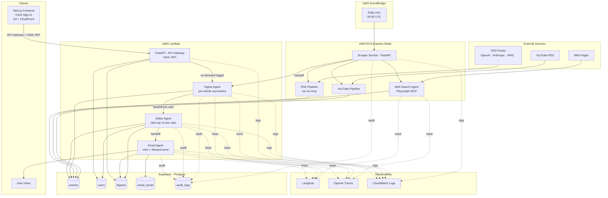
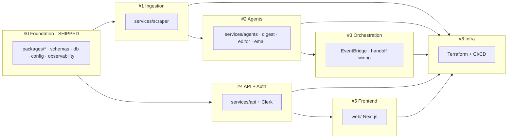

# Architecture

Mermaid diagrams of the AI News Aggregator's full target system. The authoritative design spec lives at [docs/superpowers/specs/2026-04-23-foundation-design.md](superpowers/specs/2026-04-23-foundation-design.md). Only Sub-project #0 (Foundation) is implemented today.

## Full system

## Sub-project dependency graph

