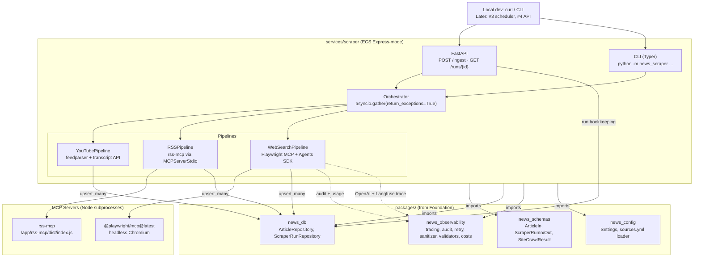

# Ingestion Pipeline (Sub-project #1) — Design Spec

- **Date:** 2026-04-24
- **Status:** Approved for implementation planning
- **Owner:** Patrick Walukagga
- **Scope:** A single ECS Express-mode service with three internal pipelines (YouTube RSS, blog RSS via rss-mcp, web-search via Playwright MCP + OpenAI Agents SDK) that populate the `articles` table. Includes Dockerfile and a Terraform-wrapping `deploy.py`. Excludes EventBridge scheduling (→ #3), agent hand-off (→ #2), and Terraform modules themselves (→ #6).

---

## 1. Overview

Sub-project #1 ships the ingestion half of the AI News Aggregator — the data-producing side. Three pipelines write into the tenant-agnostic `articles` table produced by Foundation:

1. **YouTube pipeline** — `feedparser` over YouTube's per-channel RSS URL + optional transcript fetch via `youtube_transcript_api` (with Webshare proxy fallback)
2. **RSS pipeline** — `rss-mcp` Node subprocess over stdio, invoked from Python via `MCPServerStdio.call_tool("get_feed", ...)` (no LLM in this path — direct tool call, mirroring the legacy `rss_pipeline.py`)
3. **Web-search pipeline** — `@playwright/mcp@latest` Node subprocess + OpenAI Agents SDK agent with structured output (`SiteCrawlResult`), one agent run per curated site

Consumers: local dev (curl / CLI), and later #3 scheduler (EventBridge → ECS) and #4 API ("trigger my digest now").

This spec builds on [2026-04-23-foundation-design.md](2026-04-23-foundation-design.md). No Foundation invariants are broken; one new table (`scraper_runs`) is added via Alembic.

---

## 2. Architecture



### 2.1 Architectural decisions

| Decision | Choice | Rationale |
|---|---|---|
| Service shape | One ECS Express-mode service with three pipelines | Matches plan.md; shared observability setup; asyncio.gather fans out naturally |
| Trigger surface | FastAPI primary + Typer CLI (same business logic, different adapter) | HTTP fits ECS Express; CLI wanted for local smoke and future `ECS RunTask` batch |
| HTTP lifecycle | 202 async with `scraper_runs` bookkeeping table | Full ingest run is 15–30 min; sync response too fragile; audit_logs is wrong fit |
| Pipeline execution | All three in parallel via `asyncio.gather(return_exceptions=True)` | Each is resource-bound on a different axis; no contention |
| Legacy code | Greenfield rewrite; `_legacy/rss_pipeline.py` as primary reference for RSS | Legacy predates our abstractions; porting drags assumptions forward |
| YouTube transcripts | Inline with bounded concurrency + graceful degradation | One pipeline per source; transcripts failing for one video shouldn't cascade |
| Web-search scope | Curated `web_search.sites` in `sources.yml` | Deterministic-ish, testable; gap-fill for sites without RSS |
| Web-search execution | One agent run per site | Isolated failures; predictable cost; easier testing |
| MCP boundary | Adapter pattern (`FeedFetcher`, `TranscriptFetcher`, `WebCrawler` Protocols) | CI runs without spawning Node subprocesses; tests are fast; live tier covers the boundary |
| Deploy | `deploy.py` wraps Terraform (#6) for full deploy, standalone `build` mode for ECR pushes | Terraform owns infra state; deploy.py is a thin orchestrator |
| AWS auth | `AWS_PROFILE=aiengineer` by default | Matches existing CLI setup |

---

## 3. Repo layout

```
ai-agent-news-aggregator/
├── packages/
│   ├── schemas/src/news_schemas/
│   │   └── scraper_run.py               # NEW — ScraperRunStatus, PipelineName, PipelineStats,
│   │                                    #       YouTubeStats, WebSearchStats, RunStats, ScraperRunIn/Out
│   └── db/src/news_db/
│       ├── models/scraper_run.py        # NEW — ScraperRun (uuid PK, jsonb stats)
│       ├── repositories/scraper_run_repo.py   # NEW — start, complete, get_by_id, get_recent, mark_orphaned
│       └── alembic/versions/
│           └── 0002_scraper_runs.py     # NEW
│
├── packages/observability/src/news_observability/
│   └── costs.py                          # NEW — LLMUsage, estimate_cost_usd, extract_usage
│
├── packages/config/src/news_config/
│   └── sources.yml                       # EDIT — add `rss:` + `web_search:` blocks
│
├── services/scraper/
│   ├── pyproject.toml                    # NEW — uv workspace member
│   ├── Dockerfile                        # NEW — Python 3.12 + Node 20 + Playwright Chromium + rss-mcp
│   ├── deploy.py                         # NEW — build mode + deploy mode (Terraform wrapper)
│   ├── .dockerignore                     # NEW
│   ├── src/news_scraper/
│   │   ├── __init__.py
│   │   ├── __main__.py                   # python -m news_scraper dispatch
│   │   ├── main.py                       # FastAPI factory, lifespan: logging + tracing + orphan sweep
│   │   ├── cli.py                        # Typer commands: ingest, ingest-youtube/rss/web, runs, run-show, serve
│   │   ├── orchestrator.py               # run_all(run_id) — gather + stats merge + status compute
│   │   ├── settings.py                   # ScraperSettings (extends AppSettings)
│   │   ├── mcp_servers.py                # create_rss_mcp_server, create_playwright_mcp_server
│   │   ├── stats.py                      # RunStats dataclass helpers (merge-by-pipeline)
│   │   ├── api/
│   │   │   ├── __init__.py
│   │   │   ├── routes.py                 # /healthz, /ingest, /ingest/{pipeline}, /runs/{id}, /runs
│   │   │   └── dependencies.py           # session factory, settings, orchestrator injector
│   │   └── pipelines/
│   │       ├── __init__.py
│   │       ├── base.py                   # Pipeline Protocol, shared lookback / dedup helpers
│   │       ├── adapters.py               # FeedFetcher/TranscriptFetcher/WebCrawler protocols
│   │       │                             # + MCPFeedFetcher, YouTubeTranscriptApiFetcher, PlaywrightAgentCrawler
│   │       ├── youtube.py                # YouTubePipeline
│   │       ├── rss.py                    # RSSPipeline
│   │       └── web_search.py             # WebSearchPipeline + SiteCrawlResult, WebSearchItem
│   └── tests/
│       ├── unit/
│       │   ├── test_pipelines_youtube.py
│       │   ├── test_pipelines_rss.py
│       │   ├── test_pipelines_web_search.py
│       │   ├── test_orchestrator.py
│       │   ├── test_stats.py
│       │   └── test_mcp_servers.py
│       └── live/                         # @pytest.mark.live — skipped in CI
│           ├── test_rss_mcp_live.py
│           ├── test_playwright_live.py
│           └── test_youtube_live.py
│
├── tests/integration/                    # existing testcontainers suite
│   ├── test_scraper_run_repo.py          # NEW
│   └── test_scraper_api.py               # NEW — FastAPI TestClient + real DB, mocked adapters
│
├── docs/
│   ├── ecs-express-bootstrap.md          # NEW — one-time dev setup commands until #6's Terraform lands
│   └── superpowers/specs/2026-04-24-ingestion-pipeline-design.md   # THIS FILE
│
└── services/scraper/_legacy/             # DELETE at end of sub-project (after all migration verified)
```

### 3.1 The adapter seam

Every MCP-bound or network-bound call passes through an adapter Protocol. Pipelines take adapters via constructor injection:

```python
class RSSPipeline:
    def __init__(self, fetcher: FeedFetcher, repo: ArticleRepository, settings: RSSSettings): ...
```

Unit tests inject fakes (`FakeFeedFetcher` returning canned dicts); production wires `MCPFeedFetcher` which spawns rss-mcp. Same pattern for `TranscriptFetcher` (YouTube) and `WebCrawler` (Playwright agent).

---

## 4. Data model

### 4.1 `scraper_runs` (new table)

| Column | Type | Notes |
|---|---|---|
| `id` | uuid PK default `gen_random_uuid()` | UUID so clients can generate before insert |
| `trigger` | text NOT NULL | `'api'` / `'cli'` / `'scheduler'` (`'scheduler'` activated in #3) |
| `status` | text NOT NULL default `'running'` | CHECK IN `('running','success','partial','failed')` |
| `started_at` | timestamptz NOT NULL default `now()` | |
| `completed_at` | timestamptz | NULL while running |
| `lookback_hours` | int NOT NULL | request-time override or sources.yml default |
| `pipelines_requested` | text[] NOT NULL | subset of `{'youtube','rss','web_search'}` |
| `stats` | jsonb NOT NULL default `'{}'` | per-pipeline stats; shape matches `RunStats` |
| `error_message` | text | top-level crash; per-pipeline errors live in `stats.<pipeline>.errors` |

**Indexes:** `(started_at DESC)`. Partial unique `WHERE status='running'` deferred — decision for #3 when we want global locking.

**Startup orphan sweep** (in `main.py` lifespan): on service start, mark any `scraper_runs` with `status='running'` and `started_at < now() - 2h` as `status='failed'`, `error_message='orphaned'`. Protects against a crashed uvicorn leaving rows stuck.

### 4.2 `stats` JSONB shape

```json
{
  "youtube": {
    "status": "success",
    "fetched": 87, "kept": 42, "inserted": 38, "skipped_old": 45,
    "transcripts_fetched": 35, "transcripts_failed": 3,
    "duration_seconds": 412.1, "errors": []
  },
  "rss": {
    "status": "success",
    "fetched": 156, "kept": 58, "inserted": 22, "skipped_old": 98,
    "duration_seconds": 41.3, "errors": []
  },
  "web_search": {
    "status": "partial",
    "sites_attempted": 5, "sites_succeeded": 4,
    "items_extracted": 17, "inserted": 15,
    "total_input_tokens": 28451, "total_output_tokens": 6893,
    "total_cost_usd": 0.008,
    "duration_seconds": 183.4,
    "errors": [{"site": "replit_blog", "error": "playwright timeout"}]
  }
}
```

### 4.3 Pydantic — `news_schemas.scraper_run`

```python
class ScraperRunStatus(StrEnum):
    RUNNING = "running"
    SUCCESS = "success"
    PARTIAL = "partial"
    FAILED  = "failed"

class PipelineName(StrEnum):
    YOUTUBE = "youtube"
    RSS = "rss"
    WEB_SEARCH = "web_search"

class PipelineStats(BaseModel):
    status: ScraperRunStatus
    fetched: int = 0
    kept: int = 0
    inserted: int = 0
    skipped_old: int = 0
    duration_seconds: float = 0.0
    errors: list[dict] = Field(default_factory=list)

class YouTubeStats(PipelineStats):
    transcripts_fetched: int = 0
    transcripts_failed: int = 0

class WebSearchStats(PipelineStats):
    sites_attempted: int = 0
    sites_succeeded: int = 0
    items_extracted: int = 0
    total_input_tokens: int = 0
    total_output_tokens: int = 0
    total_cost_usd: float = 0.0

class RunStats(BaseModel):
    youtube: YouTubeStats | None = None
    rss: PipelineStats | None = None
    web_search: WebSearchStats | None = None

class ScraperRunIn(BaseModel):
    trigger: str                            # 'api' | 'cli' | 'scheduler'
    lookback_hours: int = 24
    pipelines_requested: list[PipelineName]

class ScraperRunOut(BaseModel):
    model_config = ConfigDict(from_attributes=True)
    id: UUID
    trigger: str
    status: ScraperRunStatus
    started_at: datetime
    completed_at: datetime | None = None
    lookback_hours: int
    pipelines_requested: list[PipelineName]
    stats: RunStats
    error_message: str | None = None
```

### 4.4 `ScraperRunRepository`

```python
class ScraperRunRepository:
    async def start(self, run_in: ScraperRunIn) -> ScraperRunOut: ...
    async def complete(
        self, run_id: UUID, status: ScraperRunStatus, stats: RunStats,
        error_message: str | None = None,
    ) -> ScraperRunOut: ...
    async def get_by_id(self, run_id: UUID) -> ScraperRunOut | None: ...
    async def get_recent(self, limit: int = 20) -> list[ScraperRunOut]: ...
    async def mark_orphaned(self, older_than: datetime) -> int: ...   # lifespan startup
```

`complete()` computes `status` via `compute_run_status(stats, pipelines_requested)` — `success` iff all requested pipelines are `success`; `failed` iff all are `failed`; otherwise `partial`.

---

## 5. HTTP + CLI contracts

### 5.1 FastAPI routes

| Method | Path | Body | Returns | Notes |
|---|---|---|---|---|
| `GET` | `/healthz` | — | `{"status":"ok", "git_sha": "..."}` | ECS target-group health + deployed-image confirmation |
| `POST` | `/ingest` | `IngestRequest` | `202 ScraperRunOut` | Launches all three pipelines in parallel |
| `POST` | `/ingest/youtube` | `IngestRequest` | `202 ScraperRunOut` | Single-pipeline variant |
| `POST` | `/ingest/rss` | `IngestRequest` | `202 ScraperRunOut` | |
| `POST` | `/ingest/web-search` | `IngestRequest` | `202 ScraperRunOut` | |
| `GET` | `/runs/{run_id}` | — | `200 ScraperRunOut` / `404` | Polling endpoint |
| `GET` | `/runs?limit=20` | — | `200 list[ScraperRunOut]` | Recent runs |

```python
class IngestRequest(BaseModel):
    lookback_hours: int = Field(default=24, ge=1, le=168)
    trigger: str = Field(default="api", pattern="^(api|cli|scheduler)$")
```

**Launch semantics:** `POST /ingest` inserts a `ScraperRun` row, adds `orchestrator.run_all` to `BackgroundTasks`, returns `202 {ScraperRunOut}` with the freshly-inserted row (`status='running'`, empty stats). Caller polls `GET /runs/{id}` for final state.

**Error model:** Launch-time errors (DB down, missing config) → `5xx`. Pipeline-time errors happen inside the background task and never surface as HTTP errors — they appear as `status='partial'|'failed'` on the run row.

### 5.2 CLI (Typer)

```
python -m news_scraper --help
  ingest                  Run all pipelines (blocks until done)
  ingest-youtube          YouTube only
  ingest-rss              RSS only
  ingest-web              web-search only
  runs [--limit=N]        Show recent runs
  run-show <id>           Show one run
  serve                   uvicorn news_scraper.main:app  — same binary as Docker CMD
```

Exit codes: `0` → `success`, `1` → `partial`, `2` → `failed`, `3` → launch error. Makes CLI scriptable in the future (`python -m news_scraper ingest && python -m news_digest ...` in #3).

**Docker CMD:** `uv run uvicorn news_scraper.main:app --host 0.0.0.0 --port 8000`. CLI is available as `uv run python -m news_scraper ingest ...` for `ECS RunTask` command-override batch mode.

---

## 6. Pipelines

### 6.1 Common protocol

```python
class Pipeline(Protocol):
    name: PipelineName
    async def run(self, *, lookback_hours: int) -> PipelineStats: ...
```

Each pipeline:
1. Loads config from `sources.yml` via `news_config.loader`
2. Computes `cutoff = now(UTC) - lookback_hours`
3. Maintains in-session `seen: set[str]` keyed by `(source_name, external_id)`
4. Normalizes raw items → `list[ArticleIn]`
5. Calls `ArticleRepository.upsert_many(batch)`
6. Returns `PipelineStats`

Item-level errors → log + stats.errors + continue. Pipeline-level errors → orchestrator catches, marks pipeline `failed`, other pipelines unaffected.

### 6.2 YouTube pipeline

**Adapters:**

```python
class YouTubeFeedFetcher(Protocol):
    async def list_recent_videos(self, channel_id: str) -> list[VideoMetadata]: ...

class TranscriptFetcher(Protocol):
    async def fetch(self, video_id: str, languages: list[str]) -> FetchedTranscript | None: ...
```

Production impls:
- `FeedparserYouTubeFeedFetcher` — `asyncio.to_thread(feedparser.parse, ...)`
- `YouTubeTranscriptApiFetcher` — `asyncio.to_thread(YouTubeTranscriptApi(proxy_config=...).fetch, ...)`; reads `YouTubeProxySettings` to inject `WebshareProxyConfig` when `YOUTUBE_PROXY_ENABLED=true`, otherwise no-op

**Flow:**
1. For each channel in `sources.yml:youtube.channels`, fetch RSS in parallel (all channels → `asyncio.gather`)
2. Per channel, filter entries to `published_at >= cutoff`
3. For each video that passes the cutoff, fetch transcript via `transcript_sem = asyncio.Semaphore(YOUTUBE_TRANSCRIPT_CONCURRENCY)` (default 3). `@retry_transient` wraps the fetch.
4. Normalize to `ArticleIn`, upsert batch

**Normalization:**

```python
ArticleIn(
    source_type=SourceType.YOUTUBE,
    source_name=channel.name,
    external_id=video.video_id,
    title=video.title,
    url=f"https://www.youtube.com/watch?v={video.video_id}",
    author=channel.name,
    published_at=video.published_at,
    content_text=transcript_text,                  # may be None
    tags=[],
    raw={
        "channel_id": channel.channel_id,
        "thumbnail_url": video.thumbnail_url,
        "description": video.description,
        "transcript_segments": segments_or_none,
        "transcript_error": error_or_none,
        "has_transcript": transcript_text is not None,
    },
)
```

### 6.3 RSS pipeline (reference: `_legacy/rss_pipeline.py`)

**Adapter:**

```python
class FeedFetcher(Protocol):
    async def get_feed(self, url: str, count: int = 15) -> dict: ...
```

Production impl: `MCPFeedFetcher` — context manager owning a single `MCPServerStdio` for the whole pipeline run; calls `server.call_tool("get_feed", {"url": url, "count": count})` per feed. `@retry_transient` wraps the call.

**`sources.yml` additions:**

```yaml
rss:
  enabled: true
  max_concurrent_feeds: 5
  mcp_timeout_seconds: 60
  feeds:
    - name: aws_blog
      url: https://feeds.feedburner.com/AmazonWebServicesBlog
    - name: aws_bigdata
      url: https://blogs.aws.amazon.com/bigdata/blog/feed/recentPosts.rss
    - name: aws_compute
      url: https://aws.amazon.com/blogs/compute/feed/
    - name: aws_security
      url: http://blogs.aws.amazon.com/security/blog/feed/recentPosts.rss
    - name: aws_devops
      url: https://blogs.aws.amazon.com/application-management/blog/feed/recentPosts.rss
    - name: openai_news
      url: https://openai.com/news/rss.xml
    - name: anthropic_news
      url: https://raw.githubusercontent.com/Olshansk/rss-feeds/main/feeds/feed_anthropic_news.xml
    - name: anthropic_engineering
      url: https://raw.githubusercontent.com/Olshansk/rss-feeds/main/feeds/feed_anthropic_engineering.xml
    - name: anthropic_research
      url: https://raw.githubusercontent.com/Olshansk/rss-feeds/main/feeds/feed_anthropic_research.xml
    - name: anthropic_red_team
      url: https://raw.githubusercontent.com/Olshansk/rss-feeds/main/feeds/feed_anthropic_red.xml
    - name: gemini_releases
      url: https://cloud.google.com/feeds/gemini-release-notes.xml
    - name: dev_to
      url: https://dev.to/feed
    - name: freecodecamp
      url: https://www.freecodecamp.org/news/rss
    - name: google_devs
      url: https://feeds.feedburner.com/GDBcode
    - name: sitepoint
      url: https://www.sitepoint.com/sitepoint.rss
    - name: sd_times
      url: https://sdtimes.com/feed/
    - name: real_python
      url: https://realpython.com/atom.xml?format=xml
    - name: real_python_podcast
      url: https://realpython.com/podcasts/rpp/feed?sfnsn=mo
```

**Flow:**
1. `asyncio.Semaphore(max_concurrent_feeds)` caps concurrent `get_feed` calls
2. Per-feed worker: fetch → `parse_pub_date` (ported helper) → `stable_dedup_key` (ported helper: `guid → link → sha256(title+pubDate)`) → filter by cutoff → normalize → append to batch
3. After all feeds complete, upsert batch

**Normalization:**

```python
ArticleIn(
    source_type=SourceType.RSS,
    source_name=feed.name,
    external_id=stable_dedup_key(item),
    title=item.get("title") or "(untitled)",
    url=item.get("link"),
    author=item.get("author"),
    published_at=parse_pub_date(item.get("pubDate")),
    content_text=item.get("description"),
    tags=item.get("category") or [],
    raw=item,
)
```

### 6.4 Web-search pipeline

**Adapter:**

```python
class WebCrawler(Protocol):
    async def crawl_site(
        self, site: WebSearchSiteConfig, *, lookback_hours: int
    ) -> tuple[SiteCrawlResult, LLMUsage]: ...
```

Production impl: `PlaywrightAgentCrawler` — one agent run per site, each with its own Playwright MCP subprocess.

**`sources.yml` additions:**

```yaml
web_search:
  enabled: true
  lookback_hours: 48
  max_concurrent_sites: 2
  sites:
    - name: replit_blog
      url: https://replit.com/blog
      list_selector_hint: "Find recent posts listed on this blog page"
    - name: cursor_blog
      url: https://cursor.com/blog
      list_selector_hint: "Find recent posts listed on this blog page"
    - name: huggingface_blog
      url: https://huggingface.co/blog
      list_selector_hint: "Find recent posts listed on this blog page"
    # more curated sites to be added during implementation
```

**Agent:**

```python
class WebSearchItem(BaseModel):
    title: str
    url: HttpUrl
    author: str | None = None
    published_at: datetime | None = None
    summary: str | None = Field(None, max_length=2000)

class SiteCrawlResult(BaseModel):
    site_name: str
    items: list[WebSearchItem] = Field(..., max_length=20)

def build_agent(pw_mcp: MCPServerStdio, model: str) -> Agent:
    instructions = (
        "You are a web crawler. You will be given a site URL and instructed to list recent posts. "
        "Use the Playwright browser tools to navigate to the URL and identify a list of posts. "
        "For each post extract: title (required), url (required, absolute), author (if visible else null), "
        "published_at (ISO 8601 if visible else null), summary (short excerpt under 2000 chars). "
        "Include at most 20 items. Return only items from the last {lookback_hours} hours based on "
        "published_at, or include the item if it appears prominently on the front page when "
        "published_at is missing."
    )
    return Agent(
        name="WebSearchCrawler",
        instructions=instructions,
        model=model,
        mcp_servers=[pw_mcp],
        output_type=SiteCrawlResult,
    )
```

**Flow:**

```python
sem = asyncio.Semaphore(WEB_SEARCH_SITE_CONCURRENCY)
async def crawl_one(site):
    async with sem, create_playwright_mcp_server(timeout_seconds=120) as pw:
        agent = build_agent(pw, settings.openai.model)
        with trace(f"web_search.{site.name}"):
            t0 = perf_counter()
            result = await Runner.run(
                agent,
                input=f"Visit {site.url} and list recent posts. {sanitize_prompt_input(site.list_selector_hint)}",
                max_turns=WEB_SEARCH_MAX_TURNS,
            )
            elapsed_ms = int((perf_counter() - t0) * 1000)
        crawl = validate_structured_output(SiteCrawlResult, result.final_output)
        usage = extract_usage(result, model=settings.openai.model)
        await audit_logger.log_decision(AuditLogIn(
            agent_name=AgentName.WEB_SEARCH_AGENT,
            decision_type=DecisionType.SEARCH_RESULT,
            input_summary=site.url,
            output_summary=f"{len(crawl.items)} items extracted",
            metadata={
                "site": site.name, "model": usage.model,
                "input_tokens": usage.input_tokens,
                "output_tokens": usage.output_tokens,
                "total_tokens": usage.total_tokens,
                "requests": usage.requests,
                "estimated_cost_usd": usage.estimated_cost_usd,
                "duration_ms": elapsed_ms, "max_turns": WEB_SEARCH_MAX_TURNS,
                "run_id": str(run_id),
            },
        ))
        return crawl, usage
```

**Normalization:**

```python
ArticleIn(
    source_type=SourceType.WEB_SEARCH,
    source_name=site.name,
    external_id=hashlib.sha256(str(item.url).encode()).hexdigest(),
    title=item.title,
    url=str(item.url),
    author=item.author,
    published_at=item.published_at,
    content_text=item.summary,
    tags=[],
    raw={"extracted_by": "web_search_agent"},
)
```

---

## 7. Observability

### 7.1 Logging
- `configure_logging()` at service startup (FastAPI lifespan + CLI entry)
- JSON mode when `ENV=staging|prod`, pretty mode in dev
- Every log line during a run carries `run_id` via loguru `extra`

### 7.2 Tracing
- `configure_tracing()` at service startup (OpenAI Agents SDK + Langfuse processor)
- Only the web-search pipeline is `Runner.run`-bound — it's the only one that gets OpenAI traces out of the box
- Rich cross-pipeline tracing deferred to #3 where orchestration lives

### 7.3 Audit logs (`audit_logs`)
Only `web_search_agent` writes audit rows in #1. RSS + YouTube are mechanical (no AI decision).

| `agent_name` | `decision_type` | Input | Output | Metadata |
|---|---|---|---|---|
| `web_search_agent` | `search_result` | site URL | `"{N} items extracted"` | `site`, `model`, `input_tokens`, `output_tokens`, `total_tokens`, `requests`, `estimated_cost_usd`, `duration_ms`, `max_turns`, `run_id` |

Audit writes are fire-and-forget via `AuditLogger`.

### 7.4 Retry
| Call site | Decorator | Why |
|---|---|---|
| `feedparser.parse(rss_url)` (YouTube RSS) | `@retry_transient` | YouTube RSS sometimes 503s |
| `YouTubeTranscriptApi.fetch(...)` | `@retry_transient` | Rate limits often clear after backoff |
| `MCPServerStdio.call_tool("get_feed", ...)` | `@retry_transient` | RSSHub instances time out intermittently |
| `Runner.run(agent, ...)` (web-search) | `@retry_llm` | Rate-limit-aware OpenAI backoff |

### 7.5 LLM usage + cost tracking (new `news_observability.costs`)

```python
@dataclass(frozen=True)
class LLMUsage:
    model: str
    input_tokens: int
    output_tokens: int
    total_tokens: int
    requests: int
    estimated_cost_usd: float | None

_PRICING: dict[str, tuple[Decimal, Decimal]] = {
    # model : (input_per_million, output_per_million)  — update when OpenAI changes pricing
    "gpt-5.5":        (Decimal("2.50"),  Decimal("10.00")),
    "gpt-5.5-mini":   (Decimal("0.15"),  Decimal("0.60")),
    "gpt-5.5-nano":   (Decimal("0.05"),  Decimal("0.40")),
    "gpt-5.4.1":      (Decimal("2.00"),  Decimal("8.00")),
    "gpt-5.4.1-mini": (Decimal("0.40"),  Decimal("1.60")),
}

def estimate_cost_usd(model: str, input_tokens: int, output_tokens: int) -> float | None:
    pricing = _PRICING.get(model)
    if pricing is None:
        return None
    price_in, price_out = pricing
    cost = (Decimal(input_tokens) / 1_000_000) * price_in + (Decimal(output_tokens) / 1_000_000) * price_out
    return float(cost)

def extract_usage(result: RunResult, *, model: str) -> LLMUsage:
    u = result.context_wrapper.usage
    return LLMUsage(
        model=model,
        input_tokens=u.input_tokens,
        output_tokens=u.output_tokens,
        total_tokens=u.total_tokens,
        requests=u.requests,
        estimated_cost_usd=estimate_cost_usd(model, u.input_tokens, u.output_tokens),
    )
```

Lives in `news_observability` (not `news_scraper`) because every agent in #2 will reuse it.

### 7.6 Prompt injection + output validation
- `sanitize_prompt_input()` wraps dynamic interpolation (e.g. per-site `list_selector_hint`) before it joins the agent prompt
- `validate_structured_output(SiteCrawlResult, result.final_output)` on every agent run; `StructuredOutputError` → logged + counted as site failure

### 7.7 Error isolation matrix
| Failure site | Blast radius | Continues? | Status impact |
|---|---|---|---|
| Single RSS item parse error | That item only | Feed continues | `stats.rss.errors += [{feed, guid, error}]` |
| Single RSS feed fetch error (post-retry) | That feed only | Other feeds continue | `stats.rss.errors += [...]`; pipeline `success` if ≥1 feed OK |
| rss-mcp subprocess fails to start | Whole RSS pipeline | Other pipelines continue | `stats.rss.status='failed'` |
| Single YouTube channel feedparser error | That channel only | Other channels continue | `stats.youtube.errors += [...]` |
| Single YouTube transcript error (post-retry) | Transcript only | Pipeline continues | Row created with `content_text=None`, `raw.transcript_error=<reason>`, `stats.youtube.transcripts_failed += 1` |
| Single web-search site Playwright timeout | That site only | Other sites continue | `stats.web_search.errors += [...]` |
| OpenAI 5xx (post-retry) | One site run | Others continue | Same |
| `upsert_many` DB error | Whole pipeline batch | Orchestrator marks pipeline `failed` | Other pipelines continue; run ends `partial` |
| Orchestrator crash (OOM etc.) | Whole run | — | Lifespan orphan sweep cleans up on next boot |

---

## 8. Dockerfile

```dockerfile
# services/scraper/Dockerfile
FROM python:3.12-slim AS base

RUN apt-get update && apt-get install -y --no-install-recommends \
    curl ca-certificates gnupg \
    libnss3 libatk1.0-0 libatk-bridge2.0-0 libcups2 libdrm2 libxkbcommon0 \
    libxcomposite1 libxdamage1 libxfixes3 libxrandr2 libgbm1 libpango-1.0-0 \
    libcairo2 libasound2 libatspi2.0-0 libxshmfence1 \
 && curl -fsSL https://deb.nodesource.com/setup_20.x | bash - \
 && apt-get install -y --no-install-recommends nodejs \
 && rm -rf /var/lib/apt/lists/*

COPY --from=ghcr.io/astral-sh/uv:0.4 /uv /usr/local/bin/uv

WORKDIR /app

# Python deps — manifest-first for layer caching
COPY pyproject.toml uv.lock ./
COPY packages/ ./packages/
COPY services/scraper/pyproject.toml ./services/scraper/pyproject.toml
COPY services/scraper/src ./services/scraper/src

RUN uv sync --frozen --no-dev \
  --package news-scraper \
  --package news-db --package news-schemas --package news-config --package news-observability

# rss-mcp (Node binary)
COPY rss-mcp/dist ./rss-mcp/dist
COPY rss-mcp/package.json ./rss-mcp/package.json
RUN cd rss-mcp && npm install --production

# Playwright MCP + Chromium at build time (fast cold start)
RUN npx -y @playwright/mcp@latest --help >/dev/null 2>&1 || true
RUN npx -y playwright install chromium --with-deps

ARG GIT_SHA=unknown
ENV GIT_SHA=$GIT_SHA \
    PYTHONUNBUFFERED=1 \
    UV_LINK_MODE=copy \
    RSS_MCP_PATH=/app/rss-mcp/dist/index.js \
    NODE_ENV=production

EXPOSE 8000
CMD ["uv", "run", "uvicorn", "news_scraper.main:app", "--host", "0.0.0.0", "--port", "8000"]
```

---

## 9. `deploy.py` — Terraform-wrapping orchestrator

Two modes:

| Mode | Command | Requires |
|---|---|---|
| `build` | Build image + push to ECR (+ `:latest` alias) | ECR repo exists |
| `deploy` | Build + push + `terraform apply -replace=module.scraper.aws_ecs_service.this -var image_tag=<sha>` | Full Terraform stack from #6 |

AWS auth: `boto3.Session(profile_name=os.environ.get("AWS_PROFILE", "aiengineer"))`.
Image tag: `<account>.dkr.ecr.<region>.amazonaws.com/<repo>:<git-sha>` + `:latest`.

Shape:
```
services/scraper/deploy.py --mode build
services/scraper/deploy.py --mode deploy --env dev
services/scraper/deploy.py --mode deploy --env prod --skip-build
```

Key functions:
- `assume_profile()` — `sts.get_caller_identity()` pre-flight
- `ecr_login()` — `aws ecr get-login-password` into `docker login`
- `build_image(tag)` — `docker build --build-arg GIT_SHA=$(git rev-parse HEAD) -f services/scraper/Dockerfile .`
- `push_image(tag)` — `docker push` both `:<sha>` and `:latest`
- `terraform_deploy(env, image_tag)` — `cd infra/envs/<env> && terraform apply -replace=module.scraper.aws_ecs_service.this -var image_tag=<sha> -auto-approve`
- `smoke_test(alb_url)` — curl `/healthz`, assert JSON `git_sha` matches

`build` mode works today. `deploy` mode is dormant until #6's Terraform module lands — then `deploy.py` starts working with zero rewrite. Until then, `docs/ecs-express-bootstrap.md` describes a one-time manual bring-up for a dev cluster; anything in there gets codified into Terraform in #6.

---

## 10. Env vars (`.env.example` additions)

```bash
# ECS + AWS (deploy.py only — not runtime)
AWS_PROFILE=aiengineer
ECR_REPO_NAME=news-scraper
ECS_CLUSTER=news-aggregator
ECS_SERVICE_NAME=news-scraper

# Scraper runtime
RSS_MCP_PATH=/app/rss-mcp/dist/index.js            # Docker default; local dev sets to repo path
OPENAI_MODEL=gpt-5.5-mini                           # web-search agent
WEB_SEARCH_MAX_TURNS=15
WEB_SEARCH_SITE_TIMEOUT=120
YOUTUBE_TRANSCRIPT_CONCURRENCY=3
RSS_FEED_CONCURRENCY=5
WEB_SEARCH_SITE_CONCURRENCY=2
```

All surfaced through `ScraperSettings(BaseSettings)` in `news_scraper.settings`.

---

## 11. Testing

| Tier | Location | Covers | CI? |
|---|---|---|---|
| Unit | `services/scraper/tests/unit/` | Pipeline logic with adapter mocks, orchestrator, normalization, dedup, cost math | ✅ |
| Integration | `tests/integration/test_scraper_*.py` | `ScraperRunRepository`, FastAPI `TestClient` with adapter mocks + testcontainers-postgres | ✅ |
| Live | `services/scraper/tests/live/` | Real rss-mcp / Playwright / YouTube RSS against stable feeds | ❌ `-m "not live"` default |

Makefile additions:
```makefile
test-scraper-unit:        $(PYTEST) services/scraper -m "not live"
test-scraper-integration: $(PYTEST) tests/integration -k scraper
test-scraper-live:        $(PYTEST) services/scraper -m live
```

`make check` stays fast (unit + integration). `make test-scraper-live` run manually before pushing image.

---

## 12. Non-goals

- No EventBridge scheduling (→ #3)
- No Digest/Editor/Email agent hand-off (→ #2)
- No Terraform modules — only `deploy.py` orchestration (→ #6)
- No open-ended web search (only curated `web_search.sites`)
- No raw dicts across package boundaries
- No `audit_logs` from RSS/YouTube pipelines — web-search only
- No separate transcripts pipeline — transcripts are inline in YouTube

---

## 13. Risks & gotchas

| Risk | Mitigation |
|---|---|
| Playwright Chromium bloats image to ~1.5–2GB, slow ECS cold starts | Bake Chromium at build time; Express mode reuses warm tasks; doc in README |
| rss-mcp committed `dist/` drifts from `src/` | Keep `dist/` committed; `@pytest.mark.live` smoke catches drift |
| `youtube_transcript_api` + Webshare flakiness | Graceful degradation; `raw.transcript_error`; `@retry_transient`; documented |
| OpenAI Agents SDK version drift breaks `result.context_wrapper.usage` | Pin version; unit test asserts shape on every build |
| Orphan `scraper_runs` with `status='running'` after uvicorn crash | Lifespan-startup `mark_orphaned(older_than=now-2h)` sweep |
| ECR tag vs deployed image drift | Dual tag `:<sha>` + `:latest`; `/healthz` returns `git_sha` for verification |
| Unknown OpenAI model → `estimate_cost_usd` returns None | Warning log; `WebSearchStats.total_cost_usd` sums only known costs; unit test covers unknown-model path |
| FastAPI `BackgroundTasks` behavior vs long-running tasks | Fallback plan: lifespan-owned `asyncio.TaskGroup` if `BackgroundTasks` proves insufficient |
| ECS Express exact API operation for deploy (`UpdateService` vs variant) | Deferred to implementation plan; `deploy.py`'s Terraform-wrapping approach sidesteps direct API calls anyway |
| Docker image push times from local over slow upload | `deploy.py` `--cache-from` + ECR manifest v2; acceptable for Express cold-start model |

---

## 14. Sub-project dependency alignment

```
#0 Foundation (done) → #1 Ingestion (THIS SPEC) → #2 Agents → #3 Scheduler
                                                ↘         ↗
                                                  #6 Infra (Terraform)
```

#1 consumes Foundation packages and adds one Alembic migration. #6 consumes `services/scraper/Dockerfile` + `deploy.py` conventions. #2 consumes `articles` rows produced by #1.

---

## 15. Implementation phasing (preview — the full plan lives in `docs/superpowers/plans/`)

The implementation plan will break #1 into ~7 phases:

1. **Scaffolding + schema** — `services/scraper/` workspace member, `scraper_runs` migration, Pydantic + repo + tests
2. **news_observability.costs** — `LLMUsage`, `estimate_cost_usd`, `extract_usage` + unit tests
3. **Settings + sources.yml** — add `rss` and `web_search` blocks; `RSSConfig`, `WebSearchConfig` loader + tests
4. **Adapters** — protocols + MCP + transcript + web crawler implementations + tests (mocks for unit, real for live)
5. **Pipelines** — YouTube → RSS → web-search, each with unit tests, then integration tests via FastAPI TestClient
6. **Orchestrator + FastAPI + CLI** — wire everything together, lifespan events, full end-to-end integration test
7. **Dockerfile + deploy.py build-mode + `docs/ecs-express-bootstrap.md` + delete `_legacy/`**

Tagging: `ingestion-v0.2.0` at the end of sub-project #1.
