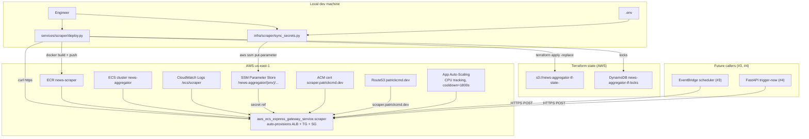

# Scraper Terraform Infrastructure — Design Spec

- **Date:** 2026-04-24
- **Status:** Approved for implementation planning
- **Owner:** Patrick Walukagga
- **Scope:** Terraform Infrastructure-as-Code to deploy `services/scraper` to AWS as an ECS Express Mode service. One-time state-backend bootstrap module (`infra/bootstrap/`) plus one scraper module (`infra/scraper/`). Sets conventions future sub-projects (#2 agents, #4 api, #5 frontend, #6 scheduler) will follow by adding their own `infra/<name>/` modules.

> **Convention set by this spec:** each deployable owns its own Terraform root module (`infra/<name>/`). Per-sub-project infra lands with the sub-project, not in a separate "#6 Infra" pass. Sub-project #6 no longer exists as "the infra sub-project"; it remains only as CI/CD pipeline work that the per-module Terraform doesn't cover.

---

## 1. Overview

Ships `infra/` directory structure with:

- `infra/bootstrap/` — one-time state-backend resources (S3 state bucket + DynamoDB lock table) using local state (chicken-and-egg).
- `infra/scraper/` — ECS Express Mode service for `services/scraper`, using the remote S3 backend.

Scraper runs as a single Fargate-backed ECS Express service behind a public HTTPS ALB at `scraper.patrickcmd.dev`, autoscaling on CPU with a 30-minute scale-in cooldown to protect long-running background ingest tasks.

Secrets live in SSM Parameter Store (SecureString) and are synced from `.env` via a helper script. `deploy.py --mode deploy` (stubbed in sub-project #1) becomes the real deploy orchestrator in this spec, building the image and then invoking `terraform apply -replace=aws_ecs_express_gateway_service.scraper` to roll the service to a new image tag.

This spec continues the work started on branch `sub-project#1` and does not create a new branch.

---

## 2. Scope

**In scope:**

- `infra/bootstrap/` Terraform root module (local state) provisioning:
  - S3 bucket `news-aggregator-tf-state-<account-id>` (versioned, encrypted, public-access-blocked)
  - DynamoDB table `news-aggregator-tf-locks` (PAY_PER_REQUEST, LockID PK)
- `infra/scraper/` Terraform root module (S3 remote state):
  - ECR repo + lifecycle policy (keep last 10 images)
  - ECS cluster `news-aggregator` (reused by future sub-projects)
  - CloudWatch log group (retention 14 days default, variable)
  - Three IAM roles: task execution, infrastructure, task
  - 8 SSM SecureString parameters for sensitive config
  - ACM certificate for `scraper.patrickcmd.dev`, DNS-validated via existing Route53 zone
  - Route53 records: validation CNAME + A-alias to ALB
  - `aws_ecs_express_gateway_service.scraper` — the service, HTTPS listener with ACM cert
  - `aws_appautoscaling_target` + `_policy.scraper_cpu` — CPU target-tracking, `scale_in_cooldown=1800`
- `infra/scraper/sync_secrets.py` — helper reading `.env` → `aws ssm put-parameter --overwrite`
- `services/scraper/deploy.py` — updated `cmd_deploy` to: build image → push to ECR → `terraform workspace select <env>` → `terraform apply -replace=... -var image_tag=<sha>` → smoke-test `/healthz`
- Root `Makefile` — new targets: `tf-bootstrap`, `tf-scraper-init`, `tf-scraper-plan`, `tf-scraper-apply`, `secrets-sync`
- `infra/README.md` — apply-order walkthrough and conventions
- `docs/ecs-express-bootstrap.md` — trimmed to reflect that Terraform now owns what was previously manual

**Out of scope:**

- Lambda / API Gateway / CloudFront / SES / EventBridge Terraform — owned by later sub-projects in their own `infra/<name>/` modules.
- CI pipeline (GitHub Actions running `terraform apply`) — deferred until multiple services need it.
- WAF / IP allowlist / VPN / bastion.
- NAT gateway / dedicated VPC — default VPC public subnets for now, `vpc_id`/`subnet_ids` parameterized for future swap.
- Secret value rotation.
- Observability/alarms dashboards (CloudWatch alarms, PagerDuty, etc.).

---

## 3. Architecture



### 3.1 Architectural decisions

| Decision | Choice | Rationale |
|---|---|---|
| Infra scope | Per-sub-project `infra/<name>/` modules | Sub-projects ship with their own infra; no separate "infra sub-project" |
| State backend | S3 + DynamoDB | Durable, team-safe, industry standard; one-time bootstrap |
| Bootstrap state | Local + gitignored | Chicken-and-egg; `terraform import` rescues if ever lost |
| Env separation | Terraform workspaces | Avoids `envs/<env>/` duplication; per-module per-workspace vars |
| Networking | Default VPC / default public subnets | Zero cost; `vpc_id`/`subnet_ids` parameterized for future swap |
| Secrets store | SSM Parameter Store (SecureString) | Essentially free vs Secrets Manager's $0.40/secret/mo; migration path to SM is trivial |
| Secret values | NOT in Terraform state | `aws_ssm_parameter.value="placeholder"` + `ignore_changes=[value]`; real values set via `sync_secrets.py` |
| Service resource | `aws_ecs_express_gateway_service` | Auto-provisions ALB + TG + SG; dramatic simplification vs classic ECS |
| Scaling | CPU target-tracking at 70%, `scale_in_cooldown=1800s` | Background task CPU activity prevents scale-to-zero mid-run |
| Min/max capacity | 0 / 2 | Per user choice — cost over warm-start reliability |
| Task size | 2048 CPU / 4096 MB | Headroom for Chromium + transcript concurrency |
| Public-facing | HTTPS on `scraper.patrickcmd.dev` | ACM cert + Route53 A-alias; existing zone |
| Deploy mechanism | `deploy.py` drives Terraform | Same script that builds image; matches sub-project #1 deploy.py stub |
| AWS auth | `AWS_PROFILE=aiengineer` (default) | Matches existing CLI setup |

---

## 4. Directory layout

```
infra/
├── README.md                          # apply-order walkthrough + conventions
├── bootstrap/                         # one-time state-backend creation
│   ├── main.tf
│   ├── variables.tf
│   ├── outputs.tf
│   ├── backend.tf                     # LOCAL STATE (gitignored terraform.tfstate)
│   ├── .terraform.lock.hcl
│   └── .gitignore                     # .terraform/, *.tfstate*, terraform.tfvars
│
└── scraper/                           # ECS Express service for services/scraper
    ├── main.tf
    ├── variables.tf
    ├── outputs.tf
    ├── backend.tf                     # S3 + DynamoDB backend
    ├── terraform.tfvars.example
    ├── sync_secrets.py                # reads .env -> aws ssm put-parameter
    ├── .terraform.lock.hcl
    └── .gitignore                     # .terraform/, *.tfstate*, terraform.tfvars
```

Future sub-projects will add:

```
infra/
├── agents/                            # #2 Digest/Editor/Email Lambda containers
├── scheduler/                         # #3 EventBridge + orchestration
├── api/                               # #4 FastAPI on Lambda + API Gateway
└── frontend/                          # #5 Next.js on S3/CloudFront
```

Each independently applied, each with its own remote-state key under the shared S3 bucket.

---

## 5. `infra/bootstrap/` — one-time state backend

### 5.1 Resources

```hcl
terraform {
  required_version = ">= 1.5"
  required_providers {
    aws = { source = "hashicorp/aws", version = "~> 5.80" }
  }
  # Deliberately NO backend block -> local state.
}

provider "aws" {
  region  = var.aws_region
  profile = var.aws_profile
}

data "aws_caller_identity" "current" {}

resource "aws_s3_bucket" "tf_state" {
  bucket = "news-aggregator-tf-state-${data.aws_caller_identity.current.account_id}"
}

resource "aws_s3_bucket_versioning" "tf_state" {
  bucket = aws_s3_bucket.tf_state.id
  versioning_configuration { status = "Enabled" }
}

resource "aws_s3_bucket_server_side_encryption_configuration" "tf_state" {
  bucket = aws_s3_bucket.tf_state.id
  rule {
    apply_server_side_encryption_by_default { sse_algorithm = "AES256" }
  }
}

resource "aws_s3_bucket_public_access_block" "tf_state" {
  bucket                  = aws_s3_bucket.tf_state.id
  block_public_acls       = true
  block_public_policy     = true
  ignore_public_acls      = true
  restrict_public_buckets = true
}

resource "aws_s3_bucket_lifecycle_configuration" "tf_state" {
  bucket = aws_s3_bucket.tf_state.id
  rule {
    id     = "expire-old-versions"
    status = "Enabled"
    noncurrent_version_expiration { noncurrent_days = 90 }
  }
}

resource "aws_dynamodb_table" "tf_lock" {
  name         = "news-aggregator-tf-locks"
  billing_mode = "PAY_PER_REQUEST"
  hash_key     = "LockID"
  attribute { name = "LockID", type = "S" }
}
```

### 5.2 Variables

```hcl
variable "aws_region"  { default = "us-east-1" }
variable "aws_profile" { default = "aiengineer" }
```

### 5.3 Outputs

```hcl
output "state_bucket_name" { value = aws_s3_bucket.tf_state.bucket }
output "lock_table_name"   { value = aws_dynamodb_table.tf_lock.name }
output "region"            { value = var.aws_region }
output "account_id"        { value = data.aws_caller_identity.current.account_id }
```

After the one-time apply, these outputs get pasted into `infra/scraper/backend.tf` and `terraform.tfvars`.

---

## 6. `infra/scraper/` — the scraper service

### 6.1 Backend + provider

```hcl
# backend.tf
terraform {
  required_version = ">= 1.5"
  required_providers {
    aws = { source = "hashicorp/aws", version = "~> 5.80" }
  }

  backend "s3" {
    # filled in via `-backend-config` at init time
    # bucket, dynamodb_table, key
    region  = "us-east-1"
    encrypt = true
  }
}

provider "aws" {
  region  = var.aws_region
  profile = var.aws_profile
}
```

Per-env separation via Terraform workspaces (`dev`, `prod`). Workspace name is read via `terraform.workspace` within `main.tf`.

### 6.2 Data sources

```hcl
data "aws_caller_identity" "current" {}
data "aws_region"           "current" {}

# Default VPC (parameterized override)
data "aws_vpc" "target" {
  default = var.vpc_id == null
  id      = var.vpc_id
}

data "aws_subnets" "target" {
  filter { name = "vpc-id"  values = [data.aws_vpc.target.id] }
  filter { name = "default-for-az" values = ["true"] }  # used when vpc_id == null
}

data "aws_route53_zone" "main" {
  name         = "${var.domain_name}."
  private_zone = false
}
```

### 6.3 Variables

```hcl
variable "aws_region"                 { default = "us-east-1" }
variable "aws_profile"                { default = "aiengineer" }
variable "domain_name"                { default = "patrickcmd.dev" }
variable "scraper_subdomain"          { default = "scraper" }
variable "cluster_name"               { default = "news-aggregator" }
variable "ecr_repo_name"              { default = "news-scraper" }
variable "image_tag"                  { default = "latest" }
variable "task_cpu"                   { default = 2048 }
variable "task_memory"                { default = 4096 }
variable "min_capacity"               { default = 0 }
variable "max_capacity"               { default = 2 }
variable "scale_in_cooldown_seconds"  { default = 1800 }
variable "log_retention_days"         { default = 14 }
variable "vpc_id"                     { default = null }
variable "subnet_ids"                 { default = null }
```

Prod workspace overrides `log_retention_days=30`, possibly `min_capacity=1`, via `terraform.tfvars` or `-var` flags.

### 6.4 Core resources

**ECR + lifecycle:**

```hcl
resource "aws_ecr_repository" "scraper" {
  name                 = var.ecr_repo_name
  image_tag_mutability = "MUTABLE"
  force_delete         = true
  image_scanning_configuration { scan_on_push = true }
}

resource "aws_ecr_lifecycle_policy" "scraper" {
  repository = aws_ecr_repository.scraper.name
  policy = jsonencode({
    rules = [{
      rulePriority = 1
      description  = "keep last 10 images"
      selection    = { tagStatus = "any", countType = "imageCountMoreThan", countNumber = 10 }
      action       = { type = "expire" }
    }]
  })
}
```

**Cluster + logs:**

```hcl
resource "aws_ecs_cluster" "main" {
  name = var.cluster_name
  setting { name = "containerInsights" value = "enabled" }
}

resource "aws_cloudwatch_log_group" "scraper" {
  name              = "/ecs/${var.ecr_repo_name}"
  retention_in_days = var.log_retention_days
}
```

**IAM — task execution role:**

```hcl
data "aws_iam_policy_document" "ecs_task_assume" {
  statement {
    actions = ["sts:AssumeRole"]
    principals { type = "Service" identifiers = ["ecs-tasks.amazonaws.com"] }
  }
}

resource "aws_iam_role" "task_execution" {
  name               = "scraper-task-execution-${terraform.workspace}"
  assume_role_policy = data.aws_iam_policy_document.ecs_task_assume.json
}

resource "aws_iam_role_policy_attachment" "task_execution_managed" {
  role       = aws_iam_role.task_execution.name
  policy_arn = "arn:aws:iam::aws:policy/service-role/AmazonECSTaskExecutionRolePolicy"
}

# SSM SecureString read access
data "aws_iam_policy_document" "task_execution_ssm" {
  statement {
    actions   = ["ssm:GetParameters"]
    resources = ["arn:aws:ssm:${data.aws_region.current.name}:${data.aws_caller_identity.current.account_id}:parameter/news-aggregator/${terraform.workspace}/*"]
  }
  statement {
    actions   = ["kms:Decrypt"]
    resources = ["arn:aws:kms:${data.aws_region.current.name}:${data.aws_caller_identity.current.account_id}:alias/aws/ssm"]
  }
}

resource "aws_iam_role_policy" "task_execution_ssm" {
  role   = aws_iam_role.task_execution.id
  policy = data.aws_iam_policy_document.task_execution_ssm.json
}
```

**IAM — infrastructure role:**

Exact policy name TBD at implementation time (AWS may provide a managed policy like `AWSECSInfrastructureRolePolicy`). If none exists, attach an inline policy granting ELB/EC2 SG operations per [the ECS Express docs](https://docs.aws.amazon.com/AmazonECS/latest/developerguide/express-service-overview.html).

```hcl
resource "aws_iam_role" "infrastructure" {
  name               = "scraper-infrastructure-${terraform.workspace}"
  assume_role_policy = data.aws_iam_policy_document.ecs_task_assume.json
}

# Managed policy OR inline policy per docs — decide at impl time
```

**IAM — task role:**

Empty for now. Future agents may need Bedrock/SES/SQS.

```hcl
resource "aws_iam_role" "task" {
  name               = "scraper-task-${terraform.workspace}"
  assume_role_policy = data.aws_iam_policy_document.ecs_task_assume.json
}
```

**SSM parameters (8 SecureString):**

```hcl
locals {
  sensitive_env = [
    "supabase_db_url",
    "supabase_pooler_url",
    "openai_api_key",
    "langfuse_public_key",
    "langfuse_secret_key",
    "youtube_proxy_username",
    "youtube_proxy_password",
    "resend_api_key",
  ]
}

resource "aws_ssm_parameter" "sensitive" {
  for_each = toset(local.sensitive_env)

  name  = "/news-aggregator/${terraform.workspace}/${each.value}"
  type  = "SecureString"
  value = "placeholder-set-via-sync-secrets"

  lifecycle { ignore_changes = [value] }
}
```

**ACM + Route53:**

```hcl
resource "aws_acm_certificate" "scraper" {
  domain_name       = "${var.scraper_subdomain}.${var.domain_name}"
  validation_method = "DNS"
  lifecycle { create_before_destroy = true }
}

resource "aws_route53_record" "scraper_validation" {
  for_each = {
    for dvo in aws_acm_certificate.scraper.domain_validation_options :
    dvo.domain_name => {
      name   = dvo.resource_record_name
      type   = dvo.resource_record_type
      record = dvo.resource_record_value
    }
  }
  zone_id = data.aws_route53_zone.main.zone_id
  name    = each.value.name
  type    = each.value.type
  ttl     = 60
  records = [each.value.record]
}

resource "aws_acm_certificate_validation" "scraper" {
  certificate_arn         = aws_acm_certificate.scraper.arn
  validation_record_fqdns = [for r in aws_route53_record.scraper_validation : r.fqdn]
}

resource "aws_route53_record" "scraper_alias" {
  zone_id = data.aws_route53_zone.main.zone_id
  name    = "${var.scraper_subdomain}.${var.domain_name}"
  type    = "A"
  alias {
    name                   = aws_ecs_express_gateway_service.scraper.alb_dns_name
    zone_id                = aws_ecs_express_gateway_service.scraper.alb_zone_id
    evaluate_target_health = true
  }
}
```

> Note: the `alb_dns_name` / `alb_zone_id` attribute names on `aws_ecs_express_gateway_service` will be verified against the provider version pinned at implementation time. If they don't exist yet, fall back to a data-source lookup by a tag applied to the Express service.

**The service:**

```hcl
resource "aws_ecs_express_gateway_service" "scraper" {
  service_name            = "scraper"
  cluster                 = aws_ecs_cluster.main.name
  execution_role_arn      = aws_iam_role.task_execution.arn
  infrastructure_role_arn = aws_iam_role.infrastructure.arn
  task_role_arn           = aws_iam_role.task.arn
  cpu                     = tostring(var.task_cpu)
  memory                  = tostring(var.task_memory)
  health_check_path       = "/healthz"
  wait_for_steady_state   = true

  primary_container {
    image          = "${aws_ecr_repository.scraper.repository_url}:${var.image_tag}"
    container_port = 8000

    aws_logs_configuration {
      log_group = aws_cloudwatch_log_group.scraper.name
    }

    # Non-sensitive config
    environment { name = "ENV"                            value = terraform.workspace }
    environment { name = "LOG_LEVEL"                      value = "INFO" }
    environment { name = "LOG_JSON"                       value = "true" }
    environment { name = "OPENAI_MODEL"                   value = "gpt-5.4-mini" }
    environment { name = "RSS_MCP_PATH"                   value = "/app/rss-mcp/dist/index.js" }
    environment { name = "WEB_SEARCH_MAX_TURNS"           value = "15" }
    environment { name = "WEB_SEARCH_SITE_TIMEOUT"        value = "120" }
    environment { name = "YOUTUBE_TRANSCRIPT_CONCURRENCY" value = "3" }
    environment { name = "RSS_FEED_CONCURRENCY"           value = "5" }
    environment { name = "WEB_SEARCH_SITE_CONCURRENCY"    value = "2" }
    environment { name = "YOUTUBE_PROXY_ENABLED"          value = "true" }
    environment { name = "LANGFUSE_HOST"                  value = "https://cloud.langfuse.com" }

    # Sensitive config (SSM SecureString refs)
    secret { name = "SUPABASE_DB_URL"        value_from = aws_ssm_parameter.sensitive["supabase_db_url"].arn }
    secret { name = "SUPABASE_POOLER_URL"    value_from = aws_ssm_parameter.sensitive["supabase_pooler_url"].arn }
    secret { name = "OPENAI_API_KEY"         value_from = aws_ssm_parameter.sensitive["openai_api_key"].arn }
    secret { name = "LANGFUSE_PUBLIC_KEY"    value_from = aws_ssm_parameter.sensitive["langfuse_public_key"].arn }
    secret { name = "LANGFUSE_SECRET_KEY"    value_from = aws_ssm_parameter.sensitive["langfuse_secret_key"].arn }
    secret { name = "YOUTUBE_PROXY_USERNAME" value_from = aws_ssm_parameter.sensitive["youtube_proxy_username"].arn }
    secret { name = "YOUTUBE_PROXY_PASSWORD" value_from = aws_ssm_parameter.sensitive["youtube_proxy_password"].arn }
    secret { name = "RESEND_API_KEY"         value_from = aws_ssm_parameter.sensitive["resend_api_key"].arn }
  }

  network_configuration {
    subnets         = coalesce(var.subnet_ids, data.aws_subnets.target.ids)
    security_groups = []
  }

  listener_configuration {
    protocol        = "HTTPS"
    certificate_arn = aws_acm_certificate_validation.scraper.certificate_arn
  }

  depends_on = [aws_ssm_parameter.sensitive]
}
```

**Auto-scaling:**

```hcl
resource "aws_appautoscaling_target" "scraper" {
  service_namespace  = "ecs"
  scalable_dimension = "ecs:service:DesiredCount"
  resource_id        = "service/${aws_ecs_cluster.main.name}/${aws_ecs_express_gateway_service.scraper.service_name}"
  min_capacity       = var.min_capacity
  max_capacity       = var.max_capacity
}

resource "aws_appautoscaling_policy" "scraper_cpu" {
  name               = "scraper-cpu-tracking-${terraform.workspace}"
  policy_type        = "TargetTrackingScaling"
  resource_id        = aws_appautoscaling_target.scraper.resource_id
  scalable_dimension = aws_appautoscaling_target.scraper.scalable_dimension
  service_namespace  = aws_appautoscaling_target.scraper.service_namespace

  target_tracking_scaling_policy_configuration {
    predefined_metric_specification {
      predefined_metric_type = "ECSServiceAverageCPUUtilization"
    }
    target_value       = 70.0
    scale_in_cooldown  = var.scale_in_cooldown_seconds
    scale_out_cooldown = 60
  }
}
```

### 6.5 Outputs

```hcl
output "scraper_url"    { value = "https://${var.scraper_subdomain}.${var.domain_name}" }
output "alb_dns_name"   { value = aws_ecs_express_gateway_service.scraper.alb_dns_name }
output "ecr_repo_url"   { value = aws_ecr_repository.scraper.repository_url }
output "log_group_name" { value = aws_cloudwatch_log_group.scraper.name }
```

---

## 7. `infra/scraper/sync_secrets.py`

A small Python helper. Reads root `.env` via `python-dotenv`, enumerates the expected SSM parameter names, calls `aws ssm put-parameter --overwrite --type SecureString` for each value found.

```python
# Shape (truncated; full in plan)
ENV_TO_PARAM = {
    "SUPABASE_DB_URL":        "supabase_db_url",
    "SUPABASE_POOLER_URL":    "supabase_pooler_url",
    "OPENAI_API_KEY":         "openai_api_key",
    "LANGFUSE_PUBLIC_KEY":    "langfuse_public_key",
    "LANGFUSE_SECRET_KEY":    "langfuse_secret_key",
    "YOUTUBE_PROXY_USERNAME": "youtube_proxy_username",
    "YOUTUBE_PROXY_PASSWORD": "youtube_proxy_password",
    "RESEND_API_KEY":         "resend_api_key",
}

def main():
    args = parse_args()  # --env dev|prod
    load_dotenv(find_dotenv())
    session = boto3.Session(profile_name=os.environ.get("AWS_PROFILE", "aiengineer"))
    ssm = session.client("ssm")
    for env_key, param_suffix in ENV_TO_PARAM.items():
        value = os.environ.get(env_key)
        if not value:
            print(f"skip {env_key} (not set in .env)")
            continue
        name = f"/news-aggregator/{args.env}/{param_suffix}"
        ssm.put_parameter(Name=name, Value=value, Type="SecureString", Overwrite=True)
        print(f"pushed {name}")
```

---

## 8. `services/scraper/deploy.py` — updated

`cmd_deploy` becomes real. Workflow:

1. `cmd_build()` — existing (build + push image).
2. `terraform workspace select <env>` (creates if missing via `-or-create` flag in newer TF versions; fallback: `workspace new` + swallow-already-exists).
3. `terraform apply -auto-approve -var image_tag=<sha> -replace=aws_ecs_express_gateway_service.scraper`.
4. `_smoke_healthz("https://scraper.patrickcmd.dev/healthz")` — HTTP GET, assert 200 + `git_sha` matches.

Returns 0 on success, non-zero on any step failure. Profile resolution stays at `AWS_PROFILE=aiengineer`.

---

## 9. Apply order + Makefile targets

### 9.1 One-time setup

```sh
cd infra/bootstrap
terraform init
terraform apply
# record outputs: state_bucket_name, lock_table_name, account_id
```

### 9.2 First-time scraper apply (per env)

```sh
cd infra/scraper
cp terraform.tfvars.example terraform.tfvars     # if present
terraform init \
  -backend-config="bucket=news-aggregator-tf-state-<account>" \
  -backend-config="dynamodb_table=news-aggregator-tf-locks" \
  -backend-config="key=scraper/terraform.tfstate"
terraform workspace new dev
terraform apply
make secrets-sync ENV=dev
```

### 9.3 Makefile additions

```makefile
# ---------- infra ----------

tf-bootstrap:           ## One-time state-backend bootstrap
	cd infra/bootstrap && terraform init && terraform apply

tf-scraper-init:        ## Initialize scraper Terraform (first time or after backend change)
	cd infra/scraper && terraform init

tf-scraper-plan:        ## Show scraper Terraform plan
	cd infra/scraper && terraform plan

tf-scraper-apply:       ## Apply scraper Terraform
	cd infra/scraper && terraform apply

secrets-sync:           ## Push .env secrets into SSM (requires ENV=dev|prod)
	@test -n "$(ENV)" || (echo "ENV required" && exit 1)
	uv run python infra/scraper/sync_secrets.py --env $(ENV)
```

`scraper-deploy` target in the Makefile remains pointed at `services/scraper/deploy.py --mode deploy --env dev` — `deploy.py` handles workspace selection internally.

---

## 10. Docs updates

- **Create** `infra/README.md` — apply-order walkthrough + conventions.
- **Trim** `docs/ecs-express-bootstrap.md` — remove manual IAM + console-based service creation, retain only ACM cert / Route53 zone prerequisites (if any).
- **Update** root `README.md` — add "Deploying" section.

---

## 11. Non-goals

- No Lambda / API Gateway / CloudFront / SES / EventBridge Terraform (owned by later sub-projects).
- No CI pipeline running `terraform apply` (manual via `deploy.py`/`make` for now).
- No Atlantis / Terragrunt / tfswitch.
- No auto-rotation of SSM secrets.
- No WAF / IP allowlist (public HTTPS + scoped IAM on callers is the line of defense).
- No NAT gateway / dedicated VPC.
- No CloudWatch alarms / PagerDuty.
- No cross-region / cross-account anything.

---

## 12. Risks

| Risk | Mitigation |
|---|---|
| `aws_ecs_express_gateway_service` is new; attribute names may change pre-1.0 | Pin AWS provider `~> 5.80` or higher as-verified; bump deliberately. Attribute names (`alb_dns_name`) verified at implementation time; fallback uses `aws_lb` data-source lookup by service tag. |
| Bootstrap state lost → can't recreate the S3 bucket Terraform already owns | Document `terraform import aws_s3_bucket.tf_state <bucket>` in `infra/README.md` |
| Scale-to-zero kills long `/ingest` mid-run | CPU target-tracking (background work keeps CPU high) + `scale_in_cooldown=1800s`; revisit in #3 if pipelines genuinely exceed 30-min cooldown |
| `aws_ssm_parameter.value="placeholder"` visible in state | State bucket is encrypted + private. Real values never in state because `sync_secrets.py` bypasses Terraform. |
| ACM DNS validation delay | `aws_acm_certificate_validation` waits up to 75 min; usually <5 min. |
| `infrastructure_role_arn` is immutable | If we need to change it, Terraform destroys+recreates the service (brief outage). Accept for now. |
| Default VPC removed / changed by user | `vpc_id`/`subnet_ids` are variables; override to the correct IDs. |
| Empty `task_role` drifts as agents/#2/#4 need AWS perms | Amend when those sub-projects ship; this spec explicitly leaves it empty. |
| Deploying from dev laptop with poor upload bandwidth | Acceptable for #1 dev. CI-based deploys deferred. |

---

## 13. Implementation phasing (preview)

The implementation plan will break this into ~6 phases:

1. **`infra/bootstrap/`** — S3 bucket, DynamoDB table, outputs, README. Apply once. Manual verification: `aws s3 ls` + `aws dynamodb list-tables`.
2. **`infra/scraper/` backend + variables + data sources** — init with `-backend-config`, create `dev` workspace. Plan shows zero resources.
3. **`infra/scraper/` ECR + cluster + log group + IAM roles + SSM** — apply. Verify: `aws ecr describe-repositories`, `aws iam get-role`, `aws ssm describe-parameters`.
4. **`infra/scraper/` ACM + Route53 records** — apply. Verify cert issued (`aws acm describe-certificate`), validation CNAME resolves.
5. **`infra/scraper/` service + auto-scaling** — apply with `image_tag=latest`. Push a `:latest` image first via `make scraper-deploy-build`. Verify `curl https://scraper.patrickcmd.dev/healthz` returns 200.
6. **`sync_secrets.py` + `deploy.py` deploy-mode + Makefile + docs** — end-to-end smoke: push a new SHA, run `make scraper-deploy`, verify `/healthz.git_sha` updates.

Tagging: `ingestion-v0.2.1` (patch bump; sub-project #1 still owns the scraper, now shippable to ECS).
