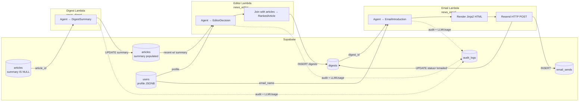

# Agents (Sub-project #2) — Design Spec

- **Date:** 2026-04-25
- **Status:** Approved for implementation planning
- **Owner:** Patrick Walukagga
- **Scope:** Three independent Lambda containers — Digest (per-article summarization), Editor (per-user ranking), Email (personalized intro + Resend send) — plus per-agent Terraform modules and an extension to `infra/bootstrap/` for a shared Lambda artifact bucket.

> **Convention reuse:** This sub-project builds on patterns established in #1 (Foundation packages, per-sub-project Terraform, AWS profile, IAM groups, `news_observability` audit/cost/sanitizer/validators, `news_schemas` cross-package contracts). It does **not** revisit those decisions.

---

## 1. Overview

Three OpenAI Agents SDK-driven Lambda functions, each with a single responsibility:

1. **Digest** — invoked per article ID; reads the article, calls an LLM via Agents SDK with structured output (`DigestSummary`), updates `articles.summary`. Idempotent (skips if summary already populated).

2. **Editor** — invoked per user ID + lookback window; reads `users.profile` JSONB and the recent articles with summaries (top 100 by recency), calls an LLM with the user-profile-driven system prompt, gets back rankings (`EditorDecision`), post-processes to top-10 `RankedArticle` list, writes a `digests` row.

3. **Email** — invoked per digest ID; loads digest + user, calls an LLM to generate a personalized intro (`EmailIntroduction`), renders a Jinja2 HTML template, sends via Resend HTTP API, records `email_sends`, marks `digests.status='emailed'`. Idempotent (won't re-send if `status='sent'` row exists).

All three run as **Lambda zip artifacts in S3** (`package_type = "Zip"`), packaged via `package_docker.py` (uses `public.ecr.aws/lambda/python:3.12` base image for `linux/amd64` manylinux wheels).

All three use **OpenAI Agents SDK with the Chat Completions backend** (`OpenAIChatCompletionsModel`), not the Responses API.

This spec deliberately leaves orchestration (EventBridge fan-out, retry queues, multi-user scheduling) to sub-project #3. #2 ships standalone Lambda functions with clean per-invocation contracts that #3 will wire together.

---

## 2. Sub-project boundary

**In scope:**

- `services/agents/{digest,editor,email}/` — three workspace packages, each with `package_docker.py`, `lambda_handler.py`, `deploy.py`, `src/news_<agent>/`, local Typer CLI, unit tests, live tests
- `infra/{digest,editor,email}/` — three Terraform modules (Lambda function, IAM role, log group, env vars)
- Extension to `infra/bootstrap/` — adds `news-aggregator-lambda-artifacts-<account>` S3 bucket
- New Pydantic LLM-side schemas: `DigestSummary`, `EditorDecision`, `ArticleRanking`, `EmailIntroduction` in `news_schemas/agent_io.py`
- New repository methods: `ArticleRepository.get_unsummarized`, `update_summary`, `get_recent_with_summaries`; `EmailSendRepository.get_sent_for_digest`
- `news_email/resend_client.py` — async httpx wrapper around Resend HTTP API (per the email-agent reference)
- `news_email/templates/digest.html.j2` — Jinja2 HTML email template
- `make agents-*` Makefile targets — local invoke, build, deploy, invoke-live, logs

**Out of scope:**

- EventBridge / SQS / Step Functions wiring — owned by #3
- "Trigger my digest now" API endpoint — owned by #4
- Multi-user fan-out — runs for the seed dev user; #3 generalizes
- HTML email A/B testing, click tracking, unsubscribe flow
- Email retry on transient failure (record `failed` only; #3 manages DLQ)
- Translation / per-language emails (English only)

---

## 3. Architecture



### 3.1 Architectural decisions

| Decision | Choice | Rationale |
|---|---|---|
| Number of Lambdas | 3 (one per agent) | Independent IAM, independent rollouts, clean blast-radius |
| Runtime | Lambda zip + S3 (`package_type="Zip"`) | Smaller artifact than ECR images, simpler deploy mechanics, no per-Lambda ECR repo |
| Packaging | `package_docker.py` per agent (mirrors `alex-multi-agent-saas/backend/reporter/package_docker.py`) | Builds in `public.ecr.aws/lambda/python:3.12` for amd64 wheels |
| LLM SDK | OpenAI Agents SDK with `OpenAIChatCompletionsModel` | Same SDK surface as #1; Chat Completions backend per user direction |
| Output validation | `output_type=PydanticModel` (no `HttpUrl`/`EmailStr` per memory `openai_structured_outputs_format`) | Reuse Foundation `validate_structured_output` |
| Cost tracking | `news_observability.costs.extract_usage` after every `Runner.run` | Foundation invariant; metadata in audit_logs |
| Per-agent idempotency | Digest skips on `summary IS NOT NULL`; Email skips on existing sent row; Editor not idempotent (each run is a snapshot) | Cheapest correct semantics |
| Editor candidate selection | Top 100 by recency where `summary IS NOT NULL` | Caps prompt size; relies on Digest agent having run first |
| Editor LLM output | IDs + scores + reasoning only — no titles/URLs (post-join via DB) | Saves tokens; prevents URL hallucination |
| Email composition | Composer + deterministic send (Pattern X) | Testable, debuggable, decouples LLM from Resend; HTML doesn't need an LLM |
| Resend wrapper | `services/agents/email/src/news_email/resend_client.py` (Z3) | Email-local; YAGNI on shared `packages/email/` until #4 needs it |
| Lambda secrets | SSM `GetParameter` at cold start (L1), cached for warm invocations | Reuses #1's SSM tree; no extra layer; ~200ms cold-start overhead is acceptable |
| Artifact storage | One S3 bucket `news-aggregator-lambda-artifacts-<account>`, created by `infra/bootstrap/` | Reusable across agents and future Lambdas |

---

## 4. Repo layout

### 4.1 `services/agents/` — three workspace packages

```
services/agents/
├── digest/
│   ├── pyproject.toml                  # workspace member: news_digest
│   ├── package_docker.py               # build → dist/news_digest.zip
│   ├── deploy.py                       # build → S3 upload → terraform apply
│   ├── lambda_handler.py               # async def handler(event, context)
│   └── src/news_digest/
│       ├── __init__.py
│       ├── __main__.py                 # python -m news_digest <subcommand>
│       ├── settings.py                 # DigestSettings (model, max_content_chars=8000)
│       ├── agent.py                    # build_agent() → Agent[DigestSummary]
│       ├── pipeline.py                 # async summarize_article(article_id) → DigestSummary | None
│       ├── cli.py                      # Typer: summarize, sweep
│       └── tests/
│           ├── unit/
│           │   ├── test_agent.py       # mocked Runner.run
│           │   ├── test_pipeline.py    # mocked agent + repo
│           │   └── test_cli.py
│           └── live/
│               └── test_digest_live.py # real OpenAI + real Supabase
│
├── editor/                             # same shape: news_editor
│   ├── pyproject.toml
│   ├── package_docker.py
│   ├── deploy.py
│   ├── lambda_handler.py
│   └── src/news_editor/
│       ├── settings.py                 # EditorSettings (model, candidate_limit=100)
│       ├── agent.py                    # build_agent(profile_dict) → Agent[EditorDecision]
│       ├── prompts.py                  # build_system_prompt(profile) — extracted for snapshot tests
│       ├── pipeline.py                 # async rank_for_user(user_id, lookback_hours, limit) → digest_id
│       ├── cli.py                      # Typer: rank
│       └── tests/{unit,live}/
│
└── email/                              # news_email
    ├── pyproject.toml
    ├── package_docker.py
    ├── deploy.py
    ├── lambda_handler.py
    └── src/news_email/
        ├── settings.py                 # EmailSettings (model, mail_from, mail_to_default)
        ├── agent.py                    # build_agent() → Agent[EmailIntroduction]
        ├── pipeline.py                 # async send_digest_email(digest_id) → email_send_id
        ├── resend_client.py            # async send_via_resend(to, subject, html, text)
        ├── render.py                   # render_digest_html(intro, ranked_articles, themes) → str
        ├── templates/
        │   └── digest.html.j2          # Jinja2 template
        ├── cli.py                      # Typer: send, preview
        └── tests/{unit,live}/
```

### 4.2 `infra/` — per-agent Terraform + bootstrap extension

```
infra/
├── bootstrap/
│   └── main.tf                         # EXTEND: + aws_s3_bucket.lambda_artifacts
├── digest/
│   ├── main.tf                         # aws_lambda_function (Zip, S3-hosted)
│   ├── variables.tf                    # zip_s3_key, zip_sha256, image_tag (unused), task_memory
│   ├── outputs.tf                      # function_arn, function_name
│   ├── data.tf                         # remote_state for bootstrap bucket name
│   ├── backend.tf                      # S3 backend, key=digest/terraform.tfstate
│   ├── service.sh                      # invoke/logs helper
│   └── terraform.tfvars.example
├── editor/                             # same shape
└── email/                              # same shape
```

### 4.3 Additions to existing packages

| Package | Addition |
|---|---|
| `packages/db/repositories/article_repo.py` | `get_unsummarized(hours, limit)`, `update_summary(article_id, summary)`, `get_recent_with_summaries(hours, limit)` |
| `packages/db/repositories/email_send_repo.py` | `get_sent_for_digest(digest_id) -> EmailSendOut \| None` |
| `packages/db/repositories/digest_repo.py` | (already has `create`/`update_status`/`get_by_id` — verify no additions needed) |
| `packages/schemas/news_schemas/agent_io.py` | NEW: `DigestSummary`, `ArticleRanking`, `EditorDecision`, `EmailIntroduction` |
| `packages/config/settings.py` | NEW: `MailSettings(mail_from, mail_to_default, sender_name)` |
| Root `pyproject.toml` | 3 new workspace members under `services/agents/{digest,editor,email}` |
| `mypy.ini` | Extend `mypy_path` to include the 3 new agent `src/` dirs |
| `.pre-commit-config.yaml` | Extend mypy `files:` regex to include the 3 new src dirs |
| `Makefile` | New targets per agent (Section 7) |

---

## 5. Per-agent details

### 5.1 Digest agent

**LLM output schema** (`news_schemas.agent_io`):

```python
class DigestSummary(BaseModel):
    model_config = ConfigDict(extra="forbid")

    summary: str = Field(..., min_length=50, max_length=500)
    key_takeaways: list[str] = Field(default_factory=list, max_length=5)
```

**System prompt** (full text in `services/agents/digest/src/news_digest/agent.py`):

> You are an expert AI news analyst and summarizer. Your role is to create concise, engaging digest summaries of AI-related content (YouTube videos, blog posts, articles).
>
> Your task:
> 1. Write a 2-3 sentence summary (50-500 chars) highlighting the key points, why it's significant, and practical impact.
> 2. List 0-5 key takeaways, one short phrase each.
>
> Focus on technical accuracy, key insights, actionable takeaways. Avoid marketing fluff or hype.

**User prompt template:**

```
Article source: {source_type} — {source_name}
Original title: {title}
URL: {url}

CONTENT:
{content}      # truncated to max_content_chars (default 8000)
```

**Skip logic:** before LLM call, fetch the article. If `article.summary is not None`, return `{"article_id": id, "skipped": true}` immediately. No LLM call, no audit row.

**Pipeline shape:**

```python
async def summarize_article(article_id: int) -> dict:
    async with session_factory() as session:
        article_repo = ArticleRepository(session)
        audit_repo = AuditLogRepository(session)
        audit_logger = AuditLogger(audit_repo.insert)

        article = await article_repo.get_by_id(article_id)
        if article is None:
            return {"article_id": article_id, "error": "not found"}
        if article.summary is not None:
            return {"article_id": article_id, "skipped": True}
        if not article.content_text:
            return {"article_id": article_id, "skipped": True, "reason": "no content_text"}

        agent = build_agent(model=settings.openai.model)
        prompt = build_user_prompt(article, max_chars=settings.max_content_chars)

        with trace(f"digest.{article_id}"):
            t0 = perf_counter()
            result = await Runner.run(agent, input=prompt)
            elapsed_ms = int((perf_counter() - t0) * 1000)
        digest = validate_structured_output(DigestSummary, result.final_output)
        usage = extract_usage(result, model=settings.openai.model)

        await article_repo.update_summary(article_id, digest.summary)
        await audit_logger.log_decision(
            agent_name=AgentName.DIGEST_AGENT,
            user_id=None,
            decision_type=DecisionType.SUMMARY,
            input_text=f"article {article_id}: {article.title}",
            output_text=digest.summary,
            metadata={
                "article_id": article_id,
                "key_takeaways": digest.key_takeaways,
                "model": usage.model,
                "input_tokens": usage.input_tokens,
                "output_tokens": usage.output_tokens,
                "total_tokens": usage.total_tokens,
                "estimated_cost_usd": usage.estimated_cost_usd,
                "duration_ms": elapsed_ms,
            },
        )
        return {"article_id": article_id, "summary": digest.summary, "skipped": False}
```

### 5.2 Editor agent

**LLM output schema:**

```python
class ArticleRanking(BaseModel):
    model_config = ConfigDict(extra="forbid")

    article_id: int
    score: int = Field(..., ge=0, le=100)
    why_ranked: str = Field(..., min_length=10, max_length=300)
    key_topics: list[str] = Field(default_factory=list, max_length=5)


class EditorDecision(BaseModel):
    model_config = ConfigDict(extra="forbid")

    rankings: list[ArticleRanking] = Field(..., max_length=100)
    top_themes: list[str] = Field(default_factory=list, max_length=10)
    overall_summary: str = Field(default="", max_length=600)
```

**Prompt building** (`prompts.py`):

```python
def build_system_prompt(profile: UserProfile, identity: dict[str, str]) -> str:
    """Render the editor system prompt embedding the user's profile."""
    # Mirrors the structure in the reference editor_agent.py — embeds:
    #   - background, primary/secondary interests, specific_topics
    #   - content preferences (preferred + avoid)
    #   - goals
    # plus the 0-100 scoring rubric
```

**Pipeline shape:**

```python
async def rank_for_user(user_id: UUID, lookback_hours: int = 24, limit: int = 100) -> int:
    async with session_factory() as session:
        article_repo = ArticleRepository(session)
        user_repo = UserRepository(session)
        digest_repo = DigestRepository(session)
        audit_logger = AuditLogger(AuditLogRepository(session).insert)

        user = await user_repo.get_by_id(user_id)
        if user is None:
            raise ValueError(f"user {user_id} not found")
        candidates = await article_repo.get_recent_with_summaries(
            hours=lookback_hours, limit=limit
        )

        if not candidates:
            digest = await digest_repo.create(DigestIn(
                user_id=user_id,
                period_start=datetime.now(UTC) - timedelta(hours=lookback_hours),
                period_end=datetime.now(UTC),
                ranked_articles=[],
                article_count=0,
                status=DigestStatus.FAILED,
                error_message="no candidates",
            ))
            return digest.id

        agent = build_agent(profile=user.profile, identity=user.identity, model=settings.openai.model)
        prompt = build_candidate_prompt(candidates)

        with trace(f"editor.user.{user_id}"):
            t0 = perf_counter()
            result = await Runner.run(agent, input=prompt)
            elapsed_ms = int((perf_counter() - t0) * 1000)
        decision = validate_structured_output(EditorDecision, result.final_output)
        usage = extract_usage(result, model=settings.openai.model)

        # Filter rankings to known article IDs, then top-10 by score
        articles_by_id = {a.id: a for a in candidates}
        valid_rankings = [r for r in decision.rankings if r.article_id in articles_by_id]
        if len(valid_rankings) < len(decision.rankings):
            _log.warning("dropped {} hallucinated article_ids",
                         len(decision.rankings) - len(valid_rankings))
        top10 = sorted(valid_rankings, key=lambda r: r.score, reverse=True)[:10]
        ranked = [
            RankedArticle(
                article_id=r.article_id, score=r.score,
                title=articles_by_id[r.article_id].title,
                url=articles_by_id[r.article_id].url,
                summary=articles_by_id[r.article_id].summary or "",
                why_ranked=r.why_ranked,
            ) for r in top10
        ]

        digest = await digest_repo.create(DigestIn(
            user_id=user_id,
            period_start=datetime.now(UTC) - timedelta(hours=lookback_hours),
            period_end=datetime.now(UTC),
            ranked_articles=ranked,
            top_themes=decision.top_themes,
            article_count=len(candidates),
            status=DigestStatus.GENERATED,
        ))
        await audit_logger.log_decision(
            agent_name=AgentName.EDITOR_AGENT,
            user_id=user_id,
            decision_type=DecisionType.RANK,
            input_text=f"user {user_id}: ranking {len(candidates)} candidates",
            output_text=f"top pick art {top10[0].article_id if top10 else None}; themes {decision.top_themes}",
            metadata={
                "user_id": str(user_id), "candidate_count": len(candidates),
                "top_pick_id": top10[0].article_id if top10 else None,
                "top_themes": decision.top_themes,
                "model": usage.model, "input_tokens": usage.input_tokens,
                "output_tokens": usage.output_tokens, "total_tokens": usage.total_tokens,
                "estimated_cost_usd": usage.estimated_cost_usd, "duration_ms": elapsed_ms,
            },
        )
        return digest.id
```

### 5.3 Email agent

**LLM output schema:**

```python
class EmailIntroduction(BaseModel):
    model_config = ConfigDict(extra="forbid")

    greeting: str = Field(..., min_length=5, max_length=100)
    introduction: str = Field(..., min_length=20, max_length=600)
    highlight: str = Field(..., min_length=10, max_length=300)
    subject_line: str = Field(..., min_length=5, max_length=120)
```

**HTML template** (`templates/digest.html.j2` — minimal viable):

```html
<!doctype html>
<html>
  <body style="font-family: sans-serif; max-width: 640px; margin: 0 auto;">
    <h1>{{ greeting }}</h1>
    <p>{{ introduction }}</p>
    <p><strong>{{ highlight }}</strong></p>
    <hr>
    <h2>Today's top stories</h2>
    
      <article style="margin-bottom: 1.5em;">
        <h3 style="margin-bottom: 0.25em;">
          <a href="{{ article.url }}">{{ article.title }}</a>
        </h3>
        <p>{{ article.summary }}</p>
        <p><em>Why it matters: {{ article.why_ranked }}</em></p>
        <small>Score: {{ article.score }}/100</small>
      </article>
    
    <hr>
    <small>Themes: {{ top_themes | join(", ") }}</small>
  </body>
</html>
```

**Resend client** (`resend_client.py`):

```python
RESEND_API_URL = "https://api.resend.com/emails"
RESEND_REQUEST_TIMEOUT = 10.0


async def send_via_resend(
    *, to: str, subject: str, html: str, text: str | None = None
) -> dict:
    """POST to Resend; returns response JSON ({id, ...}). Raises on non-2xx."""
    payload: dict[str, object] = {
        "from": f"{settings.sender_name} <{settings.mail_from}>",
        "to": [to],
        "subject": subject,
        "html": html,
    }
    if text:
        payload["text"] = text

    async with httpx.AsyncClient(timeout=RESEND_REQUEST_TIMEOUT) as client:
        resp = await client.post(
            RESEND_API_URL,
            json=payload,
            headers={"Authorization": f"Bearer {settings.resend_api_key}"},
        )
    if resp.status_code == 401:
        raise RuntimeError("Resend authentication failed")
    if resp.status_code == 422:
        raise RuntimeError(f"Resend validation error: {resp.text}")
    if resp.status_code == 429:
        raise RuntimeError("Resend rate limit exceeded (free: 100/day)")
    resp.raise_for_status()
    return resp.json()
```

Wrapped with `@retry_transient` for 5xx/timeouts (Foundation pattern).

**Pipeline shape (high level):**

```python
async def send_digest_email(digest_id: int) -> int:
    async with session_factory() as session:
        # ... load digest + user
        # idempotency: skip if email_sends WHERE digest_id=X AND status='sent' exists
        existing = await email_send_repo.get_sent_for_digest(digest_id)
        if existing:
            return existing.id

        agent = build_agent(model=settings.openai.model)
        prompt = build_email_prompt(user, digest)
        result = await Runner.run(agent, input=prompt)
        intro = validate_structured_output(EmailIntroduction, result.final_output)
        usage = extract_usage(result, model=settings.openai.model)

        html = render_digest_html(intro, digest.ranked_articles, digest.top_themes)
        send_in = await email_send_repo.create(EmailSendIn(
            user_id=user.id, digest_id=digest_id,
            to_address=user.email, subject=intro.subject_line,
            status=EmailSendStatus.PENDING,
        ))
        try:
            resp = await send_via_resend(
                to=user.email, subject=intro.subject_line, html=html
            )
            await email_send_repo.mark_sent(send_in.id, provider_message_id=resp["id"])
            await digest_repo.update_status(digest_id, DigestStatus.EMAILED)
        except Exception as exc:
            await email_send_repo.mark_failed(send_in.id, error=str(exc))
            raise

        await audit_logger.log_decision(
            agent_name=AgentName.EMAIL_AGENT, user_id=user.id,
            decision_type=DecisionType.INTRO,
            input_text=f"digest {digest_id} for {user.email_name}",
            output_text=intro.introduction,
            metadata={
                "digest_id": digest_id, "email_send_id": send_in.id,
                "provider_message_id": resp.get("id"),
                "subject": intro.subject_line, "model": usage.model,
                **usage.as_dict(),
                "duration_ms": elapsed_ms,
            },
        )
        return send_in.id
```

---

## 6. Lambda packaging + Terraform

### 6.1 `package_docker.py` per agent

Mirrors `alex-multi-agent-saas/backend/reporter/package_docker.py`. Uses `public.ecr.aws/lambda/python:3.12` to install requirements + workspace-local packages, then zips. Output: `dist/news_<agent>.zip`. Always builds `--platform linux/amd64`.

### 6.2 `deploy.py` per agent

```sh
uv run python services/agents/digest/deploy.py --mode build      # build zip + upload to S3
uv run python services/agents/digest/deploy.py --mode deploy --env dev  # build + terraform apply
```

`build` mode: runs `package_docker.py`, computes `sha256(zip)`, uploads to `s3://<artifact-bucket>/digest/<git-sha>.zip`. Stores upload metadata for terraform consumption.

`deploy` mode: runs `build`, then `terraform workspace select <env>` + `terraform apply -auto-approve -var=zip_s3_key=digest/<sha>.zip -var=zip_sha256=<sha256>`. Per-workspace function name (`news-digest-dev`/`news-digest-prod`).

### 6.3 Terraform per-agent shape

```hcl
data "terraform_remote_state" "bootstrap" {
  backend = "s3"
  config = {
    bucket  = "news-aggregator-tf-state-${data.aws_caller_identity.current.account_id}"
    key     = "bootstrap/terraform.tfstate"
    region  = "us-east-1"
    profile = "aiengineer"
  }
}

resource "aws_iam_role" "lambda_exec" {
  name = "news-digest-${terraform.workspace}"
  assume_role_policy = jsonencode({
    Version = "2012-10-17"
    Statement = [{
      Effect    = "Allow"
      Principal = { Service = "lambda.amazonaws.com" }
      Action    = "sts:AssumeRole"
    }]
  })
}

resource "aws_iam_role_policy_attachment" "lambda_basic" {
  role       = aws_iam_role.lambda_exec.name
  policy_arn = "arn:aws:iam::aws:policy/service-role/AWSLambdaBasicExecutionRole"
}

resource "aws_iam_role_policy" "ssm_read" {
  role = aws_iam_role.lambda_exec.id
  policy = jsonencode({
    Version = "2012-10-17"
    Statement = [
      {
        Effect = "Allow"
        Action = ["ssm:GetParameter", "ssm:GetParameters", "ssm:GetParametersByPath"]
        Resource = "arn:aws:ssm:${data.aws_region.current.region}:${data.aws_caller_identity.current.account_id}:parameter/news-aggregator/${terraform.workspace}/*"
      },
      {
        Effect = "Allow"
        Action = "kms:Decrypt"
        Resource = "arn:aws:kms:${data.aws_region.current.region}:${data.aws_caller_identity.current.account_id}:alias/aws/ssm"
      },
    ]
  })
}

resource "aws_cloudwatch_log_group" "digest" {
  name              = "/aws/lambda/news-digest-${terraform.workspace}"
  retention_in_days = 14
}

resource "aws_lambda_function" "digest" {
  function_name    = "news-digest-${terraform.workspace}"
  role             = aws_iam_role.lambda_exec.arn
  package_type     = "Zip"
  runtime          = "python3.12"
  handler          = "lambda_handler.handler"
  s3_bucket        = data.terraform_remote_state.bootstrap.outputs.lambda_artifacts_bucket
  s3_key           = var.zip_s3_key
  source_code_hash = var.zip_sha256
  timeout          = 60
  memory_size      = 1024
  architectures    = ["x86_64"]

  environment {
    variables = {
      ENV                  = terraform.workspace
      LOG_LEVEL            = "INFO"
      LOG_JSON             = "true"
      OPENAI_MODEL         = "gpt-5.4-mini"
      SSM_PARAM_PREFIX     = "/news-aggregator/${terraform.workspace}"
      LANGFUSE_HOST        = "https://cloud.langfuse.com"
    }
  }

  logging_config {
    log_format = "JSON"
    log_group  = aws_cloudwatch_log_group.digest.name
  }
}
```

Editor variant: `timeout=300`, `memory_size=2048`. Email variant: `timeout=120`, `memory_size=1024`, plus extra env: `MAIL_FROM`, `SENDER_NAME`, `MAIL_TO_DEFAULT`.

### 6.4 SSM secrets — read from Lambda

Lambdas don't have ECS Express's native `secret { value_from = arn }` injection. We add a lightweight `news_config.lambda_settings` helper:

```python
def load_settings_from_ssm(prefix: str = "/news-aggregator/dev") -> dict[str, str]:
    """Read all SecureString params under prefix into env vars at cold start."""
    if not os.environ.get("SUPABASE_DB_URL"):
        ssm = boto3.client("ssm")
        resp = ssm.get_parameters_by_path(
            Path=prefix, WithDecryption=True, Recursive=True
        )
        for p in resp["Parameters"]:
            key = p["Name"].rsplit("/", 1)[-1].upper()
            os.environ.setdefault(key, p["Value"])
```

Called once at module import. ~200 ms on cold start, then cached for warm container lifetime. The SSM tree is the same one #1 already populated — no new params needed except `MAIL_FROM` (added to Email agent's SSM list) and `MAIL_TO_DEFAULT` (plain env var; not a secret).

### 6.5 Bootstrap module extension

```hcl
# infra/bootstrap/main.tf — ADD:

resource "aws_s3_bucket" "lambda_artifacts" {
  bucket = "news-aggregator-lambda-artifacts-${data.aws_caller_identity.current.account_id}"
  tags   = { Project = "news-aggregator", Purpose = "lambda-artifacts" }
}

resource "aws_s3_bucket_versioning" "lambda_artifacts" {
  bucket = aws_s3_bucket.lambda_artifacts.id
  versioning_configuration { status = "Enabled" }
}

resource "aws_s3_bucket_server_side_encryption_configuration" "lambda_artifacts" {
  bucket = aws_s3_bucket.lambda_artifacts.id
  rule {
    apply_server_side_encryption_by_default { sse_algorithm = "AES256" }
  }
}

resource "aws_s3_bucket_lifecycle_configuration" "lambda_artifacts" {
  bucket = aws_s3_bucket.lambda_artifacts.id
  rule {
    id     = "expire-old-artifacts"
    status = "Enabled"
    noncurrent_version_expiration { noncurrent_days = 90 }
  }
}

# in outputs.tf
output "lambda_artifacts_bucket" {
  value = aws_s3_bucket.lambda_artifacts.bucket
}
```

After applying bootstrap once more, all per-agent modules consume `data.terraform_remote_state.bootstrap.outputs.lambda_artifacts_bucket`.

---

## 7. Local development + Make targets

### 7.1 Local CLI per agent

```sh
# Digest
uv run python -m news_digest summarize 42                  # one article
uv run python -m news_digest sweep --hours 24 --limit 50   # local convenience: scan + summarize

# Editor
uv run python -m news_editor rank --user-id <uuid> --hours 24

# Email
uv run python -m news_email send --digest-id 17
uv run python -m news_email preview --digest-id 17 > preview.html  # render only, no send
```

`sweep` mode is local-CLI-only; the Lambda handler is per-article-ID.

### 7.2 Makefile additions

```makefile
# ---------- agents (#2) ----------
agents-digest:                ## summarize one article (ARTICLE_ID=...) or sweep (LOOKBACK=...)
agents-editor:                ## rank for user (USER_ID=... LOOKBACK=24)
agents-email:                 ## send digest email (DIGEST_ID=...)
agents-preview:               ## render digest HTML (DIGEST_ID=...) → stdout

digest-deploy-build:          ## package_docker.py + s3 upload (digest)
digest-deploy:                ## build + terraform apply (digest)
editor-deploy-build / editor-deploy
email-deploy-build  / email-deploy

digest-invoke ARTICLE_ID=42   ## live aws lambda invoke
editor-invoke USER_ID=<uuid>
email-invoke DIGEST_ID=17

agents-logs AGENT=digest SINCE=10m   ## tail CloudWatch for one agent
agents-logs-follow AGENT=editor

agents-bootstrap              ## fresh-start: bootstrap-bucket + 3 lambdas (no zip yet)

tag-agents                    ## git tag agents-v0.3.0
```

### 7.3 Testing tiers

| Tier | Location | What | CI? |
|---|---|---|---|
| Unit | `services/agents/<name>/src/news_<name>/tests/unit/` | Mocked agent + repo (canned LLM output, fake repos) | ✅ always |
| Snapshot | same dir | `test_render.py` (email HTML), `test_prompts.py` (editor system prompt) | ✅ always |
| Integration | `tests/integration/test_<name>_pipeline.py` | testcontainers-postgres + mocked LLM; full pipeline writes real rows | ✅ always |
| Live | `services/agents/<name>/src/news_<name>/tests/live/` | Real OpenAI + real Supabase + real Resend (email gated by `MAIL_TO_TEST` env). `@pytest.mark.live` | ❌ default — `make test-agents-live` |

### 7.4 Mock pattern for `Runner.run`

```python
from types import SimpleNamespace

class _FakeRunner:
    def __init__(self, output: BaseModel) -> None:
        self._output = output

    async def run(self, agent, input, max_turns=None):
        usage = SimpleNamespace(
            input_tokens=100, output_tokens=50, total_tokens=150, requests=1
        )
        return SimpleNamespace(
            final_output=self._output,
            context_wrapper=SimpleNamespace(usage=usage),
        )
```

Same shape as the `_FakeResult` in `test_web_search_adapters.py`. Patch via `monkeypatch.setattr("news_<agent>.agent.Runner.run", _FakeRunner(canned_output).run)`.

---

## 8. Audit logging + observability

| Agent | `agent_name` | `decision_type` | `user_id` | `input_summary` | `output_summary` | metadata |
|---|---|---|---|---|---|---|
| Digest | `digest_agent` | `summary` | None | `article {id}: {title[:80]}` | `summary` (truncated 2000) | `{article_id, key_takeaways, model, input_tokens, output_tokens, total_tokens, requests, estimated_cost_usd, duration_ms}` |
| Editor | `editor_agent` | `rank` | `<uuid>` | `user {id}: ranking {n} candidates` | `top pick: art {id}, themes: {top_themes}` | `{user_id, candidate_count, top_pick_id, top_themes, **LLMUsage}` |
| Email | `email_agent` | `intro` | `<uuid>` | `digest {id} for {email_name}` | introduction text | `{digest_id, email_send_id, provider_message_id, subject, **LLMUsage}` |

`LLMUsage` (from `news_observability.costs.extract_usage`) always carries `model, input_tokens, output_tokens, total_tokens, requests, estimated_cost_usd, duration_ms`.

Tracing: each Lambda calls `configure_tracing(enable_langfuse=True)` at module-level. When `LANGFUSE_*_KEY` is present in env, OpenAI Agents SDK auto-traces to Langfuse.

Logging: structured JSON to CloudWatch via Lambda's built-in JSON logging config plus loguru's `LOG_JSON=true` mode. CloudWatch log group per Lambda (14-day retention dev, 30-day prod via tfvars override).

---

## 9. Error handling

| Failure | Behavior |
|---|---|
| Digest: article not found | Handler returns `{"article_id": id, "error": "not found"}`; no LLM call, no audit row |
| Digest: `summary` already populated | Return `{"article_id": id, "skipped": true}`; no LLM call, no audit row |
| Digest: empty `content_text` | Return `{"article_id": id, "skipped": true, "reason": "no content_text"}`; no LLM call |
| Any agent: LLM 5xx | `@retry_llm` retries up to 5× with exponential backoff. Final failure raises → Lambda invocation fails → CloudWatch error → #3 retries via SQS DLQ later |
| Any agent: structured-output validation error | Logged + audit row written with `output_summary='validation_failed'`; handler returns `{"failed": true, "reason": "validation"}` — no DB write |
| Editor: 0 candidate articles | Write `digests` row with `status='failed', error_message='no candidates'`; return `{"digest_id": id}`; downstream skips email |
| Editor: hallucinated `article_id`s in rankings | Drop unknown IDs (logged), keep top-10 from valid set; if `len(top10) == 0`, mark digest `failed` |
| Email: digest not found | Return `{"error": "digest not found"}`; no retry |
| Email: digest already emailed (`email_sends WHERE digest_id=X AND status='sent'`) | Return existing `email_send_id`; no LLM call, no Resend call |
| Email: Resend 401 (auth) / 422 (validation) | Insert `email_sends` with `status='failed', error_message=<resend response>`; raise (infra failure — alert on this) |
| Email: Resend 429 (rate-limit) | Same as 4xx; rare on free tier (100/day) |
| Email: Resend 5xx / timeout | `@retry_transient` retries up to 4×; final failure marks `email_sends.status='failed'` and raises |
| Audit log write fails | Swallowed by `AuditLogger` (Foundation invariant); logged as warning |

Lambda-level: handler returns JSON for success and business-failure cases. Only **infrastructure failures** raise (and propagate to Lambda's `Errors` metric). #3 distinguishes business failures (don't retry) from infra failures (retry via DLQ).

---

## 10. Cost guardrails

| Agent | Per invocation | At 1 user × 200 articles/day |
|---|---|---|
| Digest | ~3k input + ~200 output tokens × $0.15/1M + $0.60/1M | $0.0006/article × 200 = **$0.12/day** |
| Editor | ~15k input + ~3k output tokens | $0.004/run × 1 = **$0.004/day** |
| Email | ~1.5k input + ~400 output tokens | $0.0005/run × 1 = **$0.001/day** |

**Total per user per day: ~$0.12** (~97% of which is the digest agent doing per-article summaries).

Levers if digest cost balloons:
- Switch to `gpt-5.4-nano` for digest (smaller model, ~3× cheaper)
- Truncate `content_text` more aggressively (currently 8000 chars)
- Skip more aggressively in pre-filter (e.g., only summarize if `len(content_text) > 500`)
- Pre-filter against existing `summary IS NOT NULL` (already implemented)

Cost is queried via `audit_logs.metadata.estimated_cost_usd` aggregations.

---

## 11. Non-goals (explicit)

- No EventBridge / SQS / Step Functions wiring (→ #3)
- No multi-user fan-out — runs against the seed dev user; #3 generalizes
- No "trigger digest now" API — owned by #4
- No HTML email A/B testing, click tracking, unsubscribe flow
- No translation / multilingual emails
- No webhook handling for Resend bounces (→ #3)
- No `gpt-5.4` (full) — start with `gpt-5.4-mini`; revisit if quality demands
- No conditional sending (e.g., skip email if score < threshold) — emit even thin digests; user can configure thresholds in #4
- No streaming LLM responses — single completion per agent run
- No tool use for digest/editor — pure structured output. Email agent is composer-only (no `send_email` tool); Resend call is deterministic Python

---

## 12. Risks

| Risk | Mitigation |
|---|---|
| Cold-start SSM read adds ~200ms latency | Acceptable; agents already 5–30s due to LLM. Cached per warm container. |
| Lambda zip too big (50 MB unzipped, 250 MB layers max) | Each Lambda only carries its own deps (~80 MB est: workspace packages + agents-sdk + httpx + jinja2). Verified during first build. |
| Editor LLM hallucinates `article_id`s not in candidates | Post-process drops unknown IDs and logs warning. If filtered top-10 empty, mark digest `failed`. |
| Email "double-send" race (concurrent invocations for same digest) | Idempotency check before LLM call. Not bulletproof against simultaneous invocations; #3 deduplicates via SQS message dedup ID. |
| Resend bounces / spam-filtered | `provider_message_id` stored. Resend webhook integration deferred to #3. |
| OpenAI Agents SDK Chat Completions backend output format differs from Responses API | `Runner.run(...).final_output` returns parsed structured output regardless of backend. Asserted with a unit test on every agent. |
| LLM model name stale (gpt-5.4-mini deprecated) | Pricing table returns None for unknown models; agent still runs (cost shows None in audit). Monitor + bump. |
| Email template rendering inconsistent across mail clients | Out of scope for v1. Plain HTML, no CSS tricks. Iterate when actual users complain. |
| Multi-user fan-out — too many concurrent Lambda invocations | Default region limit (1000 concurrent) is fine for ≤100 users. #3 throttles via SQS / Step Functions Map state if it grows. |
| Agents SDK `OpenAIChatCompletionsModel` import path changes between SDK versions | Pin `openai-agents` version; assert `from agents import OpenAIChatCompletionsModel` works at module-import time; verify via Context7 during implementation. |
| `gpt-5.4-mini` rejects schema constraints (e.g., `min_length` on `subject_line`) | Test live early; fall back to looser schema + Python-side validation if needed |
| Memory `openai_structured_outputs_format` (HttpUrl/EmailStr in agent output rejected) | All four LLM-side schemas use plain `str`. URLs join from DB post-LLM. |
| `ssm:GetParameters` quota | Cold-start fetch is one batch call per Lambda. Lambda concurrency × cold-start rate is well under SSM quotas. |
| Live email tests accidentally email random people | `MAIL_TO_TEST` env var required; `@pytest.mark.live` deselected by default |

---

## 13. Sub-project dependency alignment

```
#0 Foundation (done) → #1 Ingestion (done) → #2 Agents (THIS SPEC) → #3 Scheduler
                                          ↘                       ↗
                                            (per-sub-project Terraform; #6 only handles CI/CD)
```

#2 consumes Foundation packages (no changes), reads `articles` rows produced by #1 (no changes to schema), writes to `digests` + `email_sends` (existing schema). Adds three new repository methods + one new schema module (`agent_io.py`).

#3 will provide: EventBridge cron (daily) → Step Functions Map → fan-out per article (digest) → fan-out per user (editor → email). Won't change #2 internals.

---

## 14. Implementation phasing (preview — full plan in `docs/superpowers/plans/`)

Approximately 8 phases:

1. **Schemas + repository methods** — `news_schemas/agent_io.py`, three new article-repo methods, email-repo idempotency check
2. **Bootstrap extension** — extend `infra/bootstrap/` with the artifacts S3 bucket; one-time apply
3. **Digest agent** — workspace package, agent + pipeline + handler + CLI + tests
4. **Editor agent** — workspace package, prompts + agent + pipeline + handler + CLI + tests
5. **Email agent** — workspace package, agent + render + Resend client + pipeline + handler + CLI + tests
6. **Per-agent Terraform** — three modules (`infra/digest/`, `infra/editor/`, `infra/email/`)
7. **Per-agent `package_docker.py` + `deploy.py`** — three pairs (each ~150 LOC)
8. **Makefile + docs** — `agents-*` targets; update `infra/README.md` with agent lifecycle; tag `agents-v0.3.0`

Each phase ends with `make check` green and a commit on the `sub-project#2` branch.
