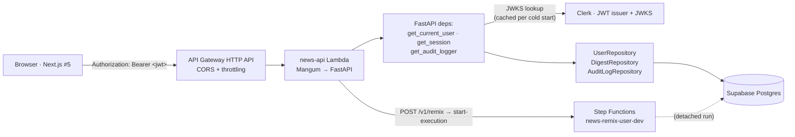

# Sub-project #4 — API + Auth — Design Spec

> Status: **approved** — 2026-04-27.
> Predecessors: #0 Foundation (`foundation-v0.1.1`), #1 Ingestion (`ingestion-v0.2.1`), #2 Agents (`agents-v0.3.0`), #3 Scheduler (`scheduler-v0.4.0`).
> Successor: #5 Frontend (Next.js + Clerk).

## 1. Goal

Expose a small authenticated HTTP API that the future Next.js frontend
(#5) will use to (a) onboard a Clerk-authenticated user, (b) round-trip
their `UserProfile`, (c) read their digest history, and (d) trigger an
on-demand "remix my digest now" run via the existing
`news-remix-user-dev` Step Functions state machine shipped in #3.

The API replaces today's `clerk_user_id="dev-seed-user"` placeholder
with real Clerk-driven identity, keyed by JWT.

### Success criteria

- `GET /v1/me`, `PUT /v1/me/profile`, `GET /v1/digests`,
  `GET /v1/digests/{id}`, `POST /v1/remix`, `GET /v1/healthz` all
  deployed at a stable HTTPS URL fronted by API Gateway HTTP API.
- A Clerk-authenticated user calling `GET /v1/me` for the first time
  has a row in `users` with their JWT-claim email + name and a null
  `profile_completed_at`.
- A subsequent `PUT /v1/me/profile` with a complete `UserProfile`
  flips `profile_completed_at` to now; that user is then picked up by
  the daily cron pipeline's `list_active_users` (already shipped in
  #3) on the next run.
- `POST /v1/remix` returns the `executionArn` of a started
  `news-remix-user-dev` execution, observable via
  `aws stepfunctions describe-execution`.
- `make api-test-health` against the deployed endpoint returns 200.
- `make api-test-me JWT=<real-clerk-jwt>` against the deployed
  endpoint returns the caller's `UserOut`.

### Non-goals (v1)

- **No Clerk webhooks** (no `POST /clerk/webhook`, no Svix signature
  verification). Lazy upsert via the JWT itself is enough — see §3.
- **No Clerk Organisations** (no `org_id` column anywhere). v1 is
  one Clerk identity → one `users` row. Multi-tenancy is a future
  sub-project.
- **No remix execution polling endpoint** (no `GET /v1/remix/{arn}`).
  The frontend re-fetches `/v1/digests` and renders the new entry.
- **No admin endpoints.** No "list all users", "force-trigger cron",
  "view another user's digest" — those belong behind a different auth
  boundary (a future ops sub-project).
- **No `GET /v1/sources`.** Frontend does not need to know what we
  scrape from for v1.
- **No rate limiting beyond API Gateway's account-level throttling.**
  Add only when abuse appears.
- **No `DELETE /v1/me`** (right-to-be-forgotten). Real requirement,
  separate design — needs cascade rules + UX confirmation flow.
- **No JSON-Patch on profile.** Full replace only — see §4.
- **No custom domain.** Raw `*.execute-api.<region>.amazonaws.com`
  URL is fine for v1.
- **No `DEV_AUTH_BYPASS` flag.** Reliability liability that buys
  nothing — see §7.
- **No idempotency key on `POST /v1/remix`.** SFN tolerates
  duplicates; the editor agent updates today's digest row in place.
- **No execution status proxy via the API role.** IAM does not grant
  `states:DescribeExecution` or `states:ListExecutions` — see §5.

## 2. Architecture



### Per-request lifecycle

1. Browser calls API with Clerk-issued JWT in `Authorization: Bearer …`.
2. API Gateway HTTP API forwards the raw HTTP request — no gateway-side
   JWT validation; CORS preflight handled here.
3. **Cold start (one-time per container):**
   `news_config.lambda_settings.load_settings_from_ssm()` →
   `setup_logging()` → `configure_tracing(enable_langfuse=True)`. JWKS
   prefetch is **not** done at cold start — first auth-required
   request triggers it lazily so the Lambda can come up even if Clerk
   is briefly degraded.
4. **Every invocation:** `news_db.engine.reset_engine()` (the
   warm-start fix from #3), then Mangum unwraps the event into ASGI
   and FastAPI routes the request.
5. Auth-required routes declare `Depends(get_current_user)`. The dep:
   reads `Authorization`, ensures JWKS is cached, validates JWT
   signature + `iss`/`aud`/`exp`, looks up `users.clerk_user_id`. If
   missing, performs `upsert_by_clerk_id` from the JWT claims (lazy
   upsert). Returns `UserOut`.
6. Handler runs DB work in a single
   `async with get_session()` block.
7. `POST /v1/remix` calls `boto3.client('stepfunctions').start_execution`
   on the remix SFN ARN read at cold-start from a Lambda env var
   (set by Terraform via `terraform_remote_state.scheduler`).
8. Response goes back through Mangum → API Gateway → browser.

### Failure model

| Failure | HTTP | Notes |
|---|---|---|
| Missing/malformed Bearer header | 401 | `WWW-Authenticate: Bearer` set. |
| Invalid JWT (signature, kid, algorithm, issuer, expiry) | 401 | One generic message — don't leak which check failed. |
| Authenticated but resource not theirs | 404 | Not 403 — don't leak existence of other users' resources. |
| Profile incomplete on `POST /v1/remix` | 409 | `{"error": "profile_incomplete"}`. |
| SFN throttled (`ThrottlingException`) | 503 + `Retry-After: 5` | |
| Other AWS errors (`ExecutionLimitExceeded`, `StateMachineDoesNotExist`) | 500 | Logged + audit row + bubble. |
| DB error | 500 | Logged + audit row + bubble. Audit log writes are themselves fire-and-forget. |

## 3. Auth flow — JWT validation + lazy upsert

The single piece of new mechanism in this sub-project. Every other
component (DB engine, repositories, observability, deploy) is an
existing pattern from #2/#3.

### Decision summary

| Concern | Decision |
|---|---|
| Provisioning trigger | **Lazy upsert via JWT** (no Clerk webhooks). |
| Validation location | **FastAPI dependency** (no API Gateway JWT authorizer). |
| Library | **PyJWT** (no `clerk-backend-api` SDK). |
| JWKS cache lifetime | Module-level state, scoped to container lifetime. |
| Cache fetch timing | Lazy on first auth-required request, not at cold start. |
| Multi-tenancy | Single Clerk identity → single `users` row (no Orgs). |

Rationale captured in the brainstorming Q&A; key reasons:

- **Lazy upsert over webhooks** — no public webhook endpoint to
  operate, no Svix signature verification, no idempotency tax. With
  `UPSERT on clerk_user_id` the lazy path is race-free. Eager
  provisioning can be added later as additive code if a real need
  appears.
- **FastAPI dep over gateway authorizer** — local/prod parity (works
  identically under uvicorn and Mangum), single source of truth for
  auth (the lazy-upsert path needs claims inside the handler anyway),
  idiomatic DI for `current_user`. The DoS-protection win from
  gateway-side validation is theoretical at our scale.
- **PyJWT over Clerk SDK** — we need ~30 lines of JWT validation; the
  SDK pulls in their broader org/session/billing client we don't use.

### JWKS module

```python
# services/api/src/news_api/auth/jwks.py
_jwks: dict[str, RSAPublicKey] | None = None

async def get_jwks(client: httpx.AsyncClient, url: str) -> dict[str, RSAPublicKey]:
    global _jwks
    if _jwks is None:
        resp = await client.get(url, timeout=5.0)
        resp.raise_for_status()
        _jwks = {k["kid"]: rsa_pub_from_jwk(k) for k in resp.json()["keys"]}
    return _jwks
```

`reset_jwks()` is exposed for tests. Module-level state ties cache
lifetime to container lifetime (Lambda recycles → fresh cache); this
is intentional and simpler than `lru_cache`.

### JWT verifier

```python
# services/api/src/news_api/auth/verify.py
class ClerkClaims(BaseModel):
    sub: str            # Clerk user ID — maps to users.clerk_user_id
    email: EmailStr
    name: str
    exp: int
    iat: int
    iss: str
    azp: str | None = None  # authorized party

def verify_clerk_jwt(token: str, jwks: dict[str, RSAPublicKey],
                     issuer: str, audience: str | None) -> ClerkClaims:
    headers = jwt.get_unverified_header(token)
    key = jwks.get(headers["kid"])
    if key is None:
        raise InvalidKid()
    payload = jwt.decode(
        token, key,
        algorithms=["RS256"],
        issuer=issuer,
        audience=audience or None,
    )
    return ClerkClaims.model_validate(payload)
```

Algorithm whitelist is the literal list `["RS256"]`. Passing it
defeats the algorithm-confusion attack class (HS256 token signed with
the public key as a shared secret). We never accept anything else.

### `get_current_user` dependency

```python
# services/api/src/news_api/deps.py
async def get_current_user(
    request: Request,
    session: AsyncSession = Depends(get_session_dep),
) -> UserOut:
    auth = request.headers.get("authorization", "")
    if not auth.startswith("Bearer "):
        raise HTTPException(401, "missing bearer token")
    token = auth[7:]

    settings = get_api_settings()
    jwks = await get_jwks(_http_client, settings.clerk_jwks_url)
    try:
        claims = verify_clerk_jwt(token, jwks, settings.clerk_issuer, audience=None)
    except (InvalidKid, jwt.InvalidTokenError) as exc:
        raise HTTPException(401, "invalid token") from exc

    repo = UserRepository(session)
    user = await repo.get_by_clerk_id(claims.sub)
    if user is not None:
        return user

    # Lazy upsert: first authenticated call from this Clerk user.
    return await repo.upsert_by_clerk_id(UserIn(
        clerk_user_id=claims.sub,
        email=claims.email,
        name=claims.name,
        email_name=claims.name.split()[0] if claims.name else "there",
        profile=UserProfile.empty(),
        profile_completed_at=None,
    ))
```

### `UserProfile.empty()`

`UserProfile` currently has all-required nested fields. We add a
classmethod that returns an "empty / not-yet-onboarded" instance:

```python
# packages/schemas/src/news_schemas/user_profile.py
class UserProfile(BaseModel):
    ...
    @classmethod
    def empty(cls) -> "UserProfile":
        return cls(
            background=[],
            interests=Interests(primary=[], secondary=[], specific_topics=[]),
            preferences=Preferences(content_type=[], avoid=[]),
            goals=[],
            reading_time=ReadingTime(daily_limit="30 minutes",
                                     preferred_article_count="10"),
        )
```

Editor agent already filters by `profile_completed_at IS NOT NULL`,
so empty profiles are inert until the user completes onboarding.

### Audit log policy

`get_current_user` does **not** write an audit row — that would be
one row per authenticated request. Only meaningful state changes are
logged:

- `PUT /v1/me/profile` → `DecisionType.PROFILE_UPDATE`,
  `metadata={"first_completion": prev_was_null}`.
- `POST /v1/remix` → `DecisionType.REMIX_TRIGGERED`,
  `metadata={"execution_arn": ..., "lookback_hours": ...}`.

`AgentName.API`, `DecisionType.PROFILE_UPDATE`, and
`DecisionType.REMIX_TRIGGERED` are added as new enum values to
`packages/schemas/src/news_schemas/audit.py`.

## 4. Endpoints

All paths under `/v1/` to leave room for future breaking-change
versioning. Request/response shapes are Pydantic v2 — FastAPI
generates OpenAPI for free for the frontend to consume.

### `GET /v1/healthz`

| | |
|---|---|
| Auth | none |
| Response | `200 {"status": "ok", "git_sha": "<sha>"}` |
| Notes | `git_sha` is a `GIT_SHA` env var stamped by Terraform at deploy time. Same shape as the scraper. |

### `GET /v1/me`

| | |
|---|---|
| Auth | `Depends(get_current_user)` |
| Response | `200 UserOut` |
| Notes | Lazy-creates the row on first call (handled inside the dep). The route handler is one line: `return current_user`. |

### `PUT /v1/me/profile`

| | |
|---|---|
| Auth | required |
| Body | `UserProfile` (full replace, not patch) |
| Response | `200 UserOut` (with the updated profile and the now-set `profile_completed_at` if it was previously null) |

Behaviour:

1. `repo.update_profile(current_user.id, body)` — replaces JSONB.
2. If `current_user.profile_completed_at is None`:
   `repo.mark_profile_complete(current_user.id)` — flips the flag.
3. Audit-log: `DecisionType.PROFILE_UPDATE`,
   `metadata={"first_completion": prev_was_null}`.

Full-replace is chosen over JSON-Patch because the profile is small
(~1KB), the editor agent treats it atomically, and full replace
matches Pydantic v2's validation model. Patch semantics would leak
field-shape knowledge into the frontend.

### `GET /v1/digests`

| | |
|---|---|
| Auth | required |
| Query | `limit: int = 10` (max 50), `before: int \| None = None` |
| Response | `200 {"items": list[DigestSummaryOut], "next_before": int \| None}` |

`DigestSummaryOut` is a new schema added to
`packages/schemas/src/news_schemas/digest.py`: `id`, `period_start`,
`period_end`, `status`, `generated_at`, `article_count`,
`top_themes`, `intro`. **Excludes** the heavy `ranked_articles`
JSONB — that's only on the detail view.

Pagination is cursor-based on `digest.id` (digests are insert-only,
monotonically increasing IDs):

```sql
SELECT ... FROM digests
WHERE user_id = :uid AND id < COALESCE(:before, 9223372036854775807)
ORDER BY id DESC
LIMIT :limit;
```

`next_before` is the smallest `id` in the page (or null if fewer than
`limit` results returned). No `OFFSET` — avoids the tail-page scan
cost.

New repo method (existing `get_recent_for_user` returns full
`DigestOut` and doesn't accept `before`, so we add rather than
overload):

```python
DigestRepository.get_for_user(
    user_id: UUID,
    limit: int,
    before: int | None = None,
) -> list[DigestSummaryOut]
```

### `GET /v1/digests/{id}`

| | |
|---|---|
| Auth | required |
| Response | `200 DigestOut` (full, including `ranked_articles`) |
| 404 | digest doesn't exist OR `digest.user_id != current_user.id` (don't distinguish) |

### `POST /v1/remix`

| | |
|---|---|
| Auth | required |
| Body | `{"lookback_hours": int = 24}` (validated `1 ≤ x ≤ 168`, mirroring scraper's `IngestRequest`) |
| Response | `202 {"execution_arn": str, "started_at": datetime}` |
| 409 | `current_user.profile_completed_at is None` → `{"error": "profile_incomplete"}` |

Behaviour:

1. Pre-flight: profile-completion check (saves an SFN execution that
   would no-op).
2. `start_remix(state_machine_arn=settings.remix_sfn_arn,
   user_id=current_user.id,
   lookback_hours=body.lookback_hours)` — the boto3 wrapper in
   `clients/stepfunctions.py`.
3. Audit-log: `DecisionType.REMIX_TRIGGERED`.
4. Return execution ARN. Frontend re-fetches `/v1/digests` after a
   delay; no polling endpoint per §1.

### Cross-cutting

- **All authenticated routes scope by `current_user.id`.** No path
  takes `user_id` as a parameter; the JWT is the only source of
  identity.
- **Pydantic v2 everywhere.** Request bodies and response models are
  explicit; OpenAPI generated from them.
- **Tracing.** Every handler runs inside the `configure_tracing(...)`
  call from cold-start init.

## 5. Remix endpoint internals

### Boto3 client lifecycle

```python
# services/api/src/news_api/clients/stepfunctions.py
import boto3
from functools import lru_cache

@lru_cache(maxsize=1)
def _sfn_client():
    # Cache one client per warm container — same lifetime as runtime credentials.
    return boto3.client("stepfunctions")

async def start_remix(*, state_machine_arn: str, user_id: UUID,
                      lookback_hours: int) -> tuple[str, datetime]:
    payload = json.dumps({
        "user_id": str(user_id),
        "lookback_hours": lookback_hours,
    })
    resp = await asyncio.to_thread(
        _sfn_client().start_execution,
        stateMachineArn=state_machine_arn,
        input=payload,
    )
    return resp["executionArn"], resp["startDate"]
```

`asyncio.to_thread` over `aioboto3`: aioboto3 is a community fork
that lags behind boto3's release cadence and adds another dep tree.
The Step Functions call is a single HTTPS request — running it on a
worker thread is the well-understood, codebase-consistent pattern
(#2 and #3 don't use aioboto3 either).

### IAM scope

The API Lambda's role gets exactly:

- `lambda:BasicExecutionRole` (CloudWatch Logs).
- `ssm:GetParametersByPath` on `arn:aws:ssm:<region>:<acct>:parameter/news-aggregator/<env>/*`.
- `states:StartExecution` on the **exact remix state machine ARN**:

```hcl
{
  Effect   = "Allow"
  Action   = "states:StartExecution"
  Resource = data.terraform_remote_state.scheduler.outputs.remix_state_machine_arn
}
```

Explicitly **not granted**:

- `states:DescribeExecution` / `states:ListExecutions` — the API
  doesn't proxy execution status (no polling endpoint per §1, §4).
- `states:StartExecution` on the cron-pipeline state machine —
  letting authenticated users trigger the full daily cron from the
  API would be a denial-of-wallet vector. Cron only fires from
  EventBridge.

### Reading the SFN ARN at deploy time

`infra/api/main.tf` reads the remix ARN via `terraform_remote_state`
from `infra/scheduler/`'s state file:

```hcl
data "terraform_remote_state" "scheduler" {
  backend = "s3"
  config = {
    bucket  = "news-aggregator-tf-state-${data.aws_caller_identity.current.account_id}"
    key     = "scheduler/terraform.tfstate"
    region  = "us-east-1"
    profile = "aiengineer"
  }
}
```

This is the **exception** to the "don't use
`terraform_remote_state.bootstrap`" rule we documented for #2 — that
rule applied because bootstrap uses *local* state. Scheduler uses S3
state, so cross-module reads work.

## 6. Infra (Terraform + IAM + SSM)

### Module layout

```
infra/api/
├── backend.tf              # s3 backend, key=api/terraform.tfstate
├── data.tf                 # current account/region + scheduler remote_state + lambda_artifacts bucket
├── variables.tf            # zip_s3_key, zip_sha256, allowed_origins, log_retention_days, clerk_issuer
├── main.tf                 # Lambda function + IAM role + 2 policy attachments + log group
├── apigateway.tf           # HTTP API + $default stage + Lambda integration + CORS + alarm
├── outputs.tf              # api_endpoint, function_arn, function_name
├── terraform.tfvars.example
└── .gitignore
```

### Resources created

| Resource | Purpose |
|---|---|
| `aws_lambda_function.api` | Runtime `python3.12`, handler `lambda_handler.handler`, memory 512 MB, timeout 15 s. |
| `aws_iam_role.api` + 2 inline policies | Execution role with the perms in §5 + CloudWatch Logs basic exec. |
| `aws_cloudwatch_log_group.api` | `/aws/lambda/news-api-<env>`, retention `var.log_retention_days` (14 default). |
| `aws_apigatewayv2_api.api` | HTTP API protocol, CORS configured here. |
| `aws_apigatewayv2_stage.default` | `$default` auto-deploy stage. Access logs to a separate log group. |
| `aws_apigatewayv2_integration.api` | `AWS_PROXY` integration → Lambda, payload format v2. |
| `aws_apigatewayv2_route.proxy` | `ANY /{proxy+}` — single catch-all route into Mangum. |
| `aws_lambda_permission.allow_api_gw` | Allows API Gateway to invoke the Lambda. |
| `aws_cloudwatch_metric_alarm.api_5xx` | Fires if `5XXError ≥ 5` over 5 min. |

### Lambda env vars (set by Terraform)

| Var | Source | Purpose |
|---|---|---|
| `SSM_PARAM_PREFIX` | static `/news-aggregator/${terraform.workspace}` | Where SSM secrets live. |
| `REMIX_STATE_MACHINE_ARN` | `data.terraform_remote_state.scheduler.outputs.remix_state_machine_arn` | What `start_remix` invokes. |
| `CLERK_ISSUER` | `var.clerk_issuer` | Validate JWT `iss` claim. |
| `CLERK_JWKS_URL` | derived from `var.clerk_issuer` | JWKS prefetch URL. |
| `ALLOWED_ORIGINS` | `var.allowed_origins` (comma-joined) | FastAPI CORS configuration (also set on API Gateway). |
| `GIT_SHA` | `var.git_sha` (passed by `deploy.py`) | Surfaced via `GET /v1/healthz`. |
| `LOG_LEVEL` | `var.log_level` (default `INFO`) | loguru level. |

### CORS

```hcl
cors_configuration {
  allow_origins   = var.allowed_origins                  # ["http://localhost:3000"] in dev
  allow_methods   = ["GET", "PUT", "POST", "OPTIONS"]
  allow_headers   = ["Authorization", "Content-Type"]
  expose_headers  = []
  max_age         = 3600
}
```

`allowed_origins` is a per-env list — `["http://localhost:3000"]` in
dev, the future Vercel/CloudFront origin in prod. Default value
covers a fresh `terraform apply` for dev.

### HTTP API not REST API

Cheaper ($1/M vs $3.50/M), native CORS, simpler config, JWT
authorizer built-in (we don't use it but it's there). REST API is
only worth it if you need request-validation models, API keys + usage
plans, or X-Ray on the gateway itself — none of which we need.

### SSM keys added

```
/news-aggregator/<env>/clerk_secret_key       SecureString — REQUIRED
```

Just one. We deliberately **do not** store `clerk_publishable_key`
in SSM — it's, by definition, public, and lives in the Next.js
frontend's env file (#5), never in the backend. The backend only
needs the secret-validation context (`CLERK_ISSUER` →
`CLERK_JWKS_URL`), which is non-secret and lives as a Lambda env var
set by Terraform.

### One-time IAM extension

**None.** The `aiengineer` user's `NewsAggregatorComputeAccess` group
already has `AWSLambda_FullAccess`,
`AmazonAPIGatewayAdministrator`, and `AmazonS3FullAccess` — those
cover everything `infra/api/` provisions. First sub-project since #1
that doesn't touch `setup-iam.sh`.

### Deploy lifecycle

```
make api-deploy
  → services/api/deploy.py --mode deploy --env dev
    → package_docker.py builds zip via lambda/python:3.12 (~25 MB)
    → uploads to s3://news-aggregator-lambda-artifacts-<acct>/api/<git-sha>.zip
    → terraform apply with -var=zip_s3_key=… -var=zip_sha256=…
                          -var=allowed_origins=… -var=clerk_issuer=…
                          -var=git_sha=…
```

Same flow as `services/scheduler/deploy.py`, including the
`AGENT_DIR.parents[1]` (not `[2]`) gotcha — the API also lives one
level under `services/`, like the scheduler.

## 7. Local dev + Makefile

### Local serving

```sh
make api-serve     # uvicorn http://localhost:8000, --reload
                   # reads .env directly (no SSM in dev)
```

`services/api/src/news_api/cli.py` Typer app exposes one command
`serve` that runs uvicorn against the FastAPI app. Running locally
**bypasses Mangum entirely** — uvicorn → ASGI directly. Same
FastAPI app handles both transports; the seam is
`lambda_handler.py = Mangum(app)`.

### Local auth — no bypass flag

The JWT dep is the same in dev and prod — there is no
`DEV_AUTH_BYPASS=1` mode. Two options for everyday dev:

1. **Mint a token from the Clerk dashboard** ("Quickstart → JWT
   template") and `curl -H "Authorization: Bearer <jwt>"`.
2. **Run the Next.js frontend locally** (#5) — it does Clerk signin
   and ships JWTs to `http://localhost:8000` via fetch.

Reasoning against a bypass flag: easy to leave on, easy to misconfigure
in prod, and the actual auth flow is well-trodden enough that neither
dev pain point is real.

For unit + integration tests we use a different mechanism — sign
tokens with a test RSA keypair, monkeypatch the JWKS — see §8.

### Makefile additions

Mirroring agents (#2) and scheduler (#3) sections in the Makefile,
appended in this order:

```makefile
# ---------- api (#4) ----------

.PHONY: api-serve api-deploy-build api-deploy api-invoke api-test-me \
        api-logs api-logs-follow tag-api

api-serve:                  ## run FastAPI locally on :8000
	uv run python -m news_api serve

api-deploy-build:           ## build + s3 upload (api)
	uv run python services/api/deploy.py --mode build

api-deploy:                 ## build + terraform apply (api)
	uv run python services/api/deploy.py --mode deploy --env dev

api-invoke:                 ## smoke /healthz on the deployed endpoint
	@URL=$$(cd infra/api && terraform output -raw api_endpoint) && \
	  curl -s "$$URL/v1/healthz" | jq

api-test-me:                ## test GET /me with $JWT (BYO token: export JWT=...)
	@test -n "$(JWT)" || (echo "JWT required: export JWT=<clerk-jwt>" && exit 1)
	@URL=$$(cd infra/api && terraform output -raw api_endpoint) && \
	  curl -s -H "Authorization: Bearer $(JWT)" "$$URL/v1/me" | jq

api-logs:                   ## tail api Lambda logs  [SINCE=10m]
	aws logs tail /aws/lambda/news-api-dev --since $${SINCE:-10m} --profile aiengineer

api-logs-follow:            ## follow api Lambda logs in real time
	aws logs tail /aws/lambda/news-api-dev --follow --profile aiengineer

tag-api:                    ## tag sub-project #4
	git tag -f -a api-v0.5.0 -m "Sub-project #4 API + Auth"
	@echo "Push with: git push origin api-v0.5.0"
```

### Documentation updates (Phase 7 of the plan)

- **`infra/README.md`** — new "Sub-project #4 — API + Auth" section
  mirroring #2/#3: per-module init, deploy, smoke commands, failure
  modes, rollback recipe.
- **`AGENTS.md`** — flip #4 from "not started" to "shipped" in the
  decomposition table; add `services/api/` and `infra/api/` to the
  repo layout block; new "Sub-project #4 (API) — operational
  commands" section; add anti-patterns: "do not add a
  `DEV_AUTH_BYPASS` flag", "do not grant `states:DescribeExecution`
  to the API role", "do not store `clerk_publishable_key` in SSM —
  it lives in the frontend".
- **`README.md`** — refresh status table + add a "Running the API
  (#4)" section pointing to `infra/README.md`.

## 8. Testing

### Pyramid

| Layer | What | Where | Runner |
|---|---|---|---|
| **Unit** | JWKS cache (cold-start fetch + reuse + reset), `verify_clerk_jwt` (valid / expired / wrong-issuer / bad-kid / wrong-algorithm), `start_remix` boto3 wrapper (mock client), Pydantic request models (validation rules) | `services/api/src/news_api/tests/unit/` | `pytest` (no Docker) |
| **Integration** | Each route end-to-end — real Postgres via testcontainers, real ASGI app via `httpx.AsyncClient + ASGITransport`, JWTs signed locally with a test RSA keypair, JWKS URL monkeypatched to return that public key | `services/api/src/news_api/tests/integration/` | `pytest -m integration` (Docker required) |
| **Live smoke** | `make api-invoke` (no auth), `make api-test-me JWT=…` (real Clerk JWT against deployed endpoint) | Manual | shell |

### Test JWT pattern

```python
# tests/conftest.py
@pytest.fixture(scope="session")
def jwt_keypair() -> tuple[RSAPrivateKey, dict]:
    """Generate one RSA keypair for the test session; expose the public JWK."""
    privkey = rsa.generate_private_key(public_exponent=65537, key_size=2048)
    jwk = rsa_pub_to_jwk(privkey.public_key(), kid="test-key-1")
    return privkey, {"keys": [jwk]}

@pytest.fixture
def signed_jwt(jwt_keypair):
    privkey, _ = jwt_keypair
    def _sign(*, sub: str, email: str, name: str = "Test User",
              issuer: str = "https://test.clerk", expires_in: int = 600) -> str:
        return jwt.encode({
            "sub": sub, "email": email, "name": name,
            "iss": issuer,
            "iat": int(time.time()),
            "exp": int(time.time()) + expires_in,
        }, privkey, algorithm="RS256", headers={"kid": "test-key-1"})
    return _sign

@pytest.fixture(autouse=True)
def patch_jwks(monkeypatch, jwt_keypair):
    """Replace the JWKS fetcher with a function that returns our test JWK."""
    _, jwks = jwt_keypair
    monkeypatch.setattr("news_api.auth.jwks.get_jwks",
                        lambda *args, **kwargs: rsa_pub_dict_from_jwks(jwks))
```

Standard PyJWT testing recipe. No Clerk dependency to spin up; every
test is self-contained.

### Required integration tests (per CLAUDE.md TDD policy)

For every route, at minimum:

- `/healthz` — 200 without auth.
- `/me` — 401 missing token; 401 invalid token; 401 expired token;
  200 + lazy-upsert on first call (DB row appears with
  `profile_completed_at is None`); 200 + returns existing user on
  second call.
- `/me/profile` — 200 + sets `profile_completed_at` on first
  complete update; 200 + does not re-set it on subsequent updates;
  422 on invalid profile body; audit row written.
- `/digests` — 200 + paginated; cross-user isolation (user A's JWT
  cannot list user B's digests).
- `/digests/{id}` — 200 + own; 404 + other user's digest;
  404 + nonexistent.
- `/remix` — 409 if profile incomplete; 202 + boto3 mock asserts
  called with `{user_id: <uuid>, lookback_hours: <n>}`; audit row
  written.
- **JWT regression suite** — wrong issuer → 401; wrong algorithm
  (HS256 forged with public key as shared secret) → 401; tampered
  signature → 401; missing `kid` → 401.

### Bar for completion

- `make lint` clean.
- `make typecheck` clean.
- `make test` (full suite — unit + integration) clean.
- `make api-deploy --env dev` succeeds end-to-end against AWS.
- `make api-invoke` returns 200.
- `make api-test-me JWT=<real-clerk-jwt>` returns the caller's
  `UserOut` with `profile_completed_at: null` on first call,
  unchanged on second call.
- `tag-api` (`api-v0.5.0`) created and pushed.

## 9. Glossary of new artefacts

Items introduced in this sub-project (for cross-referencing in the
implementation plan):

**Schema (in `packages/schemas/`):**
- `UserProfile.empty()` classmethod
- `DigestSummaryOut` (lighter projection — no `ranked_articles`)
- `AgentName.API` enum value
- `DecisionType.PROFILE_UPDATE`, `DecisionType.REMIX_TRIGGERED`
  enum values

**DB (in `packages/db/`):**
- `DigestRepository.get_for_user(user_id, limit, before)` →
  `list[DigestSummaryOut]` (cursor pagination)

**Service (`services/api/`):**
- `news_api.app` — FastAPI app
- `news_api.settings.ApiSettings`
- `news_api.deps.get_current_user`, `get_session_dep`,
  `get_audit_logger`
- `news_api.auth.jwks.get_jwks` / `reset_jwks`
- `news_api.auth.verify.verify_clerk_jwt` / `ClerkClaims`
- `news_api.routes.{healthz,me,digests,remix}`
- `news_api.clients.stepfunctions.start_remix`
- `news_api.cli.serve`
- `lambda_handler.handler` (Mangum)
- `package_docker.py`, `deploy.py`

**Infra (`infra/api/`):**
- The eight files listed in §6.

**Top-level:**
- Makefile `# ---------- api (#4) ----------` block.
- New SSM key `clerk_secret_key`.
- `infra/README.md`, `AGENTS.md`, `README.md` updates per §7.

## 10. Risks and mitigations

| Risk | Mitigation |
|---|---|
| **JWKS rotation while a container is warm.** Clerk rotates signing keys; an old cached JWKS would 401 valid tokens until container recycle. | Catch `InvalidKid` specifically and reset the cache once per request before retrying — in a follow-up if it bites. For v1: container churn (~1 hour idle) is short enough that this is rare. |
| **Lazy upsert race on simultaneous first requests.** Two parallel calls from a brand-new Clerk user could both hit `get_by_clerk_id` → None → `upsert_by_clerk_id`. | `upsert_by_clerk_id` uses `INSERT … ON CONFLICT (clerk_user_id) DO UPDATE` — race-safe; the second call sees the first one's row. |
| **Empty `UserProfile` from `UserProfile.empty()` violates editor agent assumptions.** | Editor already filters `WHERE profile_completed_at IS NOT NULL`. Empty profiles never reach the editor. Asserted in an integration test. |
| **PyJWT algorithm-confusion attack.** | Algorithm whitelist is the literal `["RS256"]`. HS256 tokens forged with the public key as shared secret fail verification. JWT regression test covers it. |
| **API Lambda warm-start asyncio loop drift.** | `news_db.engine.reset_engine()` at the top of `handler()` (the same fix from #3). Captured in AGENTS.md anti-patterns. |
| **Cross-region Step Functions invocation.** | API Lambda and remix SFN are both in `us-east-1`; ARN is region-locked anyway. Single-region for the whole project. |
| **Cost runaway on `POST /v1/remix` spam.** | Each remix run is ~ one editor + one email LLM call (~$0.005). API has no rate limit; if abuse appears we add a per-user 60s window. |
| **Frontend origin not yet known.** | `var.allowed_origins` defaults to `["http://localhost:3000"]` for dev, configurable per env. Updated in the same `terraform apply` when #5 picks an origin. |
