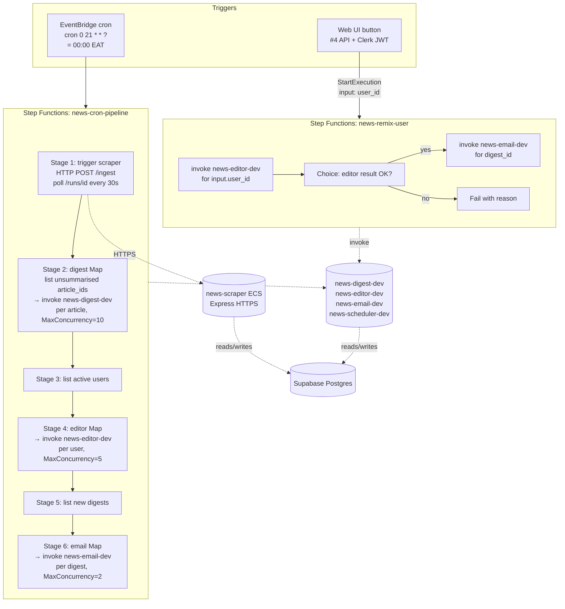

# Scheduler + Orchestration (Sub-project #3) — Design Spec

- **Date:** 2026-04-27
- **Status:** Approved for implementation planning
- **Owner:** Patrick Walukagga
- **Scope:** Two AWS Step Functions state machines (cron-pipeline + remix-user) wrapping the existing #1 scraper and #2 agents, plus an EventBridge daily cron, plus a small "list" Lambda for the query-only stages. Per-sub-project Terraform module under `infra/scheduler/`.

> **Convention reuse:** Builds on patterns established in #1 (per-sub-project Terraform, AWS profile, IAM scope, audit_logs, SSM secrets) and #2 (Lambda zips on S3, the three agent Lambdas, the foundation packages). Does NOT revisit those decisions.

---

## 1. Overview

The cron pipeline runs daily at midnight EAT (= 21:00 UTC), end-to-end:

```
EventBridge cron → Step Functions (cron-pipeline)
    → trigger scraper (HTTPS, poll for completion)
    → digest Map (per unsummarised article)
    → editor Map (per active user)
    → email Map (per new digest)
```

A second state machine (`remix-user`) is invoked manually from the web UI in #4 ("send me my digest now") and runs `editor → email` for one user, skipping the scraper + digest stages.

Both state machines invoke the **existing** Lambdas from #2 (`news-digest-dev`, `news-editor-dev`, `news-email-dev`) — no new agent code. Per-stage list operations (unsummarised articles, active users, new digests) run in a single new Lambda, `news-scheduler-dev`, which dispatches by `event["op"]`.

This sub-project deliberately leaves the Clerk-authed HTTP endpoint that triggers `remix-user` to #4. #3 outputs the state-machine ARN; #4 wires its API Lambda to `StartExecution`.

---

## 2. Sub-project boundary

**In scope:**

- `services/scheduler/` — workspace package with one Lambda (`news_scheduler`) that dispatches three list handlers (`list_unsummarised`, `list_active_users`, `list_new_digests`).
- `infra/scheduler/` — Terraform module with: two state machines, EventBridge cron rule, EventBridge HTTPS connection (for the scraper task), one Lambda function, IAM roles for Step Functions / Lambda / EventBridge.
- ASL JSON files for both state machines, rendered via `templatefile()` so Lambda ARNs and the scraper base URL are interpolated at apply time.
- Two CloudWatch alarms (cron failed, cron stale).
- `make scheduler-*` and `make cron-*` / `make remix-*` Makefile targets.

**Out of scope:**

- The Clerk-authed HTTP endpoint that triggers `remix-user` (owned by #4).
- Unsubscribe / paused-digest UX (owned by #5 frontend or wherever the user-facing toggle lives).
- Per-user timezone scheduling (everyone gets midnight EAT for now).
- Adaptive scheduling ("send when user is most likely to read").
- Multi-region failover.
- Step Functions Express workflows — using Standard (cheaper at our cron-frequency scale).
- A `digest_paused_at` column on `users` — defer to whenever the unsubscribe UX lands.

---

## 3. Architecture



### 3.1 Architectural decisions

| Decision | Choice | Rationale |
|---|---|---|
| Orchestration mechanism | AWS Step Functions Standard | Native fan-out (Map state) + sequential staging + per-task retry without app code. Free tier covers 4K state transitions/month; we use ~30/day. |
| Number of state machines | 2 (cron + remix) | Different inputs, different fan-out logic. One parameterised state machine would be more complex to read and debug than two flat ones. |
| Express vs Standard | Standard | Standard's $0.025/1K transitions is fine at our scale. Express makes sense >100K execs/day. |
| Fan-out concurrency | Map state with `MaxConcurrency` per stage | No SQS — Step Functions Map invokes Lambdas directly. Backpressure via concurrency cap; DLQ via per-task `Catch`. |
| Scraper trigger | Native HTTPS task (`arn:aws:states:::http:invoke`) | Scraper endpoint is public; no Lambda needed. Polling loop in ASL via `Wait + Choice`. |
| List handlers | One Lambda, dispatched by `event["op"]` | Three 30-line query functions sharing a DB connection pool. Three separate Lambdas would be 3× the IAM, log groups, deploy artifacts. |
| Active-user predicate | `users.profile_completed_at IS NOT NULL` | Zero migrations. Unsubscribe UX is YAGNI for #3. |
| Within-stage failure handling | `ToleratedFailurePercentage = 100` on agent Maps; fail-fast on scraper | Per-user isolation — one user's failure shouldn't block 99 others. Scraper failure means stale data → fail loud. |
| Idempotency on overlap | Application-layer (existing) | Reuses the digest/email idempotency from #2 (digest skips when summary set; email skips when sent row exists). Manual remix runs always proceed (user intent). |
| Map cap on digest stage | 200 article IDs per cron run | Cap blast radius. Older unsummarised articles wait until tomorrow. |
| Cron schedule | `cron(0 21 * * ? *)` UTC = 00:00 EAT | Simple. Per-user timezone is a future concern. |

---

## 4. State machine: `news-cron-pipeline`

**Trigger:** EventBridge rule `news-cron-pipeline-${env}` with `ScheduleExpression = cron(0 21 * * ? *)`.

**Input:** `{}` (no input — cron just fires).

**Execution name:** auto-generated by Step Functions (UUID). Idempotency on accidental double-fires is handled at the application layer by the agents themselves (digest skips when `summary IS NOT NULL`; email skips when an existing `email_sends.status='sent'` row exists for the digest). EventBridge cron has at-most-once semantics with rare retries; the impact of a double-run is bounded.

### 4.1 Stage 1 — Trigger scraper

ASL `Task` with `Resource = arn:aws:states:::http:invoke`. POST to `${SCRAPER_BASE_URL}/ingest` with body `{"lookback_hours": 24, "trigger": "cron"}`. Capture `run_id`.

Then a polling loop:
- `Wait 30s`
- `HTTP GET ${SCRAPER_BASE_URL}/runs/${run_id}`
- `Choice` — terminal status (`success`/`partial`/`failed`)? Proceed (continue on `partial`, fail-fast on `failed`). Else loop.
- Hard cap: 60 iterations = 30 minutes wall-clock. Exceed → fail-fast.

EventBridge Connection (managed by Terraform) holds the scraper base URL. No auth header — scraper endpoint is internal-public; if a shared `X-Internal-Token` is added later, it's a one-line ASL change.

### 4.2 Stage 2 — Digest Map

Invoke `news-scheduler-dev` with `{"op": "list_unsummarised", "hours": 24, "limit": 200}` → returns `{"article_ids": [42, 43, ...]}`.

If `len(article_ids) == 0`, the Map runs over an empty list (cheap no-op). Proceed.

`Map` state, `MaxConcurrency = var.digest_max_concurrency` (default 10), `ToleratedFailurePercentage = 100`. Per item:

- `Resource = arn:aws:lambda:::function:news-digest-${env}`
- Payload: `{"article_id": <id>}`
- `Retry` policy: `["Lambda.ServiceException", "Lambda.TooManyRequestsException"]`, MaxAttempts 2, IntervalSeconds 5, BackoffRate 2.0, JitterStrategy `FULL`.
- `Catch` on `States.ALL`: `Next = continue` (per-task failure does not bubble up; agent's audit_logs row records it).

Result aggregation: discarded. Editor reads from DB.

### 4.3 Stage 3 — List active users

Invoke `news-scheduler-dev` with `{"op": "list_active_users"}` → returns `{"user_ids": ["uuid1", ...]}`.

The list handler queries `SELECT id FROM users WHERE profile_completed_at IS NOT NULL ORDER BY created_at`. No limit cap (sub-projects #4–6 will likely add one when user counts grow).

### 4.4 Stage 4 — Editor Map

`Map`, `MaxConcurrency = var.editor_max_concurrency` (default 5), `ToleratedFailurePercentage = 100`. Per item:

- Invoke `news-editor-${env}` with `{"user_id": "<uuid>", "lookback_hours": 24}`.
- `Retry`: same Lambda transient errors as Stage 2. NOT retried on `ValueError` (user not found = caller bug).
- `Catch`: same as Stage 2.

Editor's pipeline already handles "no candidates" / "no valid rankings" / "validation" — all surface as `failed` digest rows. No state-machine-level handling needed.

### 4.5 Stage 5 — List new digests

Invoke `news-scheduler-dev` with `{"op": "list_new_digests"}` → returns `{"digest_ids": [101, 102, ...]}`.

The list handler queries `SELECT id FROM digests WHERE generated_at >= CURRENT_DATE AND status = 'generated' ORDER BY generated_at`. The `email_pipeline.digest.status is GENERATED` gate (commit `ff02901`) double-checks this at send time.

### 4.6 Stage 6 — Email Map

`Map`, `MaxConcurrency = var.email_max_concurrency` (default 2), `ToleratedFailurePercentage = 100`. Per item:

- Invoke `news-email-${env}` with `{"digest_id": 101}`.
- `Retry`: 3 attempts on `Lambda.TooManyRequestsException`, IntervalSeconds 30, BackoffRate 2.0.
- `Catch`: same as Stage 2 — failed sends already mark `email_sends.status='failed'` from the agent.

Resend free-tier limit is 100/day, ~1/sec sustained. `MaxConcurrency=2` keeps headroom. The agent-side `ResendRateLimitError` typed exception bubbles back to Step Functions and triggers retry.

---

## 5. State machine: `news-remix-user`

**Trigger:** `StartExecution` from #4's API Lambda (Clerk-authed).

**Input:** `{"user_id": "<uuid>", "lookback_hours": 24}` (lookback_hours optional, default 24).

**Execution name:** `remix-${user_id}-${timestamp_ms}` — uniqueness across executions is implicit via the timestamp; multiple remixes for the same user are allowed (each is a fresh user-initiated request).

### 5.1 Stage 1 — Editor

Invoke `news-editor-${env}` with the input payload verbatim. Capture result.

`Retry`: 2 attempts on `Lambda.{Service,TooManyRequests}Exception`, 5s + jitter.

### 5.2 Stage 2 — Choice gate

`Choice` state on the editor result:
- If `result.failed == true` or `result.status != "generated"` → fail the execution with the editor's `reason` (e.g. `no_valid_rankings`, `validation`, `no candidates`). UI in #4 polls execution status and surfaces the reason.
- Else → extract `digest_id`, proceed to Stage 3.

### 5.3 Stage 3 — Email

Invoke `news-email-${env}` with `{"digest_id": <from stage 1>}`.

`Retry`: 3 attempts on `Lambda.TooManyRequestsException`, 30s + 2× backoff.

The email pipeline's idempotency (`get_sent_for_digest`) and `digest.status` gate handle duplicate-send protection if the user clicks the UI button twice.

### 5.4 Output

The execution's final output (visible in #4's `DescribeExecution` response):

```json
{
  "digest_id": 17,
  "email_send_id": 42,
  "provider_message_id": "msg-abc"
}
```

#4's API can return this to the UI for "your digest was sent (msg id: ...)".

**Total wall-clock budget:** ~2 minutes typical, 5-minute timeout cap.

---

## 6. Repo layout

### 6.1 `services/scheduler/` — workspace package

```
services/scheduler/
├── pyproject.toml                         # name = news_scheduler
├── package_docker.py                      # build → dist/news_scheduler.zip
├── deploy.py                              # build → S3 → terraform apply
├── lambda_handler.py                      # routes by event["op"]
└── src/news_scheduler/
    ├── __init__.py
    ├── __main__.py                        # python -m news_scheduler <subcommand>
    ├── settings.py                        # SchedulerSettings (DB only — no OpenAI)
    ├── handlers/
    │   ├── __init__.py
    │   ├── list_unsummarised.py           # async run(*, hours, limit) → {"article_ids": [...]}
    │   ├── list_active_users.py           # async run() → {"user_ids": [...]}
    │   └── list_new_digests.py            # async run() → {"digest_ids": [...]}
    ├── cli.py                             # Typer: list-unsummarised / list-active-users / list-new-digests
    └── tests/unit/
        ├── test_list_unsummarised.py      # mocked repo; assert query shape + limit
        ├── test_list_active_users.py
        ├── test_list_new_digests.py
        └── test_cli.py                    # CliRunner help text
```

The Lambda's `handler(event, context)`:

```python
def handler(event, context):
    op = event["op"]
    if op == "list_unsummarised":
        return asyncio.run(list_unsummarised.run(hours=event.get("hours", 24), limit=event.get("limit", 200)))
    if op == "list_active_users":
        return asyncio.run(list_active_users.run())
    if op == "list_new_digests":
        return asyncio.run(list_new_digests.run())
    return {"failed": True, "reason": "unknown_op", "op": op}
```

Cold-start hydration (SSM → env) is identical to the agent Lambdas (reuses `news_config.lambda_settings.load_settings_from_ssm`).

The handler's `__init__.py` for `handlers/` keeps the three implementations in separate files so the test surface stays simple.

### 6.2 `services/scheduler/` — additions to existing repos

Already-existing additions (handled in #1/#2):
- `news_db.repositories.article_repo.get_unsummarized` (Task 1.3 of #2).
- `news_db.repositories.user_repo.get_by_id` (Foundation).

New additions:
- `news_db.repositories.user_repo.list_active_user_ids() -> list[UUID]` — `SELECT id FROM users WHERE profile_completed_at IS NOT NULL ORDER BY created_at`.
- `news_db.repositories.digest_repo.list_generated_today() -> list[int]` — `SELECT id FROM digests WHERE generated_at >= CURRENT_DATE AND status = 'generated'`.

### 6.3 `infra/scheduler/`

```
infra/scheduler/
├── backend.tf                             # S3 backend, key=scheduler/terraform.tfstate
├── data.tf                                # caller_identity, region
├── variables.tf                           # zip_s3_key, zip_sha256, scraper_base_url,
│                                          #   *_max_concurrency, log_retention_days
├── main.tf                                # IAM + log group + Lambda function
├── state_machines.tf                      # cron + remix state machines via templatefile
├── eventbridge.tf                         # cron rule, http connection, alarms
├── templates/
│   ├── cron_pipeline.asl.json             # ASL for cron state machine
│   └── remix_user.asl.json                # ASL for remix state machine
├── outputs.tf                             # cron_arn, remix_arn, scheduler_lambda_arn
├── service.sh                             # cron-invoke / remix-invoke / cron-status helpers
├── terraform.tfvars.example
└── .gitignore
```

`templatefile("templates/cron_pipeline.asl.json", { ... })` interpolates:
- `news_digest_arn`, `news_editor_arn`, `news_email_arn`, `scheduler_lambda_arn`
- `scraper_connection_arn`
- `digest_max_concurrency`, `editor_max_concurrency`, `email_max_concurrency`

### 6.4 Additions to existing files

| File | Addition |
|---|---|
| Root `pyproject.toml` | Add `services/scheduler` to workspace members + `news_scheduler` to sources |
| `mypy.ini` | Append `:services/scheduler/src` to `mypy_path` |
| `.pre-commit-config.yaml` | Extend mypy `files:` regex to cover `services/scheduler/src/.*\.py$` |
| `Makefile` | New targets — see §7 |
| `AGENTS.md` | Update sub-project decomposition table; add #3 operational commands section |

---

## 7. Make targets

```makefile
# ---------- scheduler (#3) ----------

scheduler-deploy-build              ## build + S3 upload
scheduler-deploy                    ## build + terraform apply

cron-invoke                         ## aws stepfunctions start-execution news-cron-pipeline-dev
cron-history                        ## list recent cron executions + status
cron-describe EXECUTION_ARN=...     ## detailed execution history

remix-invoke USER_ID=<uuid>         ## start a remix execution for one user
remix-history                       ## last 5 remix executions

scheduler-logs SINCE=10m            ## tail Step Functions + Lambda CloudWatch
scheduler-logs-follow

scheduler-list-unsummarised         ## local CLI: query DB and print
scheduler-list-active-users
scheduler-list-new-digests

tag-scheduler                       ## git tag scheduler-v0.4.0
```

Local CLI commands invoke the same handlers directly via `python -m news_scheduler` for dev iteration without AWS.

---

## 8. IAM + cross-sub-project boundary

### 8.1 #3 outputs (Terraform `outputs.tf`)

- `cron_state_machine_arn` — observability.
- `remix_state_machine_arn` — **REQUIRED by #4**. #4's API Lambda IAM role must `states:StartExecution` on this ARN.
- `scheduler_lambda_arn` — observability.

### 8.2 IAM roles created in #3

**Step Functions cron-pipeline execution role:**
- `lambda:InvokeFunction` on `news-digest-${env}`, `news-editor-${env}`, `news-email-${env}`, `news-scheduler-${env}`.
- `states:UseConnection` on the EventBridge HTTPS Connection ARN.
- `logs:CreateLogGroup`, `logs:CreateLogStream`, `logs:PutLogEvents`.
- `xray:PutTraceSegments`, `xray:PutTelemetryRecords`.

**Step Functions remix-user execution role:** subset of cron's — only `news-editor-${env}` + `news-email-${env}` invoke + logs + X-Ray.

**Scheduler Lambda execution role:** same as agent Lambdas — `AWSLambdaBasicExecutionRole` + SSM read on `/news-aggregator/${env}/*` (both the path and `/*`) + KMS Decrypt on `alias/aws/ssm`.

**EventBridge cron rule role:** `states:StartExecution` on `cron_state_machine_arn`.

### 8.3 What #4 will need to add

In #4's Terraform, the API Lambda's IAM role:

```hcl
{
  Effect   = "Allow"
  Action   = "states:StartExecution"
  Resource = data.terraform_remote_state.scheduler.outputs.remix_state_machine_arn
}
```

And `states:DescribeExecution` if the API wants to poll execution status.

---

## 9. Error handling & observability

### 9.1 Per-stage retry policy

| Stage | Retry on | Attempts | Backoff | On final failure |
|---|---|---|---|---|
| Scraper trigger HTTP | `States.TaskFailed` | 2 | 10s + 2× + jitter | Fail-fast pipeline |
| Scraper poll loop | timeout (60 × 30s = 30 min) | 0 | — | Fail-fast pipeline |
| List Lambdas | `Lambda.ServiceException` | 3 | 5s + 2× | Fail-fast pipeline |
| Digest Map task | `Lambda.{Service,Throttling}Exception` | 2 | 5s + jitter | Skip article (per-task `Catch`) |
| Editor Map task | same | 2 | 5s + jitter | Skip user (per-task `Catch`) |
| Email Map task | `Lambda.TooManyRequestsException` | 3 | 30s + 2× | Skip digest (per-task `Catch`) |

`ToleratedFailurePercentage = 100` on agent Maps means partial failures don't fail the Map. Combined with per-task `Catch` and the agents' existing `audit_logs` writes, no failure is silently lost.

### 9.2 CloudWatch alarms

Two Terraform-managed alarms targeting an SNS topic placeholder (left empty by default; user wires email/Slack later):

- `news-cron-pipeline-failed` — fires on cron state-machine status `FAILED`/`TIMED_OUT` (CloudWatch metric `ExecutionsFailed`/`ExecutionsTimedOut`).
- `news-cron-pipeline-stale` — fires if no `SUCCEEDED` execution in last 36 hours (covers "the cron silently stopped firing"). Implemented as a metric math expression on `ExecutionsSucceeded`.

### 9.3 Tracing

- ASL `IncludeExecutionDataInLogs = true` writes per-state output to CloudWatch Logs `/aws/states/news-cron-pipeline-${env}/`.
- X-Ray enabled — single timeline view per execution.
- Standard workflow keeps full execution history for 90 days at the Step Functions console.

---

## 10. Testing strategy

| Tier | Location | What | CI? |
|---|---|---|---|
| Unit | `services/scheduler/src/news_scheduler/tests/unit/` | Mocked-repo tests for the 3 list handlers + CLI help. | ✅ always |
| Integration | `tests/integration/test_scheduler_handlers.py` | List handlers against testcontainers-postgres + Alembic-migrated schema. Verifies query shapes (cutoff, status filters, ordering). | ✅ always |
| ASL static | `tests/integration/test_scheduler_asl.py` | Render ASL JSON via Python `json.loads`; assert state names, retry policies, expected ARNs (using mock substitutions). Catches typos in `templatefile()` interpolations. | ✅ always |
| Live | `services/scheduler/src/news_scheduler/tests/live/` | `make cron-invoke` against AWS; poll `aws stepfunctions describe-execution` until terminal. `@pytest.mark.live`. | ❌ default — opt-in |

No Step Functions Local — adds Docker + a 500MB image to CI for marginal value over the ASL-static + live-test combination.

---

## 11. Cost guardrails

| Component | Cost driver | Estimate |
|---|---|---|
| Step Functions Standard | $0.025 per 1K state transitions | ~30 transitions/day × 30 days = 900/month → $0.02/month |
| Lambda invocations | 1ms list-handler invocations + agent invocations (already counted in #2) | <$0.01/month for the scheduler Lambda alone |
| EventBridge rule | $0 (rule), $0 (cron triggers) | Free tier covers cron triggers |
| EventBridge Connection | $0 (connection), $1 per 1M API destinations invocations | <$0.01/month |
| CloudWatch Logs | $0.50 per GB ingested | ~10 KB per execution, $negligible |

**Total #3 incremental cost: <$0.10/month.** The dominant cost remains LLM calls (already budgeted in #2 at ~$0.12/user/day).

---

## 12. Risks

| Risk | Mitigation |
|---|---|
| Scraper endpoint stops being publicly resolvable | Confirmed public. If changes, fall back to a tiny "scraper-trigger" Lambda inside the VPC; ASL change is local. |
| Cron fires when scraper is paused (ECS `min_capacity=0`) | Operator runs `make scraper-pin-up` before manual cron tests. Cron pipeline auto-fails on scraper /ingest 5xx. |
| Map state cap (10K items) hit by digest stage | Hard-cap `list_unsummarised` at 200 IDs/run. Older articles wait until tomorrow. Revisit when scraper output exceeds 200/day. |
| Step Functions Standard concurrency: 25K open executions/account | We're at <30 executions/day. Non-issue at our scale. |
| EventBridge cron skipped (rare AWS hiccup) | `cron-pipeline-stale` CloudWatch alarm fires after 36h without a successful run. |
| Resend rate-limit storm during email Map | `MaxConcurrency=2` + agent-side typed `ResendRateLimitError` retry (already in place from #2). |
| Manual remix overlaps with cron's email stage for same user | Email pipeline's `get_sent_for_digest` blocks duplicate sends (already in place from #2 + `ff02901`). |
| Scraper poll loop times out (e.g. 30 min wall-clock) before scraper finishes | Fail-fast → CloudWatch alarm → operator decides next run. Most scraper runs finish in <5 min today. |
| ASL JSON drifts from Lambda function names | `templatefile()` interpolates ARNs from Terraform — no string drift possible. ASL-static test catches schema typos. |
| Step Functions HTTPS task times out on slow scraper | `TimeoutSeconds = 30` per HTTP task; the polling loop handles the long-running case via repeated short calls. |

---

## 13. Sub-project dependency alignment

```
#0 Foundation  → #1 Ingestion  → #2 Agents  → #3 Scheduler (THIS)  → #4 API + Auth
                    (scraper)     (Lambdas)     (Step Functions)        (UI trigger
                                                                         + remix call)
```

#3 consumes:
- **#1 scraper:** HTTPS `/ingest` + `/runs/<id>` endpoints (no changes).
- **#2 agents:** the three Lambda functions (no changes).
- **Foundation packages:** `news_db.repositories.*`, `news_config.lambda_settings`, `news_observability.logging`, `news_schemas.*`.

#3 produces:
- Two state-machine ARNs (consumed by #4).
- Two new repository methods (`list_active_user_ids`, `list_generated_today`).
- One new Lambda function (`news-scheduler-${env}`) — list-handlers only.

#4 will consume:
- `remix_state_machine_arn` for `StartExecution`.
- `cron_state_machine_arn` for read-only observability (optional).

---

## 14. Implementation phasing (preview — full plan in `docs/superpowers/plans/`)

Approximately 7 phases:

1. **Repository methods** — `list_active_user_ids`, `list_generated_today` on existing repos (TDD).
2. **Scheduler Lambda scaffold + 3 list handlers** — workspace package, settings, handlers, CLI, lambda_handler, tooling-config registration (mirrors digest 3.x pattern).
3. **Scheduler `package_docker.py` + `deploy.py`** — mirrors digest's pattern with single-Lambda dispatch.
4. **Bootstrap extensions (if needed)** — none expected; uses existing artifact bucket.
5. **Terraform module `infra/scheduler/`** — Lambda, IAM roles, log group; init + plan only.
6. **State machine ASL templates + EventBridge rule + alarms** — both state machines, daily cron rule, two CloudWatch alarms; init + plan only.
7. **Live deploy + smoke test** — `make scheduler-deploy`, then `make cron-invoke` and verify execution succeeds end-to-end. Tag `scheduler-v0.4.0`.

Each phase ends with `make check` green and a commit on the `sub-project#3` branch.
