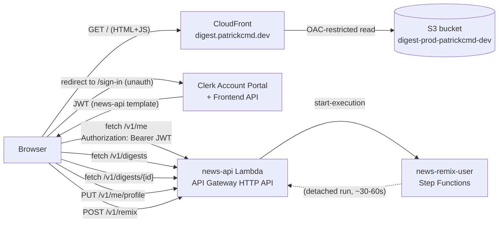

# Sub-project #5 — Frontend (Next.js + Clerk + S3/CloudFront) — Design Spec

> Status: **draft** — 2026-04-28.
> Predecessors: #0 Foundation (`foundation-v0.1.1`), #1 Ingestion (`ingestion-v0.2.1`), #2 Agents (`agents-v0.3.0`), #3 Scheduler (`scheduler-v0.4.0`), #4 API + Auth (`api-v0.5.0`).
> Successor: #6 CI/CD + Ops.

## 1. Goal

Ship a static-exported Next.js frontend, hosted on S3 + CloudFront,
that lets a Clerk-authenticated user (a) complete their onboarding
profile, (b) browse the daily digests the cron pipeline (#3) generates
for them, and (c) trigger an on-demand "remix my digest now" run via
the `POST /v1/remix` endpoint (#4). Closes the loop between the cron
pipeline (the producer) and the user (the consumer) with a real UI.

The frontend is **purely a client** of the API shipped in #4. It
does not talk to Supabase, Clerk's Backend API, Step Functions, or any
other AWS service directly — every read and write goes through
`https://<api>/v1/*` with a Clerk-issued JWT.

### Success criteria

- Three authenticated routes — `/`, `/digests/[id]`, `/profile` —
  rendered statically, hydrated client-side, deployed at
  `digest.patrickcmd.dev` (prod), `dev-digest.patrickcmd.dev`,
  `test-digest.patrickcmd.dev`.
- Unauthenticated visitors are redirected to Clerk's hosted Account
  Portal sign-in.
- A user with `profile_completed_at IS NULL` is redirected to
  `/profile` until they complete onboarding (lazy-create on `GET /me`
  + complete profile via `PUT /me/profile` flips the timestamp).
- A `Remix now` click triggers `POST /v1/remix`, shows a toast
  ("Your remix is on the way ~30–60s"), and the digest list
  auto-refetches every 5 s for up to 120 s — the new digest pops in
  when SFN completes.
- Mobile-responsive at ≤640 px (Tailwind `sm:` breakpoint); dark mode
  toggle persists across reloads via `localStorage`.
- CI runs `lint + typecheck + tests + OSV-Scanner` on every PR;
  manual `workflow_dispatch` deploys to one of `dev | test | prod`
  with a `deploy` or `destroy` choice.

### Non-goals (v1)

- **No SSR / Next.js server components / middleware.** Static export
  only (`output: "export"`). Every page is pre-rendered HTML; Clerk
  + data fetching are hydrated client-side.
- **No `@clerk/nextjs`.** We use `@clerk/react` (the SPA
  flavour). Next.js's middleware-based auth is incompatible with
  static export.
- **No public marketing landing page.** Unauthenticated `/` redirects
  to Clerk's hosted sign-in. A landing page is its own design and
  YAGNI for a private MVP.
- **No account deletion / unsubscribe / settings page.** Real design
  problem (cascade through digests/audit_logs, legal copy, confirmation
  flow) — own spec, own sub-project.
- **No e2e tests in v1.** Unit (Vitest) + component (Vitest +
  @testing-library/react) + manual smoke against deployed `dev`
  environment. Playwright is a future-#6 add.
- **No optimistic UI.** Every state update reflects the server
  response. Optimistic updates are nice but add complexity (rollback,
  conflict reconciliation) for a workflow that's already
  near-instant.
- **No Vercel / Amplify / SSR hosting.** Per-sub-project Terraform
  on AWS only — same operational model as #1–#4.
- **No deploy on `push: main`.** All deploys are manual
  `workflow_dispatch` for v1. Auto-deploy can be added later.
- **No remix execution status proxy** (no `GET /v1/remix/{arn}`).
  We poll `/v1/digests` for completion — this matches the API spec
  and keeps the IAM scope narrow. The trade-off: ~5 s detection lag.
- **No light-mode-only CSS variables.** Tailwind dark mode classes
  (`dark:`) live alongside light styles in the same components — no
  separate stylesheet.

## 2. Architecture



### Per-page lifecycle

1. **Static HTML** — Next.js exports each route to `web/out/<route>/index.html`
   at build time. CloudFront serves the file directly from S3.
2. **Client hydration** — the bundle's React tree mounts; `<ClerkProvider>`
   reads the publishable key from `NEXT_PUBLIC_CLERK_PUBLISHABLE_KEY`
   (baked into the bundle at build time) and decides whether the user
   is signed in.
3. **Auth gate** — for protected routes, a `<RequireAuth>` wrapper
   redirects unauthenticated users to `<RedirectToSignIn />` (Clerk
   Account Portal).
4. **Onboarding gate** — a layout-level `useEffect` calls `GET /v1/me`
   (with the JWT). If `profile_completed_at IS NULL` and the current
   route ≠ `/profile`, redirect to `/profile`.
5. **Data fetching** — TanStack Query handles all requests. Each query
   reads a fresh JWT via `useAuth().getToken({ template: "news-api" })`
   and injects it into the `Authorization` header.
6. **Mutations** — `PUT /v1/me/profile` and `POST /v1/remix` use
   `useMutation`. On success, related queries invalidate and refetch.

### Per-environment topology

Three independent CloudFront distributions / S3 buckets / Route 53
records / Terraform workspaces, one per environment. Each gets its
own `NEXT_PUBLIC_API_URL` and `NEXT_PUBLIC_CLERK_PUBLISHABLE_KEY`
baked into its build (because static export = no runtime env).

| Env | Subdomain | API target | Clerk instance |
|---|---|---|---|
| **prod** | `digest.patrickcmd.dev` | `https://<api>.execute-api.us-east-1.amazonaws.com` (workspace `prod`) | live Clerk instance |
| **test** | `test-digest.patrickcmd.dev` | (workspace `test`) | shared `dev` Clerk instance |
| **dev** | `dev-digest.patrickcmd.dev` | (workspace `dev`) | dev Clerk instance |

ACM certificate is reused via Terraform `data "aws_acm_certificate"`
(the existing wildcard cert covers all three subdomains — assumption
to be verified with `aws acm list-certificates --region us-east-1`
before first apply). Hosted zone (`patrickcmd.dev`) is also reused
via `data "aws_route53_zone"`.

### Failure model

| Failure | UI behavior |
|---|---|
| User not signed in | `<RedirectToSignIn />` → Clerk Account Portal |
| JWT expired mid-session | Clerk's SDK auto-refreshes; if refresh fails, sign user out + redirect |
| `GET /me` returns 401 | Same as above — JWT not accepted; sign out + redirect |
| `GET /me` returns 5xx | Inline `<Alert variant="destructive">` with retry button |
| `profile_completed_at IS NULL` | Redirect to `/profile` regardless of intended route |
| `GET /digests` returns empty list | Empty state ("No digests yet — they're generated daily at midnight EAT, or click 'Remix now' for an on-demand run") |
| `POST /remix` returns 409 (`profile_incomplete`) | Toast: "Complete your profile to remix" + link to `/profile` |
| `POST /remix` returns 503 (throttled) | Toast: "Try again in a few seconds" |
| Network offline | Toast: "Connection lost"; queries pause until back online (TanStack Query default) |

## 3. Routes & information architecture

| Route | File | Auth | Renders |
|---|---|---|---|
| `/` | `web/app/page.tsx` | required | Digest list (paginated 10 per page) + "Remix now" button + empty state |
| `/digests/[id]` | `web/app/digests/[id]/page.tsx` | required | Single digest with full `ranked_articles`, scores, `why_ranked` per item, `intro`, themes |
| `/profile` | `web/app/profile/page.tsx` | required | Profile editor — RHF form mirroring `UserProfile` schema, save + cancel |
| (any unauthenticated) | `<RedirectToSignIn />` | n/a | Bounces to Clerk Account Portal sign-in |

**Top-level layout** (`web/app/layout.tsx`):

```
┌────────────────────────────────────────────────────────┐
│  digest                            [☀/🌙] [UserButton]  │  ← Header (sticky)
├────────────────────────────────────────────────────────┤
│                                                        │
│   {children}                                           │  ← Page content
│                                                        │
├────────────────────────────────────────────────────────┤
│  Sub-project #5 · v0.6.0 · digest.patrickcmd.dev       │  ← Footer (subtle)
└────────────────────────────────────────────────────────┘
```

`<UserButton>` is Clerk's drop-in (avatar + sign-out + manage account
link). Theme toggle (`<ThemeToggle>`) persists choice in localStorage
under `theme` (system | light | dark).

**Onboarding redirect logic** lives in `web/app/(authenticated)/layout.tsx`
(a Next.js route group that wraps `/`, `/digests/[id]`, `/profile`):

```tsx
const { data: me } = useMe();   // GET /v1/me
useEffect(() => {
  if (me && me.profile_completed_at === null && pathname !== "/profile") {
    router.replace("/profile?onboarding=1");
  }
}, [me, pathname]);
```

The `?onboarding=1` query param triggers a banner on `/profile`:
*"Welcome — complete your profile to start receiving daily digests"*.

## 4. Auth integration (Clerk)

### Decisions summary

| Concern | Decision |
|---|---|
| Sign-in / sign-up UI | **Clerk Account Portal (hosted)** — `<RedirectToSignIn />` |
| SDK | **`@clerk/react`** (SPA-flavour, NOT `@clerk/nextjs`) |
| JWT template | **`news-api`** — same template used by the backend smoke test (email + name claims, ≥120 s lifetime). Single source of truth for the contract. |
| Sign-out | **`<UserButton>`** drop-in component — handles avatar + sign-out + redirect |
| Protected route wrapper | **`<RequireAuth>`** — uses `useAuth()` to gate children; redirects when `!isSignedIn` |
| Onboarding gate | **Layout-level `useEffect`** — `GET /me`, redirect to `/profile` if `profile_completed_at IS NULL` |
| API JWT injection | **TanStack Query `meta` + interceptor** — wraps `fetch` to call `getToken({ template: "news-api" })` per request |
| Token refresh | **Clerk SDK auto-handles** — fresh token per request |

### `<ClerkProvider>` setup

`web/app/layout.tsx`:

```tsx
import { ClerkProvider } from "@clerk/react";

export default function RootLayout({ children }: { children: React.ReactNode }) {
  return (
    <ClerkProvider
      publishableKey={process.env.NEXT_PUBLIC_CLERK_PUBLISHABLE_KEY!}
      signInFallbackRedirectUrl="/"
      signUpFallbackRedirectUrl="/"
    >
      <ThemeProvider>
        <QueryClientProvider client={queryClient}>
          <Header />
          <main>{children}</main>
          <Footer />
          <Toaster />
        </QueryClientProvider>
      </ThemeProvider>
    </ClerkProvider>
  );
}
```

### `<RequireAuth>` wrapper

`web/components/auth/RequireAuth.tsx`:

```tsx
import { RedirectToSignIn, useAuth } from "@clerk/react";

export function RequireAuth({ children }: { children: React.ReactNode }) {
  const { isLoaded, isSignedIn } = useAuth();
  if (!isLoaded) return <PageSkeleton />;
  if (!isSignedIn) return <RedirectToSignIn />;
  return <>{children}</>;
}
```

Used in `web/app/(authenticated)/layout.tsx` to wrap all three protected routes at once.

### JWT injection into API client

`web/lib/api.ts`:

```ts
import { useAuth } from "@clerk/react";

export function useApiClient() {
  const { getToken } = useAuth();
  return {
    async request<T>(path: string, init?: RequestInit): Promise<T> {
      const token = await getToken({ template: "news-api" });
      const resp = await fetch(`${process.env.NEXT_PUBLIC_API_URL}${path}`, {
        ...init,
        headers: {
          "Content-Type": "application/json",
          Authorization: `Bearer ${token}`,
          ...init?.headers,
        },
      });
      if (!resp.ok) throw new ApiError(resp.status, await resp.text());
      return resp.json();
    },
  };
}
```

`useApiClient` returns a stable function reference per render; consumers
pass it into TanStack Query's `queryFn` / `mutationFn`.

## 5. Data layer (TanStack Query)

### QueryClient setup

`web/lib/queryClient.ts`:

```ts
export const queryClient = new QueryClient({
  defaultOptions: {
    queries: {
      staleTime: 30_000,         // 30s — most reads tolerate brief staleness
      retry: 1,                   // one retry on failure
      refetchOnWindowFocus: true,
    },
    mutations: {
      onError: (err) => toast.error(err.message),
    },
  },
});
```

### Query keys

Standard convention (matches TanStack Query docs):

```ts
const QK = {
  me: ["me"] as const,
  digests: (limit: number, before: number | null) => ["digests", { limit, before }] as const,
  digest: (id: number) => ["digest", id] as const,
};
```

### Hooks

`web/lib/hooks/useMe.ts`:

```ts
export function useMe() {
  const api = useApiClient();
  return useQuery({
    queryKey: QK.me,
    queryFn: () => api.request<UserOut>("/v1/me"),
  });
}
```

`web/lib/hooks/useDigests.ts` (paginated):

```ts
export function useDigestsList() {
  const api = useApiClient();
  return useInfiniteQuery({
    queryKey: ["digests"],
    queryFn: ({ pageParam }) =>
      api.request<DigestListResponse>(`/v1/digests?limit=10${pageParam ? `&before=${pageParam}` : ""}`),
    getNextPageParam: (last) => last.next_before,
    initialPageParam: null as number | null,
  });
}
```

`web/lib/hooks/useDigest.ts`:

```ts
export function useDigest(id: number) {
  const api = useApiClient();
  return useQuery({
    queryKey: QK.digest(id),
    queryFn: () => api.request<DigestOut>(`/v1/digests/${id}`),
  });
}
```

`web/lib/hooks/useUpdateProfile.ts`:

```ts
export function useUpdateProfile() {
  const api = useApiClient();
  const qc = useQueryClient();
  return useMutation({
    mutationFn: (profile: UserProfile) =>
      api.request<UserOut>("/v1/me/profile", { method: "PUT", body: JSON.stringify(profile) }),
    onSuccess: (updated) => {
      qc.setQueryData(QK.me, updated);  // update /me cache without refetch
      toast.success("Profile saved");
    },
  });
}
```

`web/lib/hooks/useRemix.ts`:

```ts
export function useRemix() {
  const api = useApiClient();
  const qc = useQueryClient();
  return useMutation({
    mutationFn: (lookback_hours = 24) =>
      api.request<RemixResponse>("/v1/remix", { method: "POST", body: JSON.stringify({ lookback_hours }) }),
    onSuccess: () => {
      toast.success("Your remix is on the way (~30-60s)");
      // Poll the digest list every 5s for 120s. We invalidate the queries
      // directly rather than threading shared isPolling state through context
      // — TanStack Query's invalidateQueries triggers refetch on whatever's
      // currently mounted; if the user navigates away, the next refetch is
      // a no-op.
      let elapsedMs = 0;
      const interval = setInterval(() => {
        elapsedMs += 5_000;
        qc.invalidateQueries({ queryKey: ["digests"] });
        if (elapsedMs >= 120_000) clearInterval(interval);
      }, 5_000);
    },
    onError: (err: ApiError) => {
      if (err.status === 409) toast.error("Complete your profile to remix");
      else if (err.status === 503) toast.error("Service busy — try again in a moment");
      else toast.error("Remix failed — see logs");
    },
  });
}
```

`useDigestsList` stays simple — no `refetchInterval`, no shared
state. Polling is fire-and-forget in the mutation's `onSuccess`;
`invalidateQueries` triggers fresh fetches on whatever's mounted.

### TypeScript types

The API's response shapes (`UserOut`, `UserProfile`, `DigestOut`,
`DigestSummaryOut`, `DigestListResponse`, `RemixResponse`) live in
`web/lib/types/api.ts`. **Hand-written for v1** (~80 LOC, low churn).

A future #6 task: auto-generate from the API's OpenAPI schema using
`openapi-typescript`. Out of scope for v1 to keep the dep tree small.

## 6. Page contracts

### Home (`/`) — digest list

```tsx
export default function HomePage() {
  const { data, hasNextPage, fetchNextPage, isLoading } = useDigestsList();
  const remix = useRemix();

  if (isLoading) return <DigestListSkeleton />;
  const digests = data?.pages.flatMap((p) => p.items) ?? [];

  return (
    <div className="space-y-6">
      <header className="flex items-center justify-between">
        <h1 className="text-3xl font-bold">Your digests</h1>
        <Button onClick={() => remix.mutate(24)} disabled={remix.isPending}>
          {remix.isPending ? <Spinner /> : <SparklesIcon />}
          Remix now
        </Button>
      </header>

      {digests.length === 0 ? (
        <EmptyState />
      ) : (
        <ul className="grid gap-4 sm:grid-cols-2 lg:grid-cols-3">
          {digests.map((d) => <DigestCard key={d.id} digest={d} />)}
        </ul>
      )}

      {hasNextPage && (
        <Button variant="outline" onClick={() => fetchNextPage()}>Load more</Button>
      )}
    </div>
  );
}
```

`<DigestCard>` (in `web/components/digest/DigestCard.tsx`):
- Period (`period_start` → `period_end`, formatted as "Apr 27 → Apr 28")
- `intro` (truncated to 2 lines via Tailwind line-clamp)
- `top_themes` (3 max, as Badges)
- `article_count`
- "Read →" link to `/digests/{id}`

### Digest detail (`/digests/[id]`)

```tsx
export default function DigestDetailPage({ params }: { params: { id: string } }) {
  const id = Number(params.id);
  const { data, isLoading, error } = useDigest(id);

  if (isLoading) return <DigestDetailSkeleton />;
  if (error?.status === 404) return <NotFoundCard />;
  if (!data) return null;

  return (
    <article className="prose dark:prose-invert max-w-3xl">
      <PeriodHeader start={data.period_start} end={data.period_end} />
      {data.intro && <p className="lead">{data.intro}</p>}
      {data.top_themes.length > 0 && <ThemeBadges themes={data.top_themes} />}
      <ol className="space-y-6">
        {data.ranked_articles.map((a, i) => <RankedArticleCard key={a.article_id} article={a} rank={i + 1} />)}
      </ol>
    </article>
  );
}
```

`<RankedArticleCard>` shows: rank number, title (link to `url`),
`summary`, `why_ranked` (in a smaller "Why this article" callout),
score badge.

### Profile editor (`/profile`)

```tsx
export default function ProfilePage() {
  const { data: me } = useMe();
  const update = useUpdateProfile();
  const onboarding = useSearchParams().get("onboarding") === "1";

  const form = useForm<UserProfile>({
    resolver: zodResolver(UserProfileSchema),
    defaultValues: me?.profile ?? EMPTY_PROFILE,
  });

  const onSubmit = (data: UserProfile) => update.mutate(data);

  return (
    <div className="max-w-2xl mx-auto space-y-6">
      {onboarding && <OnboardingBanner />}
      <h1>Your profile</h1>
      <Form {...form}>
        <form onSubmit={form.handleSubmit(onSubmit)}>
          <BackgroundFieldArray />
          <InterestsFieldGroup />     {/* primary, secondary, specific_topics */}
          <PreferencesFieldGroup />   {/* content_type, avoid */}
          <GoalsFieldArray />
          <ReadingTimeFieldGroup />   {/* daily_limit, preferred_article_count */}

          <div className="flex justify-end gap-2">
            <Button variant="outline" type="button" onClick={() => form.reset()}>Cancel</Button>
            <Button type="submit" disabled={update.isPending}>
              {update.isPending ? <Spinner /> : "Save profile"}
            </Button>
          </div>
        </form>
      </Form>
    </div>
  );
}
```

### Zod schema mirroring `UserProfile`

`web/lib/schemas/userProfile.ts`:

```ts
import { z } from "zod";

export const UserProfileSchema = z.object({
  background: z.array(z.string().min(1)).default([]),
  interests: z.object({
    primary: z.array(z.string().min(1)).default([]),
    secondary: z.array(z.string().min(1)).default([]),
    specific_topics: z.array(z.string().min(1)).default([]),
  }),
  preferences: z.object({
    content_type: z.array(z.string().min(1)).default([]),
    avoid: z.array(z.string().min(1)).default([]),
  }),
  goals: z.array(z.string().min(1)).default([]),
  reading_time: z.object({
    daily_limit: z.string().min(1).default("30 minutes"),
    preferred_article_count: z.string().min(1).default("10"),
  }),
});

export type UserProfile = z.infer<typeof UserProfileSchema>;
```

The `z.array(...).default([])` mirrors the Pydantic
`Field(default_factory=list)` semantics. `min(1)` on string array
items prevents users from saving empty array slots.

### `EMPTY_PROFILE` constant

The Zod schema's `.default(...)` calls populate fields when **parsing**
input, but `useForm({ defaultValues })` needs a fully-formed `UserProfile`
object up front. Rather than invoking the schema's defaults via `parse({})`
(which would fail because nested objects like `interests` lack their own
`.default({...})`), we ship a hand-written constant in the same module:

```ts
export const EMPTY_PROFILE: UserProfile = {
  background: [],
  interests: { primary: [], secondary: [], specific_topics: [] },
  preferences: { content_type: [], avoid: [] },
  goals: [],
  reading_time: { daily_limit: "30 minutes", preferred_article_count: "10" },
};
```

This mirrors the backend's `UserProfile.empty()` classmethod (#4 spec
§3) byte-for-byte. The unit test asserts equality against the
backend-side fixture so they cannot drift.

## 7. Remix UX (auto-refetch flow)

The contract is:

1. User clicks `<Button onClick={() => remix.mutate(24)}>Remix now</Button>`.
2. `useRemix` calls `POST /v1/remix` → 202 + `execution_arn`.
3. Toast: "Your remix is on the way (~30-60s)".
4. `useRemix` sets `isPolling = true` for 120 s.
5. While `isPolling`, `useDigestsList`'s `refetchInterval` is 5 s.
6. SFN runs editor (~15 s) → email Lambda (~10 s) → upserts a row in
   `digests` with `status = GENERATED`.
7. Next 5 s poll picks up the new digest; it animates into the list
   via Tailwind's `transition-opacity` on `<DigestCard>`.
8. After 120 s, polling stops regardless. The user can manually
   refresh or trigger a fresh remix.

### Why not a polling endpoint?

The API spec deliberately doesn't expose `GET /v1/remix/{arn}`
(IAM stays narrow — `states:StartExecution` only, no
`states:DescribeExecution`). Polling `/v1/digests` instead is
semantically equivalent ("did my new digest arrive yet?") and
doesn't widen the IAM blast radius.

### Why 120 s, not longer?

Editor + email pipeline averages ~30 s end-to-end (per the live
smoke we ran today). 120 s is 4× the expected duration — covers tail
latency without burning indefinite client-side polling.

### Edge cases handled

- **User clicks Remix twice** — both `POST /v1/remix` calls succeed
  (Step Functions tolerates duplicate executions; editor updates
  today's digest in place). Second toast supersedes the first.
- **User navigates away mid-poll** — TanStack Query pauses
  background refetches when the page unmounts; resuming on return.
- **User's session expires mid-poll** — refresh fails, sign-out, redirect.
- **API returns 503 after the click** — toast: "Service busy — try
  again in a moment". `isPolling` stays false.

## 8. Module structure

```
web/
├── package.json
├── pnpm-lock.yaml
├── pnpm-workspace.yaml          # placeholder; one workspace today
├── next.config.ts               # output: "export", trailingSlash, images.unoptimized
├── tsconfig.json                # strict mode, paths alias `@/*` → `./`
├── tailwind.config.ts
├── postcss.config.mjs
├── .env.development             # NEXT_PUBLIC_API_URL=http://localhost:8000, etc.
├── .env.production.local        # ← gitignored; set by CI
├── public/
│   └── favicon.ico
├── app/
│   ├── layout.tsx               # ClerkProvider + ThemeProvider + QueryClientProvider + <Toaster />
│   ├── page.tsx                 # / (redirects to /sign-in if unauth, else to (authenticated)/)
│   ├── globals.css              # Tailwind base + dark-mode CSS variables
│   ├── not-found.tsx
│   └── (authenticated)/
│       ├── layout.tsx           # <RequireAuth> + onboarding redirect
│       ├── page.tsx             # digest list (the real /)
│       ├── digests/
│       │   └── [id]/
│       │       └── page.tsx     # digest detail
│       └── profile/
│           └── page.tsx         # profile editor
├── components/
│   ├── auth/
│   │   ├── RequireAuth.tsx
│   │   └── OnboardingBanner.tsx
│   ├── digest/
│   │   ├── DigestCard.tsx       # used in list view
│   │   ├── RankedArticleCard.tsx # used in detail view
│   │   ├── EmptyState.tsx
│   │   ├── DigestListSkeleton.tsx
│   │   └── DigestDetailSkeleton.tsx
│   ├── profile/
│   │   ├── BackgroundFieldArray.tsx
│   │   ├── InterestsFieldGroup.tsx
│   │   ├── PreferencesFieldGroup.tsx
│   │   ├── GoalsFieldArray.tsx
│   │   └── ReadingTimeFieldGroup.tsx
│   ├── layout/
│   │   ├── Header.tsx           # logo + ThemeToggle + UserButton
│   │   ├── Footer.tsx
│   │   └── ThemeToggle.tsx
│   └── ui/                      # shadcn-installed primitives (Button, Card, Skeleton, Toast, ...)
├── lib/
│   ├── api.ts                   # useApiClient + ApiError class
│   ├── queryClient.ts
│   ├── theme.tsx                # ThemeProvider + useTheme() hook (localStorage-backed)
│   ├── hooks/
│   │   ├── useMe.ts
│   │   ├── useDigests.ts
│   │   ├── useDigest.ts
│   │   ├── useUpdateProfile.ts
│   │   └── useRemix.ts
│   ├── schemas/
│   │   └── userProfile.ts       # Zod schema mirroring backend's UserProfile
│   └── types/
│       └── api.ts               # UserOut, DigestOut, DigestSummaryOut, RemixResponse, ApiError
└── tests/
    ├── setup.ts                 # Vitest global setup; mocks @clerk/react
    ├── lib/
    │   ├── api.test.ts          # JWT injection, ApiError shape
    │   └── hooks/
    │       ├── useMe.test.ts
    │       ├── useRemix.test.ts # asserts isPolling toggles, polling stops at 120s
    │       └── useUpdateProfile.test.ts
    └── components/
        ├── DigestCard.test.tsx
        ├── RankedArticleCard.test.tsx
        ├── ProfileEditor.test.tsx  # Zod validation + RHF integration
        └── RequireAuth.test.tsx
```

### Boundaries

- **`lib/api.ts`** is the only place that calls `fetch()`. Routes /
  hooks compose on top.
- **`lib/hooks/*`** is the only place that calls `useApiClient()`.
  Components consume the hook return shape (data, isLoading, mutate).
- **`lib/schemas/*`** is the only place that defines Zod schemas.
  Forms import from here.
- **`components/ui/*`** is shadcn primitives only — vendored
  copy-paste, never edited except for theme variables.
- **`components/<feature>/*`** are domain components composed of
  `ui/*` primitives.

## 9. Styling, theming, dark mode

### Tailwind v4 setup

`tailwind.config.ts`:

```ts
import type { Config } from "tailwindcss";

const config: Config = {
  darkMode: "class",
  content: ["./app/**/*.{ts,tsx}", "./components/**/*.{ts,tsx}", "./lib/**/*.{ts,tsx}"],
  theme: {
    extend: {
      colors: {
        background: "hsl(var(--background))",
        foreground: "hsl(var(--foreground))",
        primary: { DEFAULT: "hsl(var(--primary))", foreground: "hsl(var(--primary-foreground))" },
        // ... shadcn token set, see globals.css
      },
    },
  },
  plugins: [require("@tailwindcss/typography"), require("tailwindcss-animate")],
};

export default config;
```

`app/globals.css`:

```css
@tailwind base;
@tailwind components;
@tailwind utilities;

@layer base {
  :root {
    --background: 0 0% 100%;
    --foreground: 240 10% 3.9%;
    --primary: 240 5.9% 10%;
    --primary-foreground: 0 0% 98%;
    /* ... shadcn defaults, ~20 vars */
  }
  .dark {
    --background: 240 10% 3.9%;
    --foreground: 0 0% 98%;
    --primary: 0 0% 98%;
    --primary-foreground: 240 5.9% 10%;
    /* ... */
  }
}
```

### `<ThemeProvider>` + `<ThemeToggle>`

`lib/theme.tsx` exposes `useTheme()` returning `{ theme, setTheme }`.
On mount, reads `localStorage.theme` (defaults to `system`),
applies/removes `.dark` class on `<html>` element, listens for
`prefers-color-scheme` media query changes when `theme === "system"`.

### Shadcn install

Components are vendored via `pnpm dlx shadcn@latest add <component>`.
Initial set:

- `button`, `card`, `dialog`, `dropdown-menu`, `form`,
  `input`, `label`, `skeleton`, `toast`, `tooltip`, `badge`,
  `select`, `separator`

Each component lives in `web/components/ui/<name>.tsx` — copy-paste
not import. Theme overrides go in `globals.css`, not in component
files.

### Mobile responsive breakpoints

Standard Tailwind breakpoints; v1 uses only:

- **Default** (mobile): single column, full-width cards
- **`sm:`** (≥640 px): two columns for digest list
- **`lg:`** (≥1024 px): three columns for digest list

Header is always sticky; `<UserButton>` stays visible at all sizes.

## 10. Supply-chain security

| Layer | Tool | Where |
|---|---|---|
| Package manager | **pnpm** ≥ 9 | `web/.npmrc` (`engine-strict=true`) |
| No postinstall in CI | `pnpm install --ignore-scripts` | `.github/workflows/web-ci.yml` |
| Lockfile pinning | exact versions in `package.json` (no `^`/`~`); `pnpm-lock.yaml` pins transitive | always |
| CVE scanner | **OSV-Scanner** | CI step + pre-commit hook |
| Auto-update PRs | **Dependabot** | `.github/dependabot.yml` (weekly schedule for `web/`) |
| Pre-commit | OSV-Scanner runs locally | `.pre-commit-config.yaml` (existing file, new entry for `web/`) |
| CI fail-closed | `osv-scanner --recursive --fail-on-vuln` | blocks PR merge on high-severity CVEs |

`osv-scanner` is a Go binary; we install via `apt-get install
osv-scanner` (Linux runner) or Homebrew (local). One-line CI step:

```yaml
- run: |
    curl -L -o osv-scanner https://github.com/google/osv-scanner/releases/latest/download/osv-scanner_linux_amd64
    chmod +x osv-scanner
    ./osv-scanner --recursive --fail-on-vuln web/
```

`.github/dependabot.yml`:

```yaml
version: 2
updates:
  - package-ecosystem: "npm"
    directory: "/web"
    schedule:
      interval: "weekly"
    open-pull-requests-limit: 5
    labels: ["dependencies", "frontend"]
```

## 11. Infra (Terraform module)

### Module layout

```
infra/web/
├── backend.tf                    # s3 backend, key=web/terraform.tfstate
├── data.tf                       # account/region + ACM cert + Route53 zone lookups
├── variables.tf                  # subdomain (per-env), additional_subdomains, optional cert_arn override
├── main.tf                       # S3 bucket + bucket policy (deny-all-but-CloudFront)
├── cloudfront.tf                 # CloudFront distribution + OAC + ACM cert binding
├── route53.tf                    # A-record (alias) → CloudFront
├── github_oidc.tf                # IAM role for GitHub Actions to deploy this env
├── outputs.tf                    # bucket_name, distribution_id, distribution_domain, gh_actions_role_arn
├── terraform.tfvars.example
└── .gitignore
```

### Resources created (per workspace = per env)

| Resource | Purpose |
|---|---|
| `aws_s3_bucket.assets` | Holds the static export. Private (no public access). |
| `aws_s3_bucket_policy.assets` | Allows `cloudfront.amazonaws.com` (via OAC) to read |
| `aws_cloudfront_origin_access_control.web` | OAC (modern replacement for OAI) — CloudFront identifies itself to S3 via SigV4 |
| `aws_cloudfront_distribution.web` | The actual CDN. Reads from S3 via OAC. Custom error pages (`404.html` for SPA-like routing). |
| `aws_route53_record.subdomain` | A-record alias from `<env>-digest.patrickcmd.dev` (or `digest.patrickcmd.dev` for prod) to CloudFront |
| `aws_iam_role.gh_actions_deploy` | Assumed by GitHub Actions via OIDC; scoped narrowly to this env's bucket + distribution invalidation |
| `data.aws_acm_certificate.wildcard` | Existing wildcard cert (`*.patrickcmd.dev`) in us-east-1 — verified during init |
| `data.aws_route53_zone.parent` | Existing `patrickcmd.dev` zone |

### CloudFront configuration

- **Default root object**: `index.html`
- **Custom error responses**:
  - `403` → `/404.html` 200 (S3 returns 403 for missing keys when private)
  - `404` → `/404.html` 200
- **Viewer certificate**: `data.aws_acm_certificate.wildcard.arn`,
  TLSv1.2_2021, SNI-only
- **Aliases**: `[var.subdomain]` (e.g., `digest.patrickcmd.dev`)
- **Origin**: S3 bucket via OAC, `OriginPath = ""`
- **Default cache behavior**:
  - viewer protocol policy: `redirect-to-https`
  - allowed methods: `GET, HEAD, OPTIONS`
  - cached methods: `GET, HEAD`
  - compress: `true`
  - response headers policy: `Managed-SecurityHeadersPolicy` (HSTS, X-Frame-Options, etc.)
- **Price class**: `PriceClass_100` (US/EU only — no Asia/SA edge nodes; appropriate for a single-user MVP)

### GitHub OIDC trust setup

`infra/web/github_oidc.tf`:

```hcl
resource "aws_iam_role" "gh_actions_deploy" {
  name = "gh-actions-deploy-web-${terraform.workspace}"

  assume_role_policy = jsonencode({
    Version = "2012-10-17"
    Statement = [{
      Effect    = "Allow"
      Principal = { Federated = data.aws_iam_openid_connect_provider.github.arn }
      Action    = "sts:AssumeRoleWithWebIdentity"
      Condition = {
        StringEquals = {
          "token.actions.githubusercontent.com:aud" = "sts.amazonaws.com"
        }
        StringLike = {
          # Restrict to the project's repo + the relevant env's environment scope.
          "token.actions.githubusercontent.com:sub" =
            "repo:PatrickCmd/ai-agents-news-aggregator:environment:${terraform.workspace}"
        }
      }
    }]
  })
}

resource "aws_iam_role_policy" "gh_actions_deploy" {
  role = aws_iam_role.gh_actions_deploy.id
  policy = jsonencode({
    Version = "2012-10-17"
    Statement = [
      {
        Effect = "Allow"
        Action = ["s3:PutObject", "s3:DeleteObject", "s3:ListBucket"]
        Resource = [
          aws_s3_bucket.assets.arn,
          "${aws_s3_bucket.assets.arn}/*",
        ]
      },
      {
        Effect   = "Allow"
        Action   = "cloudfront:CreateInvalidation"
        Resource = aws_cloudfront_distribution.web.arn
      },
    ]
  })
}
```

The OIDC provider itself (`data.aws_iam_openid_connect_provider.github`)
is created **once per account** in `infra/bootstrap/` (one-time setup).

### Subdomain naming

| Workspace | `var.subdomain` |
|---|---|
| `prod` | `digest.patrickcmd.dev` |
| `test` | `test-digest.patrickcmd.dev` |
| `dev` | `dev-digest.patrickcmd.dev` |

### Module outputs

| Output | Used by |
|---|---|
| `bucket_name` | `web-deploy.yml` for `aws s3 sync` |
| `distribution_id` | `web-deploy.yml` for `aws cloudfront create-invalidation` |
| `distribution_domain` | `web-deploy.yml` for smoke test against the CloudFront URL |
| `subdomain_url` | `web-deploy.yml` for the post-deploy URL summary |
| `gh_actions_role_arn` | GitHub Environments secret `AWS_DEPLOY_ROLE_ARN` |

### One-time prerequisites

These don't ship in this Terraform module — they're prerequisites the
user manages once per account:

1. **GitHub OIDC provider** in the AWS account (created in
   `infra/bootstrap/` extension).
2. **Route 53 hosted zone** for `patrickcmd.dev` (already exists).
3. **ACM wildcard cert** (`*.patrickcmd.dev`) in `us-east-1`
   (assumed to exist — verify with `aws acm list-certificates --region
   us-east-1` before first apply).
4. **GitHub Environments**: `dev`, `test`, `prod` set up in repo
   Settings → Environments, each with its own secrets (see §12).

## 12. CI/CD (GitHub Actions)

Two workflows:

### `.github/workflows/web-ci.yml` — runs on every PR + push to main

```yaml
name: web-ci

on:
  pull_request:
    paths: ["web/**", ".github/workflows/web-ci.yml"]
  push:
    branches: [main]
    paths: ["web/**"]

jobs:
  ci:
    runs-on: ubuntu-latest
    defaults: { run: { working-directory: web } }
    steps:
      - uses: actions/checkout@v4
      - uses: pnpm/action-setup@v4
        with: { version: 9 }
      - uses: actions/setup-node@v4
        with: { node-version: 20, cache: "pnpm", cache-dependency-path: "web/pnpm-lock.yaml" }
      - run: pnpm install --frozen-lockfile --ignore-scripts
      - run: pnpm lint
      - run: pnpm typecheck
      - run: pnpm test
      - name: OSV-Scanner
        run: |
          curl -L -o /tmp/osv-scanner https://github.com/google/osv-scanner/releases/latest/download/osv-scanner_linux_amd64
          chmod +x /tmp/osv-scanner
          /tmp/osv-scanner --recursive --fail-on-vuln .
      - run: pnpm build
```

### `.github/workflows/web-deploy.yml` — `workflow_dispatch` only

```yaml
name: web-deploy

on:
  workflow_dispatch:
    inputs:
      environment:
        type: choice
        description: "Which env to deploy (or destroy)"
        options: [dev, test, prod]
        default: dev
      action:
        type: choice
        description: "Operation"
        options: [deploy, destroy]
        default: deploy

permissions:
  id-token: write    # for OIDC AWS auth
  contents: read

jobs:
  run:
    runs-on: ubuntu-latest
    environment: ${{ inputs.environment }}    # uses GitHub Environment secrets + protections
    steps:
      - uses: actions/checkout@v4
      - uses: aws-actions/configure-aws-credentials@v4
        with:
          role-to-assume: ${{ vars.AWS_DEPLOY_ROLE_ARN }}
          aws-region: us-east-1
      - if: ${{ inputs.action == 'deploy' }}
        uses: pnpm/action-setup@v4
        with: { version: 9 }
      - if: ${{ inputs.action == 'deploy' }}
        uses: actions/setup-node@v4
        with: { node-version: 20, cache: "pnpm", cache-dependency-path: "web/pnpm-lock.yaml" }
      - if: ${{ inputs.action == 'deploy' }}
        name: Build
        working-directory: web
        env:
          NEXT_PUBLIC_API_URL: ${{ vars.NEXT_PUBLIC_API_URL }}
          NEXT_PUBLIC_CLERK_PUBLISHABLE_KEY: ${{ secrets.NEXT_PUBLIC_CLERK_PUBLISHABLE_KEY }}
        run: |
          pnpm install --frozen-lockfile --ignore-scripts
          pnpm build
      - if: ${{ inputs.action == 'deploy' }}
        name: Sync to S3 + invalidate CloudFront
        env:
          BUCKET: ${{ vars.S3_BUCKET }}
          DIST_ID: ${{ vars.CLOUDFRONT_DISTRIBUTION_ID }}
        run: |
          aws s3 sync web/out/ s3://$BUCKET/ --delete
          aws cloudfront create-invalidation --distribution-id $DIST_ID --paths '/*'
      - if: ${{ inputs.action == 'destroy' }}
        name: Terraform destroy
        working-directory: infra/web
        run: |
          terraform init -backend-config="bucket=news-aggregator-tf-state-${{ vars.AWS_ACCOUNT_ID }}" \
                         -backend-config="key=web/terraform.tfstate" \
                         -backend-config="region=us-east-1"
          terraform workspace select ${{ inputs.environment }}
          terraform destroy -auto-approve \
            -var=subdomain=${{ vars.SUBDOMAIN }} \
            -var=github_repo=PatrickCmd/ai-agents-news-aggregator
```

### GitHub Environments — secrets + protections

| Env | Vars (non-secret) | Secrets | Required reviewers |
|---|---|---|---|
| `dev` | `AWS_DEPLOY_ROLE_ARN`, `NEXT_PUBLIC_API_URL`, `S3_BUCKET`, `CLOUDFRONT_DISTRIBUTION_ID`, `AWS_ACCOUNT_ID`, `SUBDOMAIN` | `NEXT_PUBLIC_CLERK_PUBLISHABLE_KEY` | none |
| `test` | (same) | (same, dev Clerk keys) | none |
| `prod` | (same) | (same, prod Clerk keys) | **1 required reviewer** (you) |

### One-time setup per env (manual, before first deploy)

1. Apply `infra/web/` Terraform for that workspace:
   ```sh
   cd infra/web
   terraform workspace new dev   # or test, prod
   terraform apply -var=subdomain=dev-digest.patrickcmd.dev \
                   -var=github_repo=PatrickCmd/ai-agents-news-aggregator
   ```
2. Copy outputs (`bucket_name`, `distribution_id`,
   `gh_actions_role_arn`, `distribution_domain`) into the GitHub
   Environment as Variables/Secrets per the table above.
3. Set the Clerk publishable key for that env in GitHub Secrets.

After step 3, `web-deploy.yml` works for that env via `workflow_dispatch`.

## 13. Local dev experience

### Make targets (added to root `Makefile`)

```makefile
# ---------- web (#5) ----------

.PHONY: web-install web-dev web-build web-test web-lint web-typecheck web-osv \
        web-deploy-dev web-deploy-test web-deploy-prod web-destroy-dev tag-web

web-install:                ## install pnpm deps (--ignore-scripts)
	cd web && pnpm install --frozen-lockfile --ignore-scripts

web-dev:                    ## run Next.js dev server (port 3000)
	cd web && pnpm dev

web-build:                  ## next build (static export → web/out/)
	cd web && pnpm build

web-test:                   ## vitest run (one-shot)
	cd web && pnpm test

web-lint:                   ## eslint + prettier check
	cd web && pnpm lint

web-typecheck:              ## tsc --noEmit
	cd web && pnpm typecheck

web-osv:                    ## OSV-Scanner against web/
	osv-scanner --recursive --fail-on-vuln web/

web-deploy-dev:             ## trigger web-deploy.yml dev (from CLI via gh)
	gh workflow run web-deploy.yml -f environment=dev -f action=deploy

web-deploy-test:            ## trigger web-deploy.yml test
	gh workflow run web-deploy.yml -f environment=test -f action=deploy

web-deploy-prod:            ## trigger web-deploy.yml prod (requires reviewer)
	gh workflow run web-deploy.yml -f environment=prod -f action=deploy

web-destroy-dev:            ## DESTRUCTIVE: tear down dev infra
	gh workflow run web-deploy.yml -f environment=dev -f action=destroy

tag-web:                    ## tag sub-project #5
	git tag -f -a frontend-v0.6.0 -m "Sub-project #5 Frontend (Next.js + Clerk + S3/CloudFront)"
	@echo "Push with: git push origin frontend-v0.6.0"
```

### Local Clerk + API setup

```sh
# 1. Install once (uses pnpm; replace npm muscle memory)
make web-install

# 2. Per-env vars in web/.env.local (gitignored)
NEXT_PUBLIC_API_URL=http://localhost:8000
NEXT_PUBLIC_CLERK_PUBLISHABLE_KEY=pk_test_xxx   # from Clerk Dashboard

# 3. In another terminal, run the API locally
make api-serve

# 4. Run the frontend
make web-dev
# → http://localhost:3000
# → Clerk hosted sign-in works against your dev Clerk instance
# → API calls go to http://localhost:8000/v1/*
```

### Required tooling

- **Node.js** ≥ 20 (`.nvmrc` pins exact version)
- **pnpm** ≥ 9 (`engines.pnpm` in `package.json`)
- **osv-scanner** (Homebrew on macOS: `brew install osv-scanner`)
- **gh CLI** (for `make web-deploy-*`)

## 14. Testing

### Layers

| Layer | What | Where | Runner |
|---|---|---|---|
| **Unit** | Pure functions, hooks (api client, useApiClient JWT injection, useRemix polling state machine), Zod schema validation | `web/tests/lib/**` | `vitest` |
| **Component** | UI components rendered with `@testing-library/react`, MSW for API mocks | `web/tests/components/**` | `vitest` |
| **Live smoke** | `make web-dev` + manual click-through against deployed `dev` env | manual | shell |

E2E (Playwright) is **out of scope for v1**; the Vitest layer covers
the integration surface for the contracts we care about (auth wrap,
JWT injection, cache invalidation on mutation, polling state machine).

### Mocking strategy

**Clerk:**

```ts
// web/tests/setup.ts
import { vi } from "vitest";

vi.mock("@clerk/react", () => ({
  ClerkProvider: ({ children }: any) => children,
  useAuth: () => ({
    isLoaded: true,
    isSignedIn: true,
    getToken: vi.fn().mockResolvedValue("test-jwt-token"),
  }),
  useUser: () => ({ user: { id: "user_test", primaryEmailAddress: { emailAddress: "test@example.com" } } }),
  RedirectToSignIn: () => null,
  UserButton: () => null,
}));
```

**API:** [MSW (Mock Service Worker)](https://mswjs.io/) intercepts at
the network layer; tests assert on request shape:

```ts
// web/tests/setup.ts
import { setupServer } from "msw/node";
import { http, HttpResponse } from "msw";

export const server = setupServer(
  http.get("http://localhost/v1/me", () => HttpResponse.json(MOCK_USER_OUT)),
  // ... per-test handlers via server.use(...)
);

beforeAll(() => server.listen());
afterEach(() => server.resetHandlers());
afterAll(() => server.close());
```

### Required tests (per CLAUDE.md TDD policy)

**Unit:**
- `useApiClient` injects `Authorization: Bearer <token>` from `getToken({ template: "news-api" })`
- `useApiClient` throws `ApiError(status, body)` on non-2xx
- `useRemix.isPolling` flips to `true` on success, back to `false` after 120 s
- `useRemix` shows the right toast for 409 / 503 / generic error
- `UserProfileSchema` accepts a fully-populated profile, rejects `interests.primary[0] = ""` (empty string not allowed)
- `UserProfileSchema.parse({})` returns the `UserProfile.empty()` shape (Zod defaults match Pydantic defaults)

**Component:**
- `<DigestCard>` renders period, themes, intro, article count, and a link to `/digests/{id}`
- `<RankedArticleCard>` renders all `RankedArticle` fields including `why_ranked`
- `<ProfileEditor>` form submits a valid profile via `useUpdateProfile`
- `<ProfileEditor>` form blocks submit + shows inline errors when Zod validation fails
- `<RequireAuth>` renders skeleton while `!isLoaded`, redirects when `!isSignedIn`, renders children otherwise
- `<OnboardingBanner>` shows when `?onboarding=1`, hides otherwise
- Digest list shows `<EmptyState>` when API returns `{items: [], next_before: null}`
- Digest list shows pagination button when `next_before !== null`

### Bar for completion

- `pnpm lint` clean
- `pnpm typecheck` clean
- `pnpm test` all pass
- `pnpm build` succeeds (static export to `web/out/`)
- `make web-osv` clean (no high-severity CVEs)
- One successful `web-deploy-dev` workflow run, smoke click-through:
  unauth → sign-in → onboarding → profile save → digest list → remix → toast → digest appears

## 15. Glossary of new artefacts

**Frontend package (`web/`):**
- All files in §8 module structure.
- `next.config.ts`, `tailwind.config.ts`, `tsconfig.json`,
  `package.json`, `pnpm-lock.yaml`, `.eslintrc.json`,
  `.prettierrc.json`, `vitest.config.ts`.

**Infra (`infra/web/`):**
- The seven `.tf` files in §11, plus `.gitignore` and
  `terraform.tfvars.example`.

**Bootstrap extension (`infra/bootstrap/`):**
- One new resource: `aws_iam_openid_connect_provider.github` —
  account-wide setup for GitHub Actions OIDC trust.

**CI/CD:**
- `.github/workflows/web-ci.yml`
- `.github/workflows/web-deploy.yml`
- `.github/dependabot.yml`

**Top-level changes:**
- Makefile `# ---------- web (#5) ----------` block (§13).
- Pre-commit hook addition for OSV-Scanner against `web/`.
- `infra/README.md` § "Sub-project #5 — Frontend" (mirrors #2-#4 sections).
- `AGENTS.md` flip + layout entry + ops section + anti-patterns.
- `README.md` flip + "Running the Frontend (#5)" section + badge.
- `docs/architecture.md` mermaid update reflecting the live frontend.
- `.gitignore`: add `web/.next/`, `web/out/`, `web/node_modules/`,
  `web/.env*.local`.

## 16. Risks & mitigations

| Risk | Mitigation |
|---|---|
| **Static export blocks features we want later** (e.g. server actions, ISR) | Acknowledged — if/when needed, we migrate to Vercel hosting. The Next.js code we write is portable; only deploy pipeline changes. |
| **`NEXT_PUBLIC_*` baked at build time means an env var change requires a rebuild** | Accept it. Each env builds separately; rebuilds on var change are <30 s. |
| **CloudFront cache shows stale HTML after deploy** | `aws cloudfront create-invalidation --paths '/*'` runs after every `s3 sync`. ~30 s edge propagation. |
| **Clerk JWT template `news-api` missing email/name claims breaks auth** | Backend integration test (#4 spec §8) catches this. Manual smoke confirms before each prod deploy. |
| **GitHub Actions OIDC trust scope drift (subject claim format changes)** | Pin to `repo:org/repo:environment:<env>` with explicit `StringLike` — narrowest correct scope. |
| **ACM cert assumption (wildcard `*.patrickcmd.dev`) wrong** | Verify with `aws acm list-certificates --region us-east-1` before first apply. If not wildcard, request a new cert with all three subdomains as SANs. |
| **Bundle size grows past mobile-friendly limit** | Vitest's `pnpm build` reports first-load JS per route; we'd flag if any route ships > 200 KB gzipped. shadcn primitives are tree-shakeable. |
| **Clerk dev/prod instance keys leak via `NEXT_PUBLIC_*`** | The publishable key is *meant* to be public (it's how the SDK identifies the Clerk instance). The secret key is never sent to the frontend; only the backend (in SSM). Flagged in AGENTS.md anti-patterns from #4. |
| **Light/dark mode flicker on first paint** | `next-themes`-style script tag in `<head>` reads `localStorage` synchronously and sets the `.dark` class before React hydrates. Pattern lifted from shadcn docs. |
| **Auto-refetch polling burns API quota** | Bounded: 5 s × 24 polls = 120 s × 1 user = 24 calls per remix click. At ~$0.0000004 per Lambda invoke, immaterial. |

## 17. Out-of-scope / explicit non-goals (recap)

For cross-referencing in the implementation plan:

- No SSR / server components / middleware (static export only).
- No `@clerk/nextjs` (use `@clerk/react`).
- No custom auth UI in v1 (Clerk hosted Account Portal).
- No public marketing landing page.
- No account-deletion / unsubscribe / settings page.
- No e2e (Playwright) tests in v1.
- No optimistic UI on mutations.
- No deploy-on-push-to-main (`workflow_dispatch` only).
- No remix execution status proxy.
- No light-mode-only styling.
- No OpenAPI-generated TS types in v1 (hand-written; v6 add).
- No CDN cache TTL tuning beyond CloudFront defaults.
- No A/B testing / feature flag infrastructure.
- No analytics (PostHog / Plausible / etc.) in v1.
